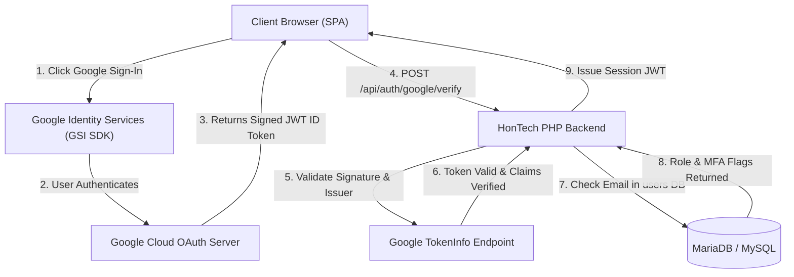

# 📄 Document 02: Technical Architecture & Data Flow

```
PROJECT:       HonTech AutoCenter Management System
MODULE:        OAuth 2.0 & Cryptographic Token Verification
AUDIENCE:      Developers, System Architects, Technical Evaluators
```

---

## 1. High-Level Authentication Architecture

HonTech implements a **Federated Identity Model** combined with a **Strict Local Role Whitelist**.



---

## 2. Cryptographic JWT Verification Process

When Google sends the `credential` payload to the frontend, the backend executes the following validation steps in `AuthController.php`:

1. **Endpoint Called**: `POST /api/auth/google/verify`
2. **Payload Extraction**:
   * Frontend transmits `{ token: "eyJhbGciOiJSUzI1Ni..." }`
3. **Verification via Google Public Keys**:
   * Backend queries `https://oauth2.googleapis.com/tokeninfo?id_token={token}`
   * Validates `aud` (Audience) matches our `GOOGLE_CLIENT_ID`.
   * Validates `iss` (Issuer) is `https://accounts.google.com` or `accounts.google.com`.
   * Validates `exp` (Expiration Timestamp) is still valid in the future.
4. **Email Whitelist Match**:
   * Queries `SELECT * FROM users WHERE email = ? AND is_deleted = 0`.
   * If not found, responds with `HTTP 403 Forbidden` (`{"message": "Unauthorized Google account"}`).
5. **Session Issuance**:
   * Issues an internal HMAC-SHA256 signed session JWT containing `{ id, email, role, exp }` stored in an HttpOnly, secure cookie or authorization header.

---

## 3. Hybrid Mode (Offline / Online Topology)

```
                     ┌───────────────────────────────┐
                     │     INTERNET CONNECTIVITY     │
                     └───────────────┬───────────────┘
                                     │
                    ┌────────────────┴────────────────┐
                    │                                 │
           [ ONLINE / CLOUD ]                [ OFFLINE / LOCAL LAN ]
                    │                                 │
         • Google OAuth 2.0                • Fast Local PIN / Password
         • Live Email OTP Relay            • On-Premises MariaDB
         • Cloud Financial Backups         • Real-Time TV Display Bays
```
