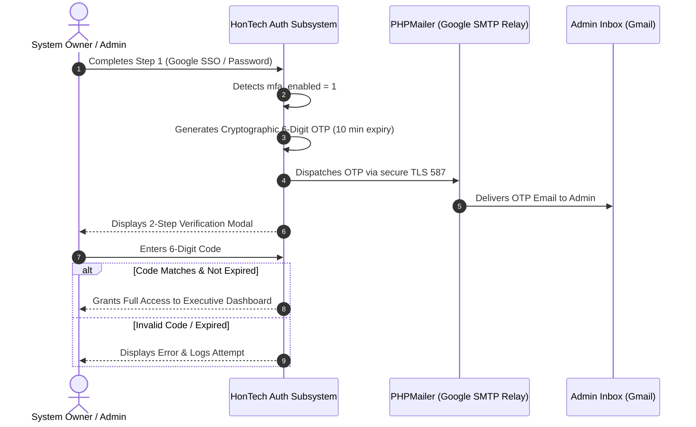

# 📄 Document 04: 2-Factor Authentication & Account Recovery Protocols

```
PROJECT:       HonTech AutoCenter Management System
MODULE:        2-Step Verification, Dynamic OTP Dispatch & Account Recovery
AUDIENCE:      Security Engineers, Quality Assurance, Developers
```

---

## 1. 2-Step Verification (2FA) Protocol

For administrative accounts (**Owner** and **Admin**), password authentication is only the first step. HonTech enforces a secondary challenge to prevent account takeover.



---

## 2. Dynamic 6-Digit OTP Dispatch Mechanism

* **Generation**: Generated using `random_int(100000, 999999)` to guarantee cryptographic entropy.
* **Storage**: Stored in cache / database session with a strict **10-minute time-to-live (TTL)**.
* **Rate Limiting**: Maximum 3 resend attempts every 5 minutes to prevent spamming.
* **Transport**: Dispatched over TLS encrypted SMTP using PHPMailer connected to `smtp.gmail.com:587`.

---

## 3. Emergency Account Recovery Protocols

If an Owner loses their phone or email access:

1. **8-Digit Emergency Backup Codes**:
   * During initial security setup, 5 single-use emergency codes are generated and hashed in the database.
   * Entering a valid emergency code grants immediate one-time recovery access and invalidates that specific code.
2. **Device Kill-Switch**:
   * The Owner can click *"Revoke All Other Sessions"* from the Security Settings panel.
   * This updates the user's `token_version` or session timestamp, instantly invalidating all tokens on compromised devices.
