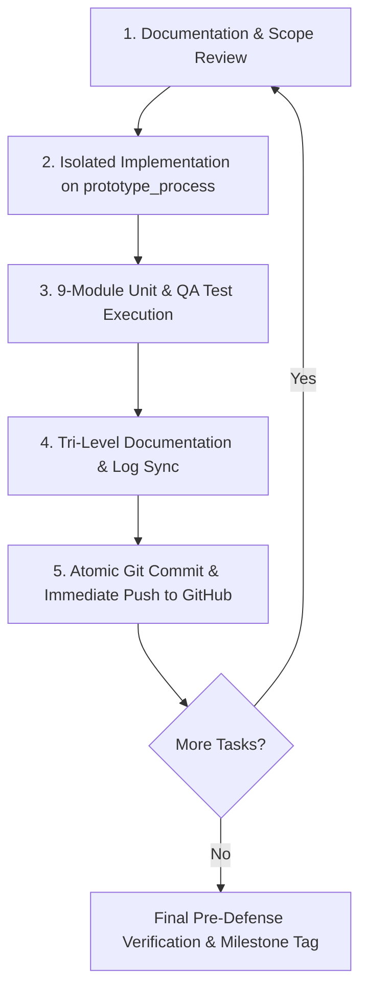
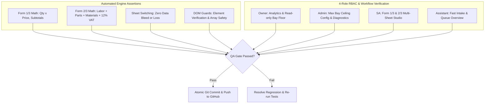

# Master Development, Testing & Documentation Flow Plan

This document synthesizes the entire HonTech documentation suite—including the **9 Core Modules from the Master QA Playbook**, **Customer History & Back-Job Evolution Log**, **Form 1/3 Physical Template Calibration**, and the new **Multi-Form Excel-Style Sheet Navigation & Form 2/3 (Quotation) Subsystem**.

---

## User Review Required

> [!IMPORTANT]
> **Active Working Branch**: All current work is safely isolated on `prototype_process`.
> 
> **Zero-Loss Git Strategy**: Every individual revision is committed and pushed immediately upon completion and verification, following the convention:
> `feat/fix(scope): concise description` -> `git push origin prototype_process`

---

## 🎯 4-Stage Operational Workflow



---

## 📑 Detailed Operational Drafts

### 📊 Draft 1: Excel-Style Multi-Sheet Navigation & Form 2/3 (Quotation) Architecture

#### 1. Excel-Style Bottom Sheet Navigation Bar
At the bottom of `#section-form13` (Form Studio), we introduce a persistent, modern, Excel-like sheet tab strip:

```
┌────────────────────────────────────────────────────────────────────────────────────────────────────────┐
│                                     ACTIVE STUDIO WORKSPACE (SPLIT-SCREEN)                             │
│                  LEFT: Smart Editor Form                │         RIGHT: Live Document Canvas          │
├────────────────────────────────────────────────────────────────────────────────────────────────────────┤
│ 📑 [ 📄 Sheet 1: Form 1/3 (Job Order) ] │ 📑 [ 📊 Sheet 2: Form 2/3 (Quotation) ] │ ➕ [ Form 3/3 (Next) ]     │
└────────────────────────────────────────────────────────────────────────────────────────────────────────┘
```

- **Visual Style**: Clean dark/light slate tab strip, active sheet highlighted with accent border (Red-600) and sheet icon, smooth transition when switching sheets.
- **Shared In-Memory Dossier Binding**: Switching sheets preserves all entered Customer & Vehicle data in real-time. When an SA enters Customer Name or Plate in Sheet 1, Sheet 2 automatically inherits it without manual retyping.
- **Independent Canvas Views**:
  - **Sheet 1**: Displays Form 1/3 (Job Order with bottom Claim Stub).
  - **Sheet 2**: Displays Form 2/3 (Quotation with Labor, Parts, Materials, 12% VAT, and Terms & Conditions).

---

#### 2. Form 2/3 (Quotation No.) Technical Blueprint
Based on the official physical **Form 2/3** document:

```
+-----------------------------------------------------------------------------------------------+
| Form 2/3                                      QUOTATION NO. [ QTN-2026-001 ]                  |
| Hontech Auto Center ("Building Trust")                                                        |
| 70 Bayan Bayanan Ave cor Narra St. Marikina Heights, Marikina City        DATE: [ 2026-09-10 ]|
| fb.com/hontechautocenter                                        JOB ORDER NO.: [ WLK-2026-001]|
| 85644550 / 71219124 / 09458757441 / 09525065084 - VIBER        PROMISED DATE: [ 2026-09-12 ] |
+-----------------------------------------------------------------------------------------------+
| CUSTOMER DETAILS                                                                              |
| Name: [ Juan Dela Cruz ]                              Plate No: [ ABC-1234 ]                  |
| Address: [ Marikina City ]                          Year/Model: [ 2021 Toyota Vios ]          |
| Contact No: [ 0917-123-4567 ]                            Color: [ Silver Metallic ]           |
+-----------------------------------------------------------------------------------------------+
| PARTS/MATERIAL       | QTY | FRT | LABOR    | PARTS    | MATERIALS | AMOUNT                   |
| Engine Oil 5W-30     |  4  | 0.5 | 350.00   | 1,800.00 |   0.00    | 2,150.00                 |
| Oil Filter Element   |  1  | 0.2 | 150.00   |   450.00 |   0.00    |   600.00                 |
| Brake Cleaner Spray  |  1  | 0.1 |   0.00   |     0.00 | 250.00    |   250.00                 |
+-----------------------------------------------------------------------------------------------+
|                                                LABOR:     [   500.00 ]                        |
|                                                VAT 12%:   [   360.00 ]                        |
|                                                MATERIALS: [   250.00 ]                        |
|                                                PARTS:     [ 2,250.00 ]                        |
|                                                TOTAL:     [ 3,360.00 ]                        |
+-----------------------------------------------------------------------------------------------+
| TERMS & CONDITIONS (15-day validity, estimate disclosure, storage clause, 25% surcharge)     |
| Prepared by: [ Service Advisor ]                      Approved by: [ General Manager ]        |
| Customer Conforme & Signature: [ ___________________________________________________________ ] |
+-----------------------------------------------------------------------------------------------+
```

#### 3. Form 2/3 Math & Tax Calculation Engine
- **Line Item Arithmetic**:
  $$\text{Row Amount} = \text{Labor} + \text{Parts} + \text{Materials}$$
- **Subtotal Accumulators**:
  $$\text{Total Labor} = \sum \text{Labor}, \quad \text{Total Parts} = \sum \text{Parts}, \quad \text{Total Materials} = \sum \text{Materials}$$
- **Tax & Grand Total Engine**:
  $$\text{Net Subtotal} = \text{Total Labor} + \text{Total Parts} + \text{Total Materials}$$
  $$\text{VAT (12\%)} = \text{Net Subtotal} \times 0.12$$
  $$\text{Grand Quotation Total} = \text{Net Subtotal} + \text{VAT (12\%)}$$

---

### 📋 Draft 2: Updated Upcoming Revisions Roadmap (P1–P8)

| Priority | Revision Area | Detailed Description | Target Components | Reference Module |
| :--- | :--- | :--- | :--- | :--- |
| **P1** | **Excel-Style Bottom Sheet Bar** | Build persistent bottom tab bar (`#form-sheet-tab-bar`) inside `#section-form13` with active indicators for Sheet 1 (Form 1/3) and Sheet 2 (Form 2/3). | `frontend/index.html`<br>`frontend/css/main.css`<br>`frontend/js/app.js` | **New UX Subsystem** |
| **P2** | **Form 2/3 Quotation Editor & Canvas** | Build the SA Quotation smart editor and live 1:1 physical Quotation Canvas including FRT, Labor, Parts, Materials, 12% VAT, and Terms & Conditions. | `frontend/index.html`<br>`frontend/js/app.js` | **Form 2/3 Spec** |
| **P3** | **Shared Dossier In-Memory Sync** | Synchronize Customer Name, Plate, Address, Contact, Model, Color, Job Order #, and Dates bidirectionally between Sheet 1 and Sheet 2. | `frontend/js/app.js` | **Module 2 & 9** |
| **P4** | **Customer History & 1-Click Auto-Fill** | Connect `#section-lookup` to Form Studio so selecting a customer or plate auto-fills both Form 1/3 and Form 2/3 in 1 click. | `frontend/js/app.js` | **Module 2** |
| **P5** | **Direct Workshop Bay Handover** | "Print & Push to Bay Queue" saves to database with status `Monitoring`/`Waiting` bounded strictly by SA active bay count (1 to N). | `backend/controllers/JobController.php`<br>`frontend/js/app.js` | **Module 3** |
| **P6** | **2-Hour Express PMS SLA Turnaround** | Automatic 2-hour SLA countdown timer with `#modal-express-delay-reason` logging into `express_lane_issues`. | `frontend/js/app.js` | **Module 4** |
| **P7** | **TV Announcement Chime** | Airport chime + Web Speech voice announcement on dispatch or bay allocation. | `frontend/js/app.js` | **Module 6** |
| **P8** | **Single-Page Print & Export Engine** | Independent print engines for Form 1/3 (with claim stub) and Form 2/3 (Quotation) without dashboard headers. | `frontend/js/app.js`<br>`frontend/css/main.css` | **Module 9** |

---

### 🧪 Draft 3: Unit Testing Suite & QA Playbook Matrix



#### A. Automated Unit Test Cases
1. **Form 2/3 Math & Tax Engine (`TC-UNIT-MATH-02`)**:
   - `calculateQuotation(labor: 500, parts: 2250, materials: 250)`:
     - Net Subtotal: `3,000.00`
     - 12% VAT: strictly `360.00`
     - Grand Total: strictly `3,360.00`
2. **Sheet Tab Switching Reactivity (`TC-UNIT-SHEET-03`)**:
   - Switching between Sheet 1 and Sheet 2 takes < 10ms.
   - Text inputs in Sheet 1 persist and populate identically into Sheet 2.

---

### 📝 Draft 4: Tri-Level Documentation & Audit Trail Standards

1. **Prototype Spec**: [`Hontech Documentation/Prototype/05_FORM_2_3_QUOTATION_SPECIFICATION.md`](file:///c:/xampp/htdocs/CapstoneOfficial2_Development_Part-2-Hontech_Prototype_Process/Hontech%20Documentation/Prototype/05_FORM_2_3_QUOTATION_SPECIFICATION.md)
2. **Prototype Log**: [`Hontech Documentation/Prototype/02_PROTOTYPE_REVISIONS_LOG.md`](file:///c:/xampp/htdocs/CapstoneOfficial2_Development_Part-2-Hontech_Prototype_Process/Hontech%20Documentation/Prototype/02_PROTOTYPE_REVISIONS_LOG.md) (`REV-PROTO-008+`)
3. **Master Revisions Log**: [`Revisions checklist.csv`](file:///c:/xampp/htdocs/CapstoneOfficial2_Development_Part-2-Hontech_Prototype_Process/Revisions%20checklist.csv) & [`REVISIONS_LOG.md`](file:///c:/xampp/htdocs/CapstoneOfficial2_Development_Part-2-Hontech_Prototype_Process/REVISIONS_LOG.md)

---

### 🛡️ Draft 5: Continuous GitHub Synchronization Protocol

1. `git status` check.
2. Atomic conventional commit per feature.
3. `git push origin prototype_process`.
4. Verification that local HEAD is up-to-date with remote.

---

## Verification Plan

### Automated Testing
- Unit test script in browser console checking 12% VAT, line item arithmetic, and sheet state retention.
- `curl.exe` verifying backend endpoint responses.

### Manual Verification
- Open [http://localhost:8000](http://localhost:8000) as Service Advisor (`sa@hontech.com`).
- Click bottom sheet tabs to switch between Form 1/3 and Form 2/3.
- Verify live math and quotation printing.
- Confirm Git working tree is clean and pushed to GitHub.
