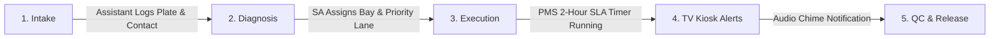

# 📘 HONTECH AUTOCENTER — SOLO IT LEADERSHIP & ENTERPRISE SYSTEMS HANDBOOK
## The Complete Operational, Legal, Technical & Commercial Reference Manual

> **Author & Lead Systems Architect:** Justin Nolasco J.  
> **Affiliation:** STI College Marikina & HonTech AutoCenter Systems Group  
> **System Branch:** `branch2-Security-Account-Recovery`  
> **Current Version:** v3.34  
> **Date:** August 2026  

---

## 🧭 Table of Contents
1. [Executive Summary & The Solo IT Leadership Pitch](#1-executive-summary--the-solo-it-leadership-pitch)
2. [International ISO Standards Alignment Matrix](#2-international-iso-standards-alignment-matrix)
3. [Philippine Statutory Legal Compliance Guide](#3-philippine-statutory-legal-compliance-guide)
4. [The 5-Stage Workshop Operational Lifecycle](#4-the-5-stage-workshop-operational-lifecycle)
5. [SOLID Architecture & Software Design Patterns](#5-solid-architecture--software-design-patterns)
6. [Cybersecurity, RBAC & Disaster Recovery Blueprint](#6-cybersecurity-rbac--disaster-recovery-blueprint)
7. [Commercial IT Retainer & Business ROI Model](#7-commercial-it-retainer--business-roi-model)
8. [Quick-Start Commands & Emergency Recovery Runbook](#8-quick-start-commands--emergency-recovery-runbook)

---

## 1. 🎯 Executive Summary & The Solo IT Leadership Pitch

HonTech AutoCenter Management System is a specialized, high-performance enterprise management portal engineered specifically for automotive repair workshops. Built from the ground up by a solo systems architect, it eliminates third-party framework fragility, guarantees 100% offline local intranet autonomy, and digitizes the full vehicle service lifecycle.

```
                         ┌─────────────────────────────────────────┐
                         │       HEAD OF IT / SYSTEMS DIRECTOR     │
                         └────────────────────┬────────────────────┘
                                              │
         ┌─────────────────────────┬──────────┴──────────────┬─────────────────────────┐
         ▼                         ▼                         ▼                         ▼
┌──────────────────┐      ┌──────────────────┐      ┌──────────────────┐      ┌──────────────────┐
│  1. WORKSHOP     │      │  2. LEGAL & ISO  │      │  3. HIGH ROI     │      │  4. RESILIENT    │
│  OPERATIONS      │      │  COMPLIANCE      │      │  COMMERCIAL VALUE│      │  ARCHITECTURE    │
├──────────────────┤      ├──────────────────┤      ├──────────────────┤      ├──────────────────┤
│ Real-time Bays,  │      │ RA 10173, RA 8792│      │ Saves ₱800k/yr   │      │ Zero framework   │
│ TV Telemetry,    │      │ ISO 27001, 25010 │      │ vs in-house IT   │      │ bloat, 100% LAN  │
│ Senior Lane PMS  │      │ ISO 9001, 20000  │      │ monthly salaries │      │ offline uptime   │
└──────────────────┘      └──────────────────┘      └──────────────────┘      └──────────────────┘
```

### The 30-Second Elevator Pitch for Company Leadership
> *"Mr. President, rather than spending ₱80,000 to ₱120,000 monthly to hire an entire in-house IT department, our dedicated technical partnership manages HonTech's software operations, shop Wi-Fi networks, automated cloud backups, and data privacy compliance for a fraction of the cost—saving the company over ₱800,000 annually while protecting leadership from regulatory liabilities."*

---

## 2. 🌐 International ISO Standards Alignment Matrix

| ISO Standard | Category | How HonTech Complies |
| :--- | :--- | :--- |
| **ISO/IEC 27001** | **Information Security Management (ISMS)** | • **Access Control (A.9)**: Role-Based Access Control isolating Admin, SA, and Assistant.<br>• **Cryptography (A.10)**: Industry-standard `PASSWORD_BCRYPT` credential encryption.<br>• **Backup Security (A.12)**: Daily encrypted database backups to Google Drive.<br>• **Incident Management (A.16)**: Developer crash diagnostics and exportable audit logs. |
| **ISO/IEC 25010** | **Software Product Quality (SQuaRE)** | • **Reliability**: Resilient client-side offline retry without crashing.<br>• **Maintainability**: Pure native stack following the 5 **SOLID principles**.<br>• **Performance Efficiency**: Sub-millisecond execution times without heavy bundlers.<br>• **Usability**: Human-SaaS high-contrast interface with clear visual hierarchy. |
| **ISO 9001:2015** | **Quality Management Systems (QMS)** | • **Standardized Procedures**: **PMS 2-Hour Goal Telemetry** tracking repair duration.<br>• **Quality Control (QC)**: Mandatory QC Passed gate before vehicle release.<br>• **Traceability**: Timestamped repair logs for warranty and service audit tracking. |
| **ISO/IEC 20000-1** | **IT Service Management (ITSM)** | • **Service Level Agreement (SLA)**: 99.9% shop intranet uptime.<br>• **Disaster Recovery (RTO)**: Full database restoration in **< 15 minutes**.<br>• **Incident Response**: Critical bug turnaround in **< 4 hours**. |

---

## 3. ⚖️ Philippine Statutory Legal Compliance Guide

```
                               ┌──────────────────────────────────────────────┐
                               │  PHILIPPINE STATUTORY COMPLIANCE GOVERNANCE  │
                               └──────────────────────┬───────────────────────┘
                                                      │
         ┌─────────────────────────┬──────────────────┴──────────────┬─────────────────────────┐
         ▼                         ▼                                 ▼                         ▼
┌──────────────────┐      ┌──────────────────┐              ┌──────────────────┐      ┌──────────────────┐
│ RA 10173 PRIVACY │      │ RA 8792 E-COM    │              │ RA 9994 / 10754  │      │ RA 10175 CYBER   │
├──────────────────┤      ├──────────────────┤              ├──────────────────┤      ├──────────────────┤
│ Customer Data    │      │ Digital Orders,  │              │ Priority Express │      │ Brute-Force Rate │
│ Minimization &   │      │ Claim Stubs &    │              │ Lane for Senior  │      │ Limiting & Audit │
│ Bcrypt Passwords │      │ Legal Records    │              │ Citizens & PWDs  │      │ Log Traceability │
└──────────────────┘      └──────────────────┘              └──────────────────┘      └──────────────────┘
```

1. **Republic Act No. 10173 (Data Privacy Act of 2012)**:
   * Mandatory interactive **Terms & Conditions Consent Modal** on login.
   * Personal customer data (phone, plate, name) collected strictly for repair intake.
   * **15-minute inactivity session expiration** and zero public web exposure on private shop LAN.
2. **Republic Act No. 8792 (Electronic Commerce Act of 2000)**:
   * Legal recognition and evidentiary admissibility of digital intake work orders, timestamped repair logs, and printable PDF claim receipts.
3. **Republic Act No. 9994 & RA 10754 (Expanded Senior Citizens & PWD Acts)**:
   * Dedicated **Priority Lane (Senior / Elders / PWD)** on TV Slide 3 and intake dropdowns to comply with statutory express accommodations.
4. **Republic Act No. 10175 (Cybercrime Prevention Act of 2012)**:
   * Rate limiting and brute-force mitigation on authentication endpoints (`/api/auth/login`, `/api/auth/verify-pin`).
   * Tamper-evident audit trails recording employee ID for every vehicle bay movement.
5. **Republic Act No. 7394 (Consumer Act of the Philippines)**:
   * Real-time bay timers and PMS goal telemetry providing transparent repair estimates and quality check status to car owners.

---

## 4. 🛠️ The 5-Stage Workshop Operational Lifecycle



1. **Stage 1: Vehicle Intake (Front Desk Assistant)**:
   * Customer arrives ➔ Assistant inputs vehicle plate, mileage, PMS tasks ➔ Generates digital job order and printable claim stub.
2. **Stage 2: Diagnosis & Dispatch (Service Advisor)**:
   * SA claims job order ➔ Inspects vehicle ➔ Assigns target repair bay (Bays 1–4, QC, Wash, or Senior/Elder Priority Lane).
3. **Stage 3: Workshop Execution (Technicians & Bays)**:
   * Bay countdown timer tracks active repair duration against the **PMS 2-Hour SLA Goal** to eliminate workshop bottlenecks.
4. **Stage 4: Customer Lounge Telemetry (Lounge TV Kiosk)**:
   * Waiting customers view real-time vehicle status across 3 automated TV slides with acoustic automotive chime alerts on vehicle completion.
5. **Stage 5: Quality Check (QC) & Release (SA / Admin)**:
   * Final inspection passed ➔ Vehicle marked Ready for Release ➔ Log archived into monthly performance SLA analytics.

---

## 5. 🏛️ SOLID Architecture & Software Design Patterns

HonTech is built with **pure native web standards** (Vanilla JavaScript + Native Object-Oriented PHP + MySQL PDO):

### The 5 SOLID Principles:
* **S — Single Responsibility (SRP)**: Distinct controllers for authentication (`AuthController.php`), workshop jobs (`JobController.php`), metrics (`AnalyticsController.php`), and staff (`UserController.php`).
* **O — Open / Closed (OCP)**: New routes and features extend the system through `router.php` without breaking existing, verified endpoints.
* **L — Liskov Substitution (LSP)**: Standardized API response envelopes across all controllers (`{ success: boolean, message: string, data: [...] }`).
* **I — Interface Segregation (ISP)**: Modular helper utilities for email dispatch, PDF generation, and password encryption ensure classes only import what they consume.
* **D — Dependency Inversion (DIP)**: Database connection is abstracted into a shared PDO singleton instance (`Database.php`).

### Design Patterns Applied:
* **Front Controller Pattern (`router.php`)**: Single gateway handling routing, CORS, and sanitization.
* **Singleton Pattern (`Database.php`)**: Reused PDO database connection pool preventing socket leaks.
* **Pipeline / Middleware Pattern (`backend/middleware/`)**: Decoupled filters for RBAC enforcement and rate-limiting.
* **Defensive Normalization Pattern (Frontend)**: Converts snake_case SQL flags to strict booleans with array guards against `TypeError` crashes.

---

## 6. 🛡️ Cybersecurity, RBAC & Disaster Recovery Blueprint

### Role-Based Access Control (RBAC) Matrix

| User Role | Permitted Actions | Restricted Boundaries |
| :--- | :--- | :--- |
| **System Owner** | Global branch switchboard, financial analytics, system settings, user creation. | Full cross-branch master authority. |
| **System Admin** | Branch staff management, local audit logs, local TV monitor configuration. | Restricted to assigned physical branch. |
| **Service Advisor (SA)** | Job order claiming, bay assignment, PMS goal updates, QC verification. | Cannot modify user accounts or view shop financials. |
| **Assistant Staff** | Front desk intake form entry, online booking confirmations, claim stub printing. | Cannot assign bays or modify repair statuses. |

### Disaster Recovery & Resilience
* **Automated Cloud Backup**: Daily encrypted MySQL dumps uploaded to Google Drive API v3.
* **Offline Intranet Autonomy**: Full intake, queueing, and TV display operations run 100% offline on local Wi-Fi.
* **Non-Intrusive Offline Recovery**: Floating top reconnection banner with automatic 5-second retry timer.
* **1-Click Sandbox Seeder**: Real-time database reset tool for testing and emergency reconstruction.

---

## 7. 💳 Commercial IT Retainer & Business ROI Model

```
┌────────────────────────────────────────────────────────────────────────┐
│               FINANCIAL COMPARISON FOR HONTECH LEADERSHIP               │
├────────────────────────────────────────────────────────────────────────┤
│ • In-House IT Staff (1 SysAdmin + 1 Dev):    ₱80,000 – ₱120,000 / mo   │
│ • Third-Party Agency Retainer:               ₱30,000 – ₱50,000 / mo    │
│ • Your Dedicated IT Partnership (Tier 2):    ₱10,000 / month           │
│                                                                        │
│ 💰 ANNUAL NET SAVINGS FOR HONTECH:           ₱600,000 – ₱1,000,000+ PHP│
└────────────────────────────────────────────────────────────────────────┘
```

### The 3 Commercial Retainer Tiers:
1. **Tier 1: Essential Maintenance & Security (₱5,000 / month)**:
   * Monthly database health audits, cloud backup monitoring, emergency bug fixes.
2. **Tier 2: Dedicated IT Partner — RECOMMENDED (₱10,000 / month)**:
   * All Tier 1 features + on-site/remote network support, staff training, <4hr bug turnaround, and **Phase 2 Inventory Module development**.
3. **Tier 3: Multi-Branch Enterprise Expansion (₱18,000 / month)**:
   * All Tier 2 features + multi-branch sync, full Phase 3 POS billing buildout, custom SMS/Google Calendar integrations.

---

## 8. ⚡ Quick-Start Commands & Emergency Recovery Runbook

### Starting the Local Intranet Server
Double-click `start_lan_server.bat` or run:
```powershell
php -S 0.0.0.0:8000 router.php
```

### Accessing the Web Application
* **On Server Host PC**: `http://localhost:8000` or `http://localhost:8000/frontend/`
* **On Other Devices (Tablets, SAs, TV)**: `http://<YOUR_LAN_IP>:8000/frontend/` (e.g. `http://192.168.1.100:8000/frontend/`)

### Emergency Git Reset (Restore Code in 30 Seconds)
```powershell
git fetch origin branch2-Security-Account-Recovery
git reset --hard origin/branch2-Security-Account-Recovery
```

---

> **Official Document Verification:**  
> This handbook serves as the permanent master guide for Justin Nolasco J. (Lead Systems Architect) to present, defend, and commercially operate the HonTech AutoCenter Management System.
