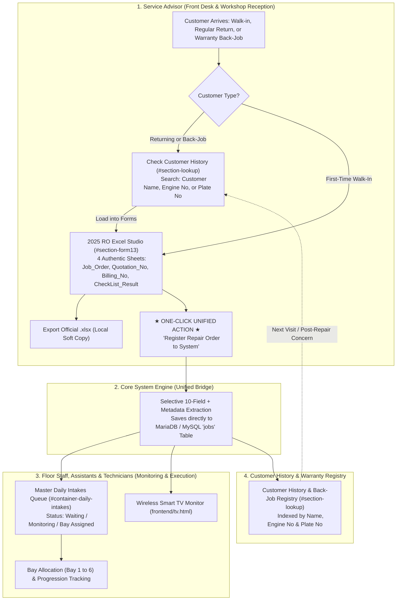

# 🏛️ HONTECH AUTOCENTER: OFFICIAL STAFF OPERATIONAL WORKFLOW & SUBSYSTEM FOUNDATIONS

**Document Classification:** Official Enterprise Workflow & System Foundation Specification  
**Document Reference:** `HONTECH-FOUNDATION-STAFF-2026-V1.0`  
**Status:** **OFFICIAL / PERMANENT PRODUCTION BLUEPRINT**  
**Target Repository:** `Hontech_Main_Active_Development_PHP_SQL`  
**Active Development Branch:** `prototype_process`  
**Lead Developers & Architects:** Justin Nolasco J., Catherine Ramos G., Mary Dayne Villas T.  
**Advisory Oversight:** Mr. Ar-Jay C. Agbayani *(Faculty Capstone Adviser)*  
**Client Partner:** HonTech AutoCenter Operations Team  

---

## 📌 1. Executive Charter & Core Principles

This specification establishes the **Single Source of Truth** for workshop vehicle intake, monitoring, and customer history tracking:

1. **Single Entry Point**: The **2025 RO Excel Studio (`#section-form13`)** is the sole authoritative interface for creating official Repair Orders.
2. **Elimination of Redundant Forms**: Legacy quick-intake forms (such as `#section-intake`) on the daily intake path are retired. SAs do not deal with fragmented intake forms.
3. **The 1-Button Unified Action**: SAs click **ONE BUTTON** (`[💾 Register Repair Order to System]`) which simultaneously feeds:
   - The central MySQL database (`jobs` table).
   - The **Daily Intakes Monitoring Queue** (`#container-daily-intakes`) and **Wireless Smart TV Monitor** (`tv.html`).
   - The **Customer History & Back-Job Lookup Module** (`#section-lookup`).
4. **Selective 10-Field Extraction**: Rather than polluting the database with ephemeral spreadsheet styling, the system captures **only the 10 core customer fields** required for operational monitoring, customer dossiers, returning customer tracking, and warranty back-jobs.

---

## 👥 2. Role-by-Role Staff Operational Blueprint

### Detailed Operational Directives

| Role | Operational Domain | Key Actions & Tools |
| :--- | :--- | :--- |
| **Service Advisor (SA)** | Front Desk, Client Assessment, Estimation, Billing | • Searches customer history by **Customer Name**, **Engine No**, or **Plate No**. • Prepares the 4 sheets in **2025 RO Studio (`#section-form13`)**. • Exports `.xlsx` soft copy for workshop records. • Presses **ONE BUTTON** to register order into system. • **Does NOT use legacy intake forms.** |
| **Workshop Assistant & Floor Staff** | Reception Queue, Vehicle Movement, Bay Scheduling | • Monitors incoming cars on the **Master Daily Intakes Queue** (`#container-daily-intakes`). • Assigns vehicles to available bays (Bay 1–6). • Updates status progression (Waiting ➔ Monitoring ➔ Quality Check ➔ Completed). • **Does NOT type intake forms** — all cars flow directly from SA Studio. |
| **Technicians / Mechanics** | Physical Vehicle Repair & Inspection | • View vehicle queue, assigned bay, and promised release times on **Wireless Smart TV Monitor**. • Perform repair work and checklist inspections. |
| **Owner / Admin** | Management, Audits, Analytics | • Tracks shop throughput, daily revenue, bay utilization, and back-job return rates on Executive Analytics (`#db-tab-analytics`). |

---

## 🔍 3. Data Alignment Matrix: Studio Forms ➔ Monitoring Table ➔ Customer Lookup

Below is the complete, audited field-by-field verification proving that all data captured in the **2025 RO Excel Studio** perfectly aligns with the requirements of the **Daily Intakes Monitoring Table** and the **Customer History Dossier**:

| Field # | Data Property | Source in 2025 RO Studio (`#section-form13`) | Presence in Monitoring Table (`#table-daily-intakes`) | Presence in Customer Lookup (`#section-lookup`) | MySQL Database Column (`jobs`) |
| :---: | :--- | :--- | :--- | :--- | :--- |
| **1** | **Customer Full Name** | `f13-input-name` | Filterable via search bar | Prominent Dossier Header & Field | `name` (VARCHAR) |
| **2** | **Address** | `f13-input-address` | Internal vehicle record | Displayed in Dossier Details Grid | `address` (VARCHAR) |
| **3** | **Contact No. / Viber** | `f13-input-contact` | Quick contact / Filterable | Displayed with 1-click copy | `contact` (VARCHAR) |
| **4** | **Year Model** | `f13-input-model` | Displayed in **Model & Category** column | Displayed in Vehicle Specs | `vehicle` (VARCHAR) |
| **5** | **KM Reading** | `f13-input-km` | Odometer baseline | Displayed with visit mileage progression | `km_reading` (INT) |
| **6** | **Engine No.** | `f13-input-engine` | Secondary ID | Displayed & Primary Search Match Key | `engine_no` (VARCHAR) |
| **7** | **Plate No.** | `f13-input-plate` | Displayed in **Plate No.** column | Displayed as badge & Search Key | `plate` (VARCHAR) |
| **8** | **Intake Date** | `f13-input-intake-date` | Determines queue date filter | Displayed as Date Received | `date_received` (DATE) |
| **9** | **Promise Date** | `f13-input-promise-date`| Displayed in **Promised Date** column | Displayed as Promised Release | `promised_date` (DATE) |
| **10**| **Vehicle Color** | `f13-input-color` | Shop-floor visual identification | Displayed in Vehicle Specs | `color` (VARCHAR) |
| *M1* | **Job Order No. / Claim Stub** | `f13-input-job-no` | Displayed in **Claim Stub** column | Displayed in Historical Orders List | `job_id` / `claim_stub` |
| *M2* | **Service Category** | `f13-input-category` | Displayed in **Model & Category** column | Categorizes historical repair records | `category` (VARCHAR) |
| *M3* | **Concern / Evaluation** | `f13-input-diagnostic` & `concern` | Displayed in **Evaluation / Diagnosis** column | Displayed in Job Summary | `evaluation` & `concern` |
| *M4* | **Service Advisor** | `f13-input-sa` | Assigned SA filter & Carry-Over | Displayed as primary advisor | `sa_name` (VARCHAR) |
| *M5* | **Arrival Time** | System Timestamp / `H:i` | Displayed in **Arrival (24H)** column | Intake timestamp | `arrival` (VARCHAR) |
| *M6* | **Initial Status** | Initial state (`Waiting`) | Displayed in **Status** column | Status indicator | `status` (VARCHAR) |
| *M7* | **Bay Location** | Default (`None` / Waiting Area) | Displayed in **Location** column | Bay tracking | `location` (VARCHAR) |
| *W1* | **Back-Job Indicator** | Internal state (`is_backjob`) | Flagged in Source (`Warranty Back-Job` badge) | Filtered in "Past Back-Jobs" tab | `is_backjob` (TINYINT) |
| *W2* | **Parent Job ID** | Internal reference (`parent_job_id`)| Cross-linked reference | Linked to original repair ticket | `parent_job_id` (VARCHAR) |

### ✅ Alignment Audit Conclusion:
**100% of the data collected in the 2025 RO Excel Studio satisfies every single column of the Daily Intakes Monitoring Table and every attribute of the Customer Lookup Dossier.** There are zero unmapped fields, zero missing dependencies, and zero manual re-entry points.

---

## 🔁 4. Returning Customer & Warranty Back-Job Lifecycle

### Flow A: Returning Customer (Regular / Satisfied Maintenance)
1. SA enters customer's **Name**, **Engine No**, or **Plate No** in Customer Lookup (`#section-lookup`).
2. System displays matching dossier showing total completed visits (e.g. `⭐ Returning Customer (3rd Visit)`).
3. SA clicks **`[⚡ Start New Service in Forms (Returning Customer)]`**.
4. System switches to `#section-form13`:
   - Auto-fills Customer Name, Address, Contact, Year Model, Plate No, Engine No, and Color.
   - Generates next sequential Job Order No.
   - Sets Intake Date to today.
   - Focuses the KM Reading input for current odometer entry.
   - Pre-syncs all 4 sheets (`Quotation_No`, `Billing_No`, `CheckList_Result`).

### Flow B: Warranty Back-Job (Post-Repair Concern)
1. Customer returns with a repeat issue or unresolved symptom.
2. SA searches by **Customer Name** or **Engine No** in Customer Lookup.
3. System lists all past repair orders from the database with dates and original concerns.
4. On the affected repair order, SA clicks **`[🔁 Issue Back-Job in Forms]`**.
5. System opens `#section-form13`:
   - Pre-fills all customer and vehicle specs.
   - Sets Service Category to `Warranty Back-Job`.
   - Links `parent_job_id` to the original repair ticket.
   - Sets `is_backjob = 1`.
   - Displays a prominent amber/red **`[WARRANTY BACK-JOB RETURN]`** banner at the top of the form.
   - Pre-populates Concern with:  
     `[BACK-JOB / WARRANTY RETURN] Ref Job: HT-JO-XXXX (Original Service: YYYY-MM-DD). Reported Issue: ...`
   - Sets Quotation labor recommendation to warranty-waived (₱0.00).

---

## 🏁 5. System Execution Standard
Whenever modifying or maintaining the HonTech system, engineers and AI agents must preserve:
- The **1-Button Unified Action** as the sole pipeline from Studio to central database.
- The **Single Source of Truth** in `#section-form13`.
- The strict 4-worksheet architecture (`Job_Order`, `Quotation_No`, `Billing_No`, `CheckList_Result`).
- Zero typing overhead on the floor staff.
