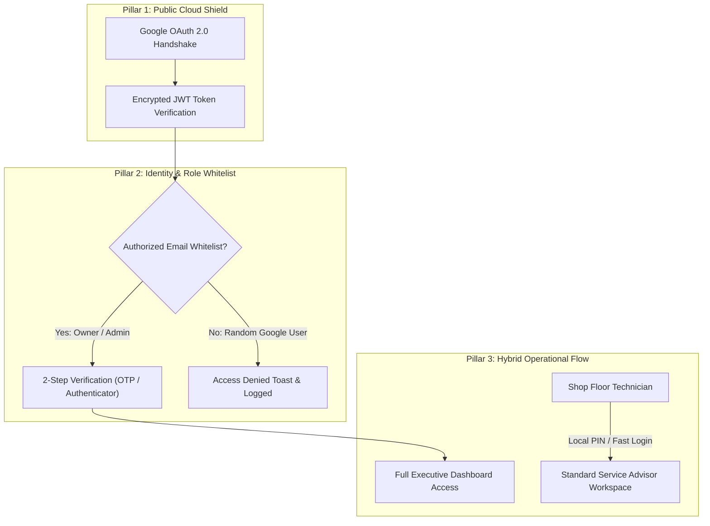

# HonTech Cloud Security & Google Auth — Executive Guide & Defense Cheat Sheet

> **Document Purpose**: A straightforward, non-overwhelming reference guide explaining why Google Auth and multi-layered cloud security were built into the HonTech AutoCenter system, how they protect the cloud deployment, and exactly how to explain and demonstrate them during your Capstone defense.

---

## 1. The 30-Second Summary (Elevator Pitch)

> *"Because HonTech is deployed to a live cloud server accessible to the public internet 24/7, relying solely on traditional PHP passwords exposes the system to automated global botnets and brute-force attacks. We engineered a **Hybrid Defense-in-Depth Architecture**: fast, low-friction access for workshop floor technicians, paired with **Google OAuth 2.0, 2-Step Verification (2FA), and strict Role-Based Whitelisting** for System Owners and Administrators managing sensitive financial and customer records."*

---

## 2. Why Traditional PHP Login Alone is Not Enough on the Cloud

When a system moves from a private local Wi-Fi network to a **public Cloud Server**, the security risks change completely:

| Risk on Public Cloud | What Happens with Traditional PHP Alone | How Google Auth + 2FA Solves It |
| :--- | :--- | :--- |
| **Global Automated Botnets** | Bots bombard `/api/login` with millions of dictionary passwords per hour. | **Google's Threat Shield** automatically detects bots, challenges unusual IPs, and rate-limits attacks. |
| **Weak / Reused Passwords** | Staff use simple passwords (`hontech123`) that are easily guessed. | **Zero Passwords Stored**: Google handles credential validation with zero password hashes in our DB. |
| **Account Takeover / Stolen Password** | If an attacker obtains the password, they gain full administrative control. | **2-Step Verification (2FA)**: Login requires physical possession of the owner's phone or authenticator. |
| **Forgotten Passwords** | Requires manual database editing in phpMyAdmin by a developer. | **Self-Service Recovery**: Automated, cryptographically verified recovery via Google & Email OTP. |
| **Database Data Leaks** | Stored password hashes can be cracked offline using GPU brute-force tools. | Google credentials cannot be cracked because no password hashes exist in the database. |

---

## 3. The 3 Pillars of HonTech Cloud Security

### Pillar 1: Public Cloud Shield (OAuth 2.0 & JWT)
* Uses official Google Identity Services (GSI) client-side and backend cryptographic token validation.
* Communication happens over secure HTTPS, preventing Man-in-the-Middle (MitM) credential sniffing.

### Pillar 2: Strict Email Whitelist & Multi-Factor Authentication (2FA)
* Anyone on the internet can click the Google button, but **only verified, pre-approved emails** (e.g., `justine03k@gmail.com`) can log in.
* High-privilege accounts undergo a secondary challenge: **Dynamic 6-digit Email/SMS OTP** or **Authenticator App (TOTP)**.

### Pillar 3: Hybrid Operational Model
* **Shop Floor (Service Advisors / Assistants)**: Can use quick local logins so fast vehicle check-ins are never blocked.
* **Executive Tier (System Owner / Admins)**: Hardened with Google SSO and 2FA to safeguard financial analytics and business settings.

---

## 4. Panelist Q&A Cheat Sheet (What to Say in Defense)

### Q1: *"Why did you use Google Auth instead of just writing your own PHP login?"*
> **Answer**: *"Writing authentication from scratch on a public cloud server exposes us to credential stuffing and brute force. Following OWASP standards, we delegated identity management to Google's proven OAuth 2.0 infrastructure, eliminating stored password vulnerabilities while retaining full role-based governance in our backend."*

### Q2: *"What happens if an unauthorized person tries to log in with their personal Google account?"*
> **Answer**: *"Our backend implements a strict Whitelist Guard. Even if Google verifies their identity, our system checks if their email is pre-authorized in our database. If not, the session is rejected immediately with an audit log alert."*

### Q3: *"What happens if the internet goes down in the local shop?"*
> **Answer**: *"We designed a Hybrid Architecture. If cloud connectivity drops, local technicians and advisors can continue logging vehicle work orders using standard offline-compatible shop accounts without interrupting workshop operations."*

### Q4: *"Why do you need 2-Step Verification if Google is already secure?"*
> **Answer**: *"2-Step Verification adds Defense-in-Depth. For critical operations like viewing financial revenue or modifying staff permissions, requiring an OTP ensures that even if an owner's laptop is left unlocked, administrative actions remain protected."*

---

## 5. Live Defense Demonstration Script (4 Simple Steps)

When demonstrating to your panel or client, follow this exact sequence:

1. **Step 1 — Show the Login Screen**:
   * Point out the clean dual-option login: Standard local credentials for staff, and the **Google Sign-In button** for administrative access.
2. **Step 2 — Trigger Google OAuth**:
   * Click the Google button and show the authentic Google modal popup.
   * Explain: *"Google verifies the identity without our server ever touching or storing raw passwords."*
3. **Step 3 — Show the 2-Step Verification Challenge**:
   * Demonstrate the 6-digit OTP code prompt dispatched via email/authenticator.
   * Explain: *"This prevents unauthorized entry even if someone learns the email."*
4. **Step 4 — Land on the Role-Governed Dashboard**:
   * Show that the system correctly recognizes the user role (**Owner**) and unlocks the appropriate administrative navigation.

---

## 6. Document Version & Reference

* **Branch**: `branch2-Security-Account-Recovery`
* **Production Cloud Repo**: `CapstoneOfficial2_Part3_Hontech_Cloud_GoogleAuth_Production`
* **Related Matrix**: [`HONTECH_QA_MANUAL_TESTING_MATRIX.html`](file:///c:/xampp/htdocs/CapstoneOfficial2_Development_Part-2-Hontech_Main_Active_Development_Branch2-Security-Account-Recovery/CapstoneOfficial2_Development_Part-2-Hontech_Main_Active_Development/Hontech%20Documentation/HONTECH_QA_MANUAL_TESTING_MATRIX.html)
* **Author**: HonTech Development Team
