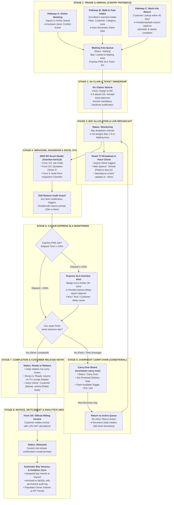

# 🏛️ HONTECH AUTOCENTER: OFFICIAL SYSTEM ARCHITECTURE, SUBSYSTEM TOPOLOGY & MASTER OPERATIONS BLUEPRINT

**Document Classification:** Official Enterprise Architecture & Canonical System Standard  
**Document Reference:** `HONTECH-ARCH-OFFICIAL-2026-V1.0`  
**Status:** **OFFICIAL / PERMANENT PRODUCTION BLUEPRINT (NOT A DRAFT)**  
**Target Repository:** `Hontech_Main_Active_Development_PHP_SQL`  
**Active Development Branch:** `prototype_process`  
**Deployment Target:** September 2026 Academic Defense & Shop Floor Production  
**Lead Developers & Architects:** Justin Nolasco J., Catherine Ramos G., Mary Dayne Villas T.  
**Advisory Oversight:** Mr. Ar-Jay C. Agbayani *(Faculty Capstone Adviser)*  
**Client Partner:** HonTech AutoCenter Operations Team  

---

## 📌 1. Executive Charter & Architectural Ground Truth

This document serves as the **supreme architectural anchor, subsystem topology, and operational ground truth** for the HonTech AutoCenter Web-Based Operations & Queue Monitoring System.

### 🛡️ The Immutable Engineering Rule:
> **"Every feature, UI module, and backend transaction documented herein represents a validated operational foundation. Under no circumstances may any AI agent or software engineer bypass, regress, disconnect, or alter these core flows without explicit team authorization."**

---

## 👥 2. The 4-Role Role-Based Access Control (RBAC) Authority Matrix

The system enforces strict operational boundaries across 4 distinct user roles to maintain shop-floor accountability and data integrity:

```
┌────────────────────────────────────────────────────────────────────────────────────────────────────────┐
│                                   4-ROLE ENTERPRISE RBAC HIERARCHY                                     │
├──────────────────────┬─────────────────────────────────────────────────────────────────────────────────┤
│ 👑 OWNER             │ • Global Multi-Branch Telemetry & Executive Analytics Dashboard                 │
│                      │ • Customer Back-Job Return Rate Intelligence & Overrun Incident Logs            │
│                      │ • Centralized Audit Logs & Staff Handover Timeline Hub                          │
│                      │ • View-Only Workshop Floor Access (Strictly locked from changing bay capacity) │
├──────────────────────┼─────────────────────────────────────────────────────────────────────────────────┤
│ 🛡️ ADMINISTRATOR      │ • Facility Max Bay Ceiling Authority (Defines shop ceiling from 2 to 50 bays)   │
│                      │ • Full Staff Account Management (Create, Suspend, Activate, Reset Passwords)   │
│                      │ • Branch Register & Multi-Shop Location Management                             │
│                      │ • Operational Settings, Printer Layout Presets & System Diagnostics             │
├──────────────────────┼─────────────────────────────────────────────────────────────────────────────────┤
│ 🔧 SERVICE ADVISOR   │ • Active Floor Bay Scaling (Scales operational bays from 1 to Admin Ceiling)    │
│ (SA)                 │ • Vehicle Claiming ("Assign to Me") & Mandatory Handover Justification         │
│                      │ • Bay Allocation (Lift 1 to N or Waiting Area) with Live Floor Sync             │
│                      │ • Diagnosis & Status Progression (Waiting ➔ Monitoring ➔ Ready ➔ Released)     │
│                      │ • Carry-Over Management & Parts Availability Toggle (YES / NO)                  │
│                      │ • 2025 RO Excel Studio (Job Orders, Quotations, Billings, Inspection Checklist) │
│                      │ • TV Audio Announcements & Lounge Voice Broadcasting Control                    │
├──────────────────────┼─────────────────────────────────────────────────────────────────────────────────┤
│ 📋 FRONT DESK        │ • Online Booking Inquiries Management & Time Slot Scheduling                    │
│ ASSISTANT            │ • "Confirm Active" Action Flow (Converts booking to live intake with timestamp) │
│                      │ • Rapid Walk-In Paperwork Intake & Real-Time Claim Stub Generation              │
│                      │ • 40-Day Regular Customer Lookup & Past Repair Dossier Inspection               │
│                      │ • Strictly Locked Out from Bay Status, Admin Settings, and Executive Analytics │
└──────────────────────┴─────────────────────────────────────────────────────────────────────────────────┘
```

---

## 🔄 3. The 8-Stage End-to-End Vehicle Lifecycle (Start to Release)



---

## 🏛️ 4. The 11 Core Navigation Modules & Functional Inventory

Every operational screen in HonTech belongs to one of these 11 integrated sections:

```
┌────────────────────────────────────────────────────────────────────────────────────────────────────────┐
│                                    11 CORE MODULES SPECIFICATION                                       │
├────────────────────┬─────────────────────────────┬─────────────────────────────────────────────────────┤
│ DOM Section ID     │ Official Module Title       │ Scope, Subsystems & Capabilities                    │
├────────────────────┼─────────────────────────────┼─────────────────────────────────────────────────────┤
│ #section-queue     │ Master Workshop Queue Hub   │ • Table 1: Online Booking Queue (#container-online) │
│                    │                             │ • Table 2: Daily Intakes Master (#container-intakes)│
│                    │                             │ • Table 3: Carry-Over Data Table (#container-carry) │
│                    │                             │ • Queue Date Calendar Toolbar (-1 Day, Today, +1 Day│
│                    │                             │ • Next-Day Clean Board Auto-Reset & History Recall  │
├────────────────────┼─────────────────────────────┼─────────────────────────────────────────────────────┤
│ #section-intake    │ Fast Vehicle Intake Form    │ • Customer Name, Contact, Plate, Model, Category    │
│                    │                             │ • Real-time Claim Stub Preview (MMDDYY-XXX)         │
│                    │                             │ • Dynamic Lane Type Selection & Custom Service Wrap │
├────────────────────┼─────────────────────────────┼─────────────────────────────────────────────────────┤
│ #section-lookup    │ Customer & Back-Job Lookup  │ • 40-Day Regular Customer Retention Tracking        │
│                    │                             │ • Historical Repair Timeline & Prior Diagnosis Logs │
│                    │                             │ • 1-Click Back-Job Return Intake Dispatcher         │
│                    │                             │ • #modal-backjob-reason (Odometer & Return Details) │
├────────────────────┼─────────────────────────────┼─────────────────────────────────────────────────────┤
│ #section-form13    │ 2025 RO Excel Studio        │ • 100% Offline-First SheetJS (xlsx.full.min.js)     │
│                    │                             │ • Top 4-Tab Bar & Official PDF Preview Sidebars     │
│                    │                             │ • Sheet 1: Job_Order (Form 1/3 & Claim Stub)        │
│                    │                             │ • Sheet 2: Quotation_No (Parts/Labor Estimator)     │
│                    │                             │ • Sheet 3: Billing_No (Official Invoice Engine)     │
│                    │                             │ • Sheet 4: CheckList_Result (15-Point Inspection)   │
│                    │                             │ • Official PDF format sidebars (no keystroke lag)   │
│                    │                             │ • Reactive vehicle dossier sync & 1-click .xlsx     │
├────────────────────┼─────────────────────────────┼─────────────────────────────────────────────────────┤
│ #section-bays      │ Workshop Floor & Bays Grid  │ • Admin Max Bay Ceiling Slider (2 to 50 bays)       │
│                    │                             │ • SA Daily Active Bay Selector (1 to Admin Ceiling) │
│                    │                             │ • High-visibility Vacant / Occupied visual cards    │
│                    │                             │ • Deep-linking: Click bay card jumps to table row   │
├────────────────────┼─────────────────────────────┼─────────────────────────────────────────────────────┤
│ #section-tv        │ Waiting Lounge TV Monitor   │ • Dual-Path: In-App Slide Monitor & Standalone TV   │
│                    │                             │ • External Kiosk (frontend/tv.html) over Wi-Fi      │
│                    │                             │ • PIN Authentication (4-digit code) & Remote Keypad │
│                    │                             │ • Standby Auto-Wakeup background polling (6s)       │
│                    │                             │ • 3-Slide Cinema Carousel (Bays, Queue, Lanes)      │
│                    │                             │ • Web Speech API Airport Chime & Voice Broadcast    │
├────────────────────┼─────────────────────────────┼─────────────────────────────────────────────────────┤
│ #section-dashboard │ Executive Analytics Hub     │ • Tab 1: KPI Summary Metrics (Intakes, Lifts, SLA)  │
│                    │                             │ • Tab 2: Daily Throughput Volume Trends (Chart.js)  │
│                    │                             │ • Tab 3: Service Category Breakdown Doughnut Chart  │
│                    │                             │ • Tab 4: Period Record Log with Column ASC/DESC Sort│
│                    │                             │ • Tab 5: Express PMS 2-Hour Overrun Incident Logs   │
│                    │                             │ • Tab 6: Centralized Audit Logs & Staff Handovers   │
├────────────────────┼─────────────────────────────┼─────────────────────────────────────────────────────┤
│ #section-staff     │ Staff Roster & RBAC Hub     │ • Personnel Roster Table with Status Badges         │
│                    │                             │ • Add Staff Modal with Duplicate Email Verification │
│                    │                             │ • Dynamic Role Dropdown & Account Activation/Suspend│
│                    │                             │ • Owner Account Shield (Immune to Deletion/Suspend) │
│                    │                             │ • Staff Direct Password Reset Modal                 │
├────────────────────┼─────────────────────────────┼─────────────────────────────────────────────────────┤
│ #section-profile   │ Account Settings & Security │ • Dynamic Edit Full Name (Syncs navbar & job logs)  │
│                    │                             │ • Password Change Flow with Input Complexity Guard  │
│                    │                             │ • 4-Digit Security PIN Management for Password Reset│
├────────────────────┼─────────────────────────────┼─────────────────────────────────────────────────────┤
│ #section-settings  │ Workshop Facility Config    │ • Default Workshop Branch Configuration             │
│                    │                             │ • Printer Page Setup & Document Paper Margins       │
│                    │                             │ • Global System Parameter Management                │
├────────────────────┼─────────────────────────────┼─────────────────────────────────────────────────────┤
│ #section-support   │ Developer Suite & Recovery  │ • Global Shortcut: Ctrl + D (Unified Dev Toolbox)   │
│                    │                             │ • Queue Date Time Machine (-1 Day, Today, +1 Day)   │
│                    │                             │ • 1-Click Multi-Day Test Dataset Generator & Purge  │
│                    │                             │ • One-Click MariaDB Seed Reset (/reset-seed)        │
│                    │                             │ • High-Contrast Runtime Exception Diagnostic Overlay│
└────────────────────┴─────────────────────────────┴─────────────────────────────────────────────────────┘
```

---

## 📊 5. Master Data Flow & Relational Schema Topology

The backend utilizes **PHP 8.x PDO** connecting to **MariaDB / MySQL (Port 3307 or 3306)**. All queries strictly enforce parameterized prepared statements and soft-deletion (`is_deleted = 0`):

```
┌────────────────────────────────────────────────────────────────────────────────────────┐
│                             PRIMARY DATABASE TABLES TOPOLOGY                           │
├──────────────────────┬─────────────────────────────────────────────────────────────────┤
│ `users`              │ `id`, `name`, `email`, `password` (bcrypt), `role`, `branch`,   │
│                      │ `is_active`, `is_online`, `security_pin`, `created_at`          │
├──────────────────────┼─────────────────────────────────────────────────────────────────┤
│ `jobs`               │ `id`, `claim_stub`, `customer_name`, `plate_number`, `model`,   │
│                      │ `category`, `lane_type`, `arrival_time`, `departure_time`,     │
│                      │ `location`, `status`, `sa_id`, `sa_name`, `evaluation`,         │
│                      │ `promised_date`, `carry_over_status`, `parts_available`,        │
│                      │ `is_backjob`, `is_deleted`, `created_at`, `updated_at`          │
├──────────────────────┼─────────────────────────────────────────────────────────────────┤
│ `job_audit_logs`     │ `id`, `job_id`, `changed_by_id`, `changed_by_name`, `field_name`,│
│                      │ `old_value`, `new_value`, `reason_preset`, `reason_text`,       │
│                      │ `created_at` (Immutable Audit Trail)                            │
├──────────────────────┼─────────────────────────────────────────────────────────────────┤
│ `express_lane_issues`│ `id`, `job_id`, `plate_number`, `elapsed_minutes`, `delay_reason`,│
│                      │ `delay_details`, `reported_by_sa`, `created_at`                 │
├──────────────────────┼─────────────────────────────────────────────────────────────────┤
│ `branches`           │ `id`, `branch_code`, `branch_name`, `is_active`, `created_at`   │
└──────────────────────┴─────────────────────────────────────────────────────────────────┘
```

---

## ⚡ 6. Terminal Automation & Developer Suite Standard

Developers and AI agents operate through standardized terminal commands:

| Command | Action Performed | Execution Environment |
| :--- | :--- | :--- |
| `npm.cmd run dev` | Launches PHP built-in web server with rewrite routing on port 8000. | `php -S 0.0.0.0:8000 router.php` |
| `npm.cmd test` | Runs the complete automated test harness (27 assertions). | Node.js Native Test Runner (`node --test`) |
| `npm.cmd run test:frontend` | Verifies SLA turnaround math, XSS sanitization, and role permissions. | `tests/frontend/*.test.js` |
| `npm.cmd run test:backend` | Executes PHP syntax linting (`php -l`) and MySQL PDO database verification. | `tests/backend/*.test.js` |
| `npm.cmd run test:security` | Audits SQL injection defense, 401/403 RBAC barriers, and 4-digit PINs. | `tests/security/*.test.js` |
| `start_lan_server.bat` | Multi-device LAN launcher auto-detecting Wi-Fi IP for phone/tablet testing. | Windows Batch Script |

---

## 🔄 7. The Mandatory 6-Stage AI Closed-Loop Lifecycle

Whenever any AI agent touches this codebase, it **MUST** execute this complete 6-stage closed loop:

```
┌────────────────────────────────────────────────────────────────────────────────────────┐
│                        HONTECH 6-STAGE AI CLOSED-LOOP LIFECYCLE                        │
├────────────────────────────────────────────────────────────────────────────────────────┤
│  STAGE 1: 📖 PRE-FLIGHT CONTEXT INGESTION                                              │
│  • Reads this master blueprint, schema rules, and the latest entries in                │
│    `REVISIONS_LOG.md` and `Revisions checklist.csv` before writing any code.           │
│                                                                                        │
│  STAGE 2: 🛠️ ATOMIC IMPLEMENTATION & BACKEND GUARDRAILS                               │
│  • Backend: Uses PDO prepared statements (`:param`), soft-delete filters               │
│    (`WHERE is_deleted = 0`), and unified `App\Utils\ApiResponse` formatting.          │
│  • Frontend: Defensive DOM element checks (`if (document.getElementById(...))`).       │
│  • Cache Busting: Increments script query version in `frontend/index.html` (`?v=X.XX`).│
│                                                                                        │
│  STAGE 3: 🛡️ WHOLE-SYSTEM INTEGRITY CHECK & AUTO-DEBUGGING                             │
│  • Cross-Module Verification: Ensures modifications do NOT break any of the 11 modules│
│    or 4 user roles.                                                                    │
│  • Self-Debugging Mandate: Runs `npm.cmd test`. If any assertion fails, the AI must   │
│    diagnose and self-debug immediately before concluding the task.                     │
│                                                                                        │
│  STAGE 4: 📋 TRACK A — MANUAL QA MATRIX SYNCHRONIZATION                                │
│  • Appends a new testing scenario to `Hontech Documentation/HONTECH_QA_TEST_CHECKLIST.csv│
│    with Test ID, Risk Tier, Target Role, and Expected Behavior for human QA testers.   │
│                                                                                        │
│  STAGE 5: 🧪 TRACK B — AUTOMATED SCRIPT TESTING & REVISIONS LOGGING                    │
│  • Adds/updates assertions in `tests/` (`npm.cmd test`).                               │
│  • Appends a detailed entry in `REVISIONS_LOG.md` with version and remarks.            │
│  • Appends a tracking row in `Revisions checklist.csv` (`REV-XXX`).                    │
│                                                                                        │
│  STAGE 6: 🌿 GITHUB COMMIT TRACEABILITY & REMOTE SYNC                                  │
│  • Stages files (`git add .`) and commits using semantic syntax:                       │
│    `git commit -m "<type>(REV-XXX): <description>"`                                    │
│  • Syncs the short commit hash (`git rev-parse --short HEAD`) into the CSV tracking.   │
│  • Pushes cleanly to the active remote branch (`git push origin <branch>`).            │
└────────────────────────────────────────────────────────────────────────────────────────┘
```

---

## 🏆 8. Official Sign-Off & System Authorization

This blueprint constitutes the **official engineering baseline** for the HonTech AutoCenter Operations System. All future developments, capstone thesis defense presentations, and client deliverables must strictly conform to the specifications defined in this document.

---

## 🔗 9. Staff Operational Workflow & Single-Source Foundation Reference

For the definitive role-by-role execution flow, the 1-button unified registration architecture, the retirement of redundant intake forms, and the complete 10-field alignment matrix between the 2025 RO Excel Studio, the Daily Intakes Monitoring Queue, and Customer Lookup, refer to the companion standard:
👉 **[`HONTECH_STAFF_PROGRESS_WORKFLOW_AND_FOUNDATIONS.md`](file:///c:/xampp/htdocs/CapstoneOfficial2_Development_Part-2-Hontech_Prototype_Process/Hontech%20Documentation/Technical/HONTECH_STAFF_PROGRESS_WORKFLOW_AND_FOUNDATIONS.md)**.

