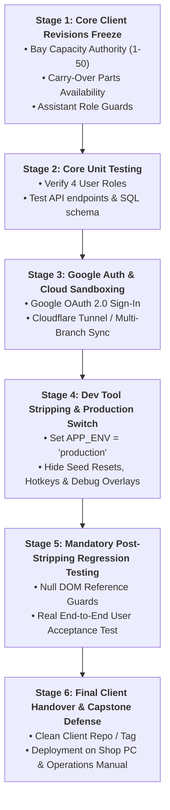

# HonTech Developer vs. Client System Architecture & Phased Delivery Protocol
**Document Version**: `v1.2.0-Enterprise`  
**Classification**: Technical Architecture, SOP & Quality Assurance Standard  
**Target Repository**: `Hontech_Main_Active_Development_PHP_SQL`  
**Active Working Branch**: `branch2-Security-Account-Recovery`  
**Lead Developer**: Justin Nolasco J.  

---

## 1. Executive Summary & Core Engineering Question

### The Core Architectural Question
> *"Is it recommended to have a Developer Version and a Client Version of the system? And what is the exact step-by-step procedure for revisions, testing, Google Auth, Cloud solutions, and client release?"*

### The Engineering Answer
**Yes, absolutely.** In enterprise software engineering, maintaining a clear boundary between **Developer Maintenance Capabilities** (diagnostic overlays, seed resets, rapid mocking tools, SLA simulators) and the **Client Production Application** (clean enterprise UI, strict security, zero dev clutter) is essential to prevent accidental data corruption and ensure a professional user experience.

Rather than maintaining two diverging codebases, HonTech adopts a **Single Codebase, Dual-Mode Environment Architecture** driven by environment switches (`APP_ENV = 'development'` vs `'production'`).

---

## 2. Developer vs. Client System Matrix

| Dimension | 🛠️ Developer Version (`APP_ENV='development'`) | 🏢 Client Production Version (`APP_ENV='production'`) |
| :--- | :--- | :--- |
| **Target User** | Justin Nolasco J., System Architects, QA Team. | HonTech Shop Owner, Admin, Service Advisors, Assistants. |
| **Visual Interface** | Shows Developer Overlays, Debug Banners, `Ctrl+D` Toolbox. | 100% clean, polished, branded interface with zero clutter. |
| **Error Handling** | Red high-contrast diagnostic overlay, stack traces, trace copy. | User-friendly notifications; errors logged silently to server. |
| **Database Operations** | Instant "Reset Database to Seed", mock intake generators. | Strict data protection; seed resets and debug buttons removed. |
| **Authentication** | 1-Click test logins + Full Auth recovery test suite. | Real Google OAuth 2.0 + Secure Password & PIN login. |
| **Network & Performance** | Verbose console logs, API inspection timers. | Optimized script execution, cached assets, minified requests. |

---

## 3. The 6-Stage Phased Delivery Lifecycle

---

## 4. Detailed Stage Protocols

### Stage 1: Core Client Revisions Freeze (Completed)
* **Goal**: Deliver all operational floor requirements requested by the client.
* **Scope Completed**:
  - **Dynamic Bay Capacity**: Owner/Admin configure shop ceiling (1–50); SAs dynamically scale active bays (1–N); TV monitor slide scales automatically.
  - **Assistant Role RBAC**: Removed Bay Status from nav/sidebar; enforced defensive navigation redirect.
  - **Carry-Over Tracking**: Added `Parts & Materials Available?` segmented toggle (`YES`/`NO`) with immediate database syncing and modal controls.
* **Exit Gate**: All revision items tested and functioning in local development.

---

### Stage 2: Intermediate Unit Testing & Role Verification
* **Goal**: Validate that all 4 user roles interact properly with newly added columns, tables, and settings.
* **Verification Scope**:
  1. **Owner Role**: Full access, bay ceiling configuration, system analytics, user management.
  2. **Admin Role**: Bay ceiling configuration, floor monitoring, SLA delay reports.
  3. **Service Advisor (SA)**: Active bay scaling (up to ceiling), ticket intake, carry-over parts toggle (`YES`/`NO`).
  4. **Assistant Role**: Read-only job cards, queue monitoring, strict lockout from Bay Status.

---

### Stage 3: Google OAuth 2.0 & Cloud Solutions Sandboxing
* **Goal**: Implement secure single sign-on and cloud multi-branch architecture in an isolated sandbox.
* **Safety Protocol**:
  - Implement Google OAuth using isolated endpoints (`backend/api/auth/google_callback.php`).
  - Configure client credentials via `.env` without hardcoding keys.
  - Test cloud tunneling (Cloudflare Tunnel) or Supabase adapter without modifying the core PHP/MySQL engine.

---

### Stage 4: Developer Tool Stripping & Production Hardening
* **Goal**: Deactivate all developer diagnostic tools to produce a 100% clean client application.
* **Actions**:
  1. Set `APP_ENV = 'production'` in `frontend/js/app.js` and `backend/config.php`.
  2. Disable hotkeys (e.g. `Ctrl + D` developer toolbox).
  3. Remove or hide all "Reset Database Seed", "Mock Generate", and test bypass buttons.
  4. Ensure server errors are written to `/logs/app.log` rather than rendered in popups.

---

### Stage 5: Mandatory Post-Stripping Regression Unit Testing
* **Critical Rule**: **Never hand over the system immediately after removing dev tools without running a full regression test.**
* **Why This Is Mandatory**:
  - If production code references a DOM element that was part of the removed dev panel, it could trigger `Uncaught TypeError: Cannot read properties of null` and crash the UI.
  - Testing after stripping proves that all defensive guards (`if (document.getElementById(...))`) are working correctly.
* **Test Matrix**:
  - [ ] Log in with clean credentials (no test mock buttons).
  - [ ] Verify zero console errors (`F12` console is completely clean).
  - [ ] Create, update, and release a vehicle ticket.
  - [ ] Toggle carry-over parts availability.
  - [ ] Run TV Display fullscreen mode for 3 full slide cycles.

---

### Stage 6: Final Client Handover & Deployment
* **Deliverables**:
  1. Tagged Git Release: `v2.0-Production-Client`.
  2. Clean Database SQL: `hontech_db_schema_v2.sql` with zero dummy data.
  3. Client Documentation: [HONTECH_ENTERPRISE_DEPLOYMENT_AND_OPERATIONS_MANUAL.md](file:///c:/xampp/htdocs/CapstoneOfficial2_Development_Part-2-Hontech_Main_Active_Development_Branch2-Security-Account-Recovery/CapstoneOfficial2_Development_Part-2-Hontech_Main_Active_Development/Hontech%20Documentation/Technical/HONTECH_ENTERPRISE_DEPLOYMENT_AND_OPERATIONS_MANUAL.md).
  4. Local Server Setup / Cloud link provided to the client.

---

## 5. Summary Engineering Checklist

- [x] Documented Developer vs. Client Dual-System Standard.
- [x] Defined mandatory Post-Stripping Regression Testing requirement.
- [x] Outlined exact 6-stage lifecycle from revisions to client release.
- [ ] Proceed to Stage 2: Unit Testing execution.
