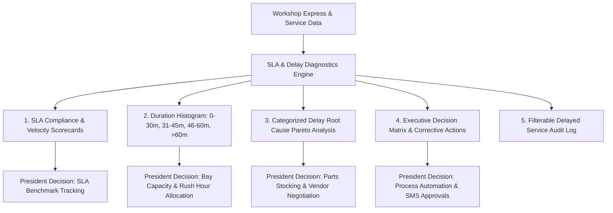

# ⚡ Executive Plan: Express Lane SLA & Delay Root Cause Intelligence Center
## Decision-Making Dashboard for HonTech President & Executive Management

> **Author:** Justin Nolasco J. (Lead Systems Architect)  
> **Target Persona:** HonTech President / General Manager / Operations Executive  
> **Core Objective:** Provide actionable operational intelligence on **Express Lane Turnaround Target (≤ 60 mins)**, **SLA Fulfillment**, and **Categorized Root Causes for Delays & Unsuccessful Services**.

---

## 1. 🎯 Executive Rationale & Problem Statement

### Why the President Needs This Dedicated View:
* **The Promise**: HonTech promises customers a **≤ 60-minute turnaround** on Express Lane services (Quick Oil Change, Filter Replacement, Multi-Point Checkup).
* **The Risk**: When Express services exceed 60 minutes or fail SLA, customer satisfaction plummets and workshop bays become clogged.
* **The Decision Gap**: Currently, delays are viewed only as raw numbers. The President needs **root cause categorization** (Parts shortage? Customer approval delay? Bay bottleneck?) to make high-impact strategic decisions (e.g., ordering parts inventory, adjusting technician shifts, or implementing digital approvals).

---

## 2. 🏛️ Proposed Architecture & New Dedicated Tab

We will introduce a new dedicated top-level dashboard tab:
* **Tab Navigation Title**: `⚡ Express Lane & Delay Intelligence` (`#btn-db-tab-express` / `#db-tab-express`)
* **Location**: Added alongside `Live Operations Monitor`, `Analytics & Reports Center`, and `Report Data (Intake & Flow)`.

---

## 3. 📊 What the Dedicated Tab Will Contain

### Section 1: Executive KPI Header & Date Filters
* **Date & Branch Filter**: Preset filters (Today, Past 7 Days, Month, Custom Range, Branch Selector).
* **4 Executive Summary KPI Cards** (Sleek Slate Monochrome Theme):
  1. **SLA Compliance Rate**: Target `% of Express jobs finished ≤ 60 mins` (e.g., `88.5% On-Time`, target: `≥ 90%`).
  2. **Average Express Turnaround Time**: e.g., `43 mins` (compared to 60m threshold).
  3. **Total Delayed / Unsuccessful Services**: Number of jobs exceeding SLA.
  4. **Primary Operational Bottleneck**: Top ranked delay category (e.g., `Parts Stockout (42%)`).

---

### Section 2: Two Interactive Executive Visual Graphs (Chart.js)
1. **Graph A: Turnaround Duration Distribution (Histogram)**
   * Groups completed express services into clear SLA performance buckets:
     * `0–30 mins` (Rapid Turnaround - High Efficiency)
     * `31–45 mins` (Optimal Express Service)
     * `46–60 mins` (Target Boundary - SLA Warning Zone)
     * `61–90 mins` (SLA Breach - Unsuccessful Service)
     * `> 90 mins` (Severe Delay - Process Breakdown)
2. **Graph B: Delay Root Causes Categorization (Horizontal Bar / Pareto Chart)**
   * Categorizes 100% of delayed jobs into standard automotive failure modes:
     * 📦 **Parts Stockout / Supplier Delay** (Waiting for filters, brake pads, fluids).
     * 📞 **Customer Approval / Additional Scope Delay** (Waiting for customer quote confirmation).
     * ⏳ **Bay & Lift Bottleneck** (Preceding vehicle overstayed on lift).
     * ⚠️ **Unexpected Mechanical / Electrical Complexity** (Seized bolts, wiring issues found during service).
     * 🔍 **Quality Control (QC) Failure / Rework** (Re-inspection required).

---

### Section 3: Automated Executive Decision Matrix (President Insights)
The system analyzes real-time patterns and provides automated, actionable recommendations:
* 📦 **Parts Inventory Trigger**: *"If Parts Delays > 30%, recommend increasing PMS safety stock levels."*
* 📱 **Customer Authorization Trigger**: *"If Customer Approval Lag > 25 mins, recommend enabling SMS 1-click approvals."*
* 🕒 **Rush-Hour Express Prioritization**: *"If delays concentrate between 9 AM - 11 AM, dedicate Lift 1 exclusively to Express PMS."*

---

### Section 4: Filterable Delayed Services Diagnostic Audit Log
A clean, high-density table listing every delayed job for managerial accountability:
* `Claim Stub #` & `Plate No.`
* `Vehicle Model & Category`
* `Arrival Time` ➔ `Departure Time` ➔ `Actual Duration` (e.g., `74 mins` | `+14m Over`)
* `Assigned Service Advisor & Lead Technician`
* `Logged Root Cause Category` (e.g., *Parts Waiting*)
* `Diagnostic Notes & Corrective Remarks`

---

## 4. 🛠️ Proposed Changes

| Component | File | Changes |
| :--- | :--- | :--- |
| **Tab Navigation** | [`frontend/index.html`](file:///c:/xampp/htdocs/CapstoneOfficial2_Development_Part-2-Hontech_Main_Active_Development_Branch2-Security-Account-Recovery/CapstoneOfficial2_Development_Part-2-Hontech_Main_Active_Development/frontend/index.html) | Add `#btn-db-tab-express` tab button in dashboard navigation bar. |
| **Tab Container UI** | [`frontend/index.html`](file:///c:/xampp/htdocs/CapstoneOfficial2_Development_Part-2-Hontech_Main_Active_Development_Branch2-Security-Account-Recovery/CapstoneOfficial2_Development_Part-2-Hontech_Main_Active_Development/frontend/index.html) | Create `#db-tab-express` container with 4 KPI cards, 2 Chart.js canvases, Decision Matrix card, and Diagnostic table. |
| **Tab Switcher Logic** | [`frontend/js/app.js`](file:///c:/xampp/htdocs/CapstoneOfficial2_Development_Part-2-Hontech_Main_Active_Development_Branch2-Security-Account-Recovery/CapstoneOfficial2_Development_Part-2-Hontech_Main_Active_Development/frontend/js/app.js) | Extend `switchDashboardTab('express')` to show container and trigger render. |
| **Analytics Engine** | [`frontend/js/app.js`](file:///c:/xampp/htdocs/CapstoneOfficial2_Development_Part-2-Hontech_Main_Active_Development_Branch2-Security-Account-Recovery/CapstoneOfficial2_Development_Part-2-Hontech_Main_Active_Development/frontend/js/app.js) | Implement `renderExpressIntelligenceModule()` computing duration buckets, delay categorization, Chart.js rendering, and decision matrix generation. |
| **Version Cache** | [`frontend/index.html`](file:///c:/xampp/htdocs/CapstoneOfficial2_Development_Part-2-Hontech_Main_Active_Development_Branch2-Security-Account-Recovery/CapstoneOfficial2_Development_Part-2-Hontech_Main_Active_Development/frontend/index.html) | Bump query parameter to `js/app.js?v=3.40`. |

---

## 5. 🔍 Verification Plan

1. **Tab Switch Test**: Click `Express Lane & Delay Intelligence` tab in top subnav and verify smooth view transition.
2. **Chart Rendering Test**: Verify both Turnaround Distribution and Delay Root Cause charts render with clean tooltips and zero canvas errors.
3. **Filter Test**: Change date range and branch scope; ensure all KPI cards, charts, and table rows update reactively.
4. **Export Test**: Verify 1-click CSV export of the delayed services diagnostic log.
