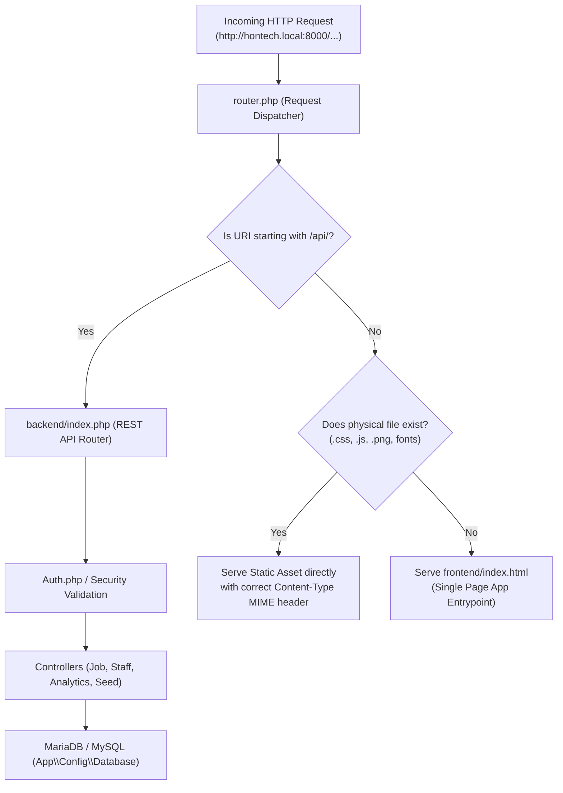

# 🚗 HONTECH AUTOCENTER MANAGEMENT SYSTEM
## 🌐 Official Domain Architecture, Implementation, Testing & Maintenance Manual
### Branch 2: Security & Account Recovery | Production & Enterprise Standard

```text
========================================================================================================
PROJECT:               HonTech AutoCenter Operations & Management System
DOCUMENT TYPE:         Official Systems Architecture & IT Operations Manual
VERSION:               2.2 (Enterprise & Capstone Production Standard)
TARGET AUDIENCE:       Lead Developers, IT System Administrators, Capstone Panel, Client Management
DATE COMPILED:         August 2026
CLASSIFICATION:        Technical Standard & Operating Procedure (SOP)
========================================================================================================
```

---

## 📌 Executive Table of Contents
1. [Executive Summary & Core Architectural Philosophy](#1-executive-summary--core-architectural-philosophy)
   - 1.1 The Business & Operational Problem
   - 1.2 The Hybrid On-Premises Architecture Solution
   - 1.3 Financial Transparency & Zero Client Headache Guarantee (100% Free ₱0.00 Model)
   - 1.4 Complete Data Sovereignty & 100% On-Premises Ownership (Zero 3rd-Party Databases & RA 10173)
2. [How the Local Domain Works (Deep Dive)](#2-how-the-local-domain-works-deep-dive)
   - 2.1 The Concept of Local vs Public Domains
   - 2.2 Network Topology & Request Routing
   - 2.3 The Three (3) Local Domain Addressing Modes
   - 2.4 Internal Request Routing Flow (`router.php` & Backend Architecture)
   - 2.5 Single-Server Multi-Branch Hub Architecture (4 Service Advisor Terminals)
   - 2.6 Dual-SSID Wi-Fi Isolation (Employee Wi-Fi vs Customer Lounge Wi-Fi)
3. [Step-by-Step Implementation Guide](#3-step-by-step-implementation-guide)
   - 3.1 Step 1: Server Machine Network Configuration (Static IP / DHCP Reservation)
   - 3.2 Step 2: Local Domain Name Setup (mDNS, Router DNS, or Hosts)
   - 3.3 Step 3: Windows Firewall Inbound Rules Configuration
   - 3.4 Step 4: Web Server & Port Binding (Port 8000 vs Port 80)
   - 3.5 Step 5: Automated 1-Click Server Startup (`start_lan_server.bat`)
   - 3.6 Step 6: Nationwide Remote Tunneling Setup (Cloudflare Quick Tunnels / Localtunnel)
   - 3.7 Step 7: Daily Step-by-Step Staff Operational Runbook (4 Advisor PCs & 2 Branches)
4. [Testing, Quality Assurance & Verification Protocols](#4-testing-quality-assurance--verification-protocols)
   - 4.1 Process 1: Server & Network Pre-Flight Integrity Verification
   - 4.2 Process 2: Multi-Device LAN & Dual-SSID Wi-Fi Isolation Testing
   - 4.3 Process 3: Real-Time Concurrency & Bay State Synchronization Testing
   - 4.4 Process 4: Security, RBAC & Data Sovereignty Audit (RA 10173)
   - 4.5 Process 5: Disaster Recovery & Power Loss Auto-Restoration Protocol
   - 4.6 Master Pre-Deployment & Infrastructure Readiness Checklist (The 20-Point Radar)
5. [Maintenance, Diagnostics & Troubleshooting Runbook](#5-maintenance-diagnostics--troubleshooting-runbook)
   - 5.1 Issue 1: "ERR_CONNECTION_REFUSED" or "ERR_CONNECTION_TIMED_OUT"
   - 5.2 Issue 2: "DNS_PROBE_FINISHED_NXDOMAIN" (Domain Not Resolving)
   - 5.3 Issue 3: "Database Connection Failed (SQLSTATE[HY000] [2002])"
   - 5.4 Issue 4: "Port 8000 Already in Use"
   - 5.5 Issue 5: "Static Assets or API Endpoints Returning 404"
   - 5.6 Issue 6: "TV Screen Lagging or Mobile Audio Chimes Not Playing"
   - 5.7 Routine Preventive Maintenance & Backup Procedures
   - 5.8 24/7 Operations, Meralco Electricity Analysis & Zero-Touch Outage Auto-Recovery
   - 5.9 Dedicated UPS Emergency Battery Backup & Graceful Shutdown SOP
6. [Academic Defense & Client Stakeholder Q&A Cheat Sheet](#6-academic-defense--client-stakeholder-qa-cheat-sheet)

---

## 1. Executive Summary & Core Architectural Philosophy

### 1.1 The Business & Operational Problem
In an automotive repair and maintenance facility like **HonTech AutoCenter**, workshop operations are time-critical and continuous. Mechanics, Service Advisors (SAs), cashiers, and waiting customers rely on instantaneous data synchronization across workshop bays, intake terminals, and waiting lounge TV monitors.

Traditional web applications rely entirely on remote cloud servers (AWS, Google Cloud, Vercel) and public top-level domains (`.com`, `.ph`). However, for a physical auto shop, complete cloud dependency introduces critical vulnerabilities:
* **Internet Outage Bottleneck:** If the local Internet Service Provider (ISP) drops connection, the entire workshop halts—mechanics cannot see assigned jobs, vehicle intake stops, and waiting lounge screens go blank.
* **Recurring Financial Costs:** Commercial cloud hosting, database clusters, and domain registration impose recurring monthly and annual subscription fees (₱2,500 – ₱6,000+ per month).
* **Data Privacy Regulations:** Storing customer contact numbers, vehicle plate numbers, and billing details on foreign cloud servers raises compliance overhead under the **Philippine Data Privacy Act of 2012 (RA 10173)**.

### 1.2 The Hybrid On-Premises Architecture Solution
The **HonTech Operations System** is architected to operate on an **On-Premises Local Area Network (LAN)**:
* **Zero Recurring Fees (₱0.00/month):** Uses the shop's existing hardware, local DNS/mDNS resolution, and built-in database engines.
* **100% Offline Immunity:** All workshop workflows (vehicle intake, bay allocation, TV bay monitors, claim stubs, billing calculations) run at maximum gigabit speed inside the shop even during complete ISP failures.
* **Cloud-Augmented:** Cloud APIs (such as Google Identity OAuth 2.0 and Cloudflare Zero-Trust Tunnels) are utilized strictly as non-blocking enhancements for 2FA logins and remote executive presentations.

### 1.3 Financial Transparency & Zero Client Headache Guarantee (100% Free ₱0.00 Model)

```
┌──────────────────────────────────────────────────────────────────────────────────────────────────┐
│                             100% FREE SOFTWARE & NETWORK BREAKDOWN                               │
├───────────────────────────────────┬──────────────────────────────────────────────────────────────┤
│ COMPONENT                         │ COST TO CLIENT (MONTHLY & ANNUAL)                            │
├───────────────────────────────────┼──────────────────────────────────────────────────────────────┤
│ 🌐 Local Domain (`.local` / DNS)  │ ₱0.00 (Uses local router/mDNS; no GoDaddy/Namecheap needed)  │
│ 🖥️ Web & API Server (PHP 8.0/8.2) │ ₱0.00 (Open-source built-in engine; no cloud VPS fees)       │
│ 🗄️ Database (MariaDB / MySQL)     │ ₱0.00 (Open-source on-premises database; no AWS RDS fees)    │
│ 🔐 Google Identity OAuth 2.0      │ ₱0.00 (Google's official Free Tier allows up to 50,000 users)│
│ 📱 Mobile Device App Access       │ ₱0.00 (Responsive web app; no Apple/Google developer fees)   │
│ 🚀 Remote Demos (Cloudflare/LT)   │ ₱0.00 (Free zero-trust reverse tunneling)                    │
├───────────────────────────────────┼──────────────────────────────────────────────────────────────┤
│ 🏷️ TOTAL RECURRING SOFTWARE COST  │ ₱0.00 / month  |  ₱0.00 / year                               │
└───────────────────────────────────┴──────────────────────────────────────────────────────────────┘
```

#### How We Eliminate the Four (4) Common Client Headaches:
1. **No Outage Panic:** When heavy rain or ISP fiber cuts knock down the internet, intake and bay dispatching continue working at 100% speed locally.
2. **No Technical Complexity:** Staff do not write code or configure command prompts. Starting the system is a 1-click execution ([`start_lan_server.bat`](file:///c:/xampp/htdocs/CapstoneOfficial2_Development_Part-2-Hontech_Main_Active_Development_Branch2-Security-Account-Recovery/CapstoneOfficial2_Development_Part-2-Hontech_Main_Active_Development/start_lan_server.bat)), and mobile pairing uses an instant on-screen QR Code.
3. **No Compliance & Data Leak Anxiety:** Customer phone numbers, repair histories, and receipts never leave the physical workshop, ensuring 100% compliance with the **Philippine Data Privacy Act of 2012 (RA 10173)**.
4. **No Data Loss Fear:** 1-click automated daily backups ([`backup_database.bat`](file:///c:/xampp/htdocs/CapstoneOfficial2_Development_Part-2-Hontech_Main_Active_Development_Branch2-Security-Account-Recovery/CapstoneOfficial2_Development_Part-2-Hontech_Main_Active_Development/Hontech%20Documentation/Technical/HONTECH_OFFICIAL_DOMAIN_IMPLEMENTATION_TESTING_AND_MAINTENANCE_MANUAL.md#57-routine-preventive-maintenance--backup-procedures)) ensure full database recovery in under 60 seconds.

#### Client Hardware Options:
* **Option A: 100% Zero Extra Expense (Recommended Baseline):** The client runs the server on an existing shop laptop or desktop PC connected to their existing Wi-Fi router. **Total Expense: ₱0.00.**
* **Option B: Optional Physical Hardware Upgrade (Future Growth):** A dedicated Mini-PC (Core i3/i5, 16GB RAM) and UPS battery surge protector (₱20,000 – ₱25,000 one-time hardware purchase). This is strictly physical hardware, with zero recurring software bills.

### 1.4 Complete Data Sovereignty & 100% On-Premises Ownership (Zero 3rd-Party Databases)

A critical architectural priority for HonTech is **complete data sovereignty**. Unlike commercial SaaS platforms that store sensitive business data on third-party cloud infrastructure, the HonTech Operations System operates with **100% on-premises database containment**:

```
┌──────────────────────────────────────────────────────────────────────────────────────────────────┐
│                            100% ON-PREMISES DATA OWNERSHIP MODEL                                 │
├───────────────────────────────────┬──────────────────────────────────────────────────────────────┤
│ ❌ TRADITIONAL 3RD-PARTY CLOUD     │ 🏆 HONTECH ON-PREMISES DATABASE (OUR ARCHITECTURE)           │
├───────────────────────────────────┼──────────────────────────────────────────────────────────────┤
│ • Data stored on foreign AWS/     │ • Data stored on the physical SSD drive inside the shop:     │
│   Google servers in US/Singapore. │   C:\xampp\mysql\data\hontech\                               │
│ • Monthly cloud storage bills.    │ • ₱0.00 / month forever (No database subscriptions).         │
│ • Risk of vendor lock-in, price   │ • HonTech has 100% permanent ownership of every single       │
│   hikes, or account suspension.   │   byte. No vendor can ever lock the company out.             │
│ • Third-party cloud data breaches │ • 100% insulated from internet scrapers and foreign breaches.│
└───────────────────────────────────┴──────────────────────────────────────────────────────────────┘
```

#### Why This Matters for HonTech AutoCenter:
1. **Zero Third-Party Databases:** There is NO MongoDB Atlas, NO AWS RDS, NO Firebase, and NO Supabase. The MariaDB/MySQL database engine is installed directly on the shop's central server.
2. **Absolute Data Privacy Compliance (RA 10173):** Customer phone numbers, vehicle license plates, repair estimates, and invoice totals remain physically contained within the shop premises, fully insulated from international cloud data subpoenas or leaks.
3. **Total Business Independence:** The company has permanent, unalienable access to its own raw SQL tables and transaction history with zero recurring cloud storage invoices.

### 1.5 Strengths & Weaknesses: On-Premises Local Server vs. Cloud Solutions (AWS/Vercel)

```
┌──────────────────────────────────────────────────────────────────────────────────────────────────┐
│                   STRENGTHS & WEAKNESSES: ON-PREMISES LOCAL vs. CLOUD SOLUTIONS                  │
├───────────────────────────────────┬──────────────────────────────────────────────────────────────┤
│ 🏆 HONTECH ON-PREMISES SYSTEM     │ ☁️ TRADITIONAL CLOUD HOSTING (AWS / VERCEL / FIREBASE)       │
├───────────────────────────────────┼──────────────────────────────────────────────────────────────┤
│ ✅ **STRENGTHS:**                 │ ✅ **STRENGTHS:**                                            │
│ • **₱0.00 Monthly Software Cost:**│ • Accessible from anywhere in the world by default.          │
│   Zero server bills, zero DB fees.│ • Automatic hardware management by Amazon / Google.          │
│ • **100% Offline Immunity:** Runs │                                                              │
│   at full gigabit LAN speed even  │ ❌ **WEAKNESSES:**                                           │
│   if PLDT / Globe internet drops. │ • **Internet Dependency:** If the shop internet drops, the   │
│ • **Data Privacy Sovereignty:**   │   entire workshop freezes—mechanics cannot see jobs.         │
│   Customer phone numbers & sales  │ • **Expensive Monthly Bills:** Database clusters and VPS     │
│   stay physically inside the shop │   servers cost **₱2,500 – ₱6,000+ PHP / month**.             │
│   (100% RA 10173 compliant).      │ • **Data Privacy Risks:** Customer records stored on foreign │
│                                   │   cloud servers in Singapore / US.                           │
│ ⚠️ **WEAKNESSES & MITIGATIONS:**   │ • **Vendor Lock-in:** Cloud providers can raise prices or    │
│ • Remote branch requires tunnel   │   suspend accounts at any time.                              │
│   (Solved via free Cloudflare).   │                                                              │
│ • Physical server needs power     │                                                              │
│   (Solved via laptop battery/UPS).│                                                              │
└───────────────────────────────────┴──────────────────────────────────────────────────────────────┘
```

### 1.6 Real-World Offline Example: What Happens During Heavy Rains & Internet Outages?

```
┌──────────────────────────────────────────────────────────────────────────────────────────────────┐
│              REAL-WORLD SCENARIO: A HEAVY THUNDERSTORM HITS MARIKINA & PLDT FIBER DIES           │
├──────────────────────────────────────────────────────────────────────────────────────────────────┤
│ ⛈️ 09:30 AM: Heavy rain knocks down the PLDT fiber internet connection in Marikina.             │
│                                                                                                  │
│ ❌ IN A CLOUD-BASED SHOP (AWS / Vercel):                                                         │
│ • The browser displays "No Internet Connection (ERR_INTERNET_DISCONNECTED)".                     │
│ • Service Advisors cannot open repair orders.                                                    │
│ • Mechanics stop working because they cannot see bay assignments.                                │
│ • Customers in the waiting lounge get frustrated. Operations completely halt.                   │
│                                                                                                  │
│ 🏆 IN HONTECH AUTO-CENTER (OUR LOCAL ON-PREMISES SYSTEM):                                         │
│ • The local Wi-Fi router continues broadcasting inside the shop building.                        │
│ • Service Advisors 1 & 2 continue creating vehicle intakes at full **1 Gbps gigabit speed**.     │
│ • Claim stubs print instantly on the front desk thermal printer.                                 │
│ • Mechanics continue working on Bays 1–10, and the Waiting Lounge TV updates seamlessly.        │
│ • **Result: The workshop experiences 0 seconds of downtime and zero lost revenue!**               │
└──────────────────────────────────────────────────────────────────────────────────────────────────┘
```

---

## 2. How the Local Domain Works (Deep Dive)

### 2.1 The Concept of Local vs Public Domains

```
┌──────────────────────────────────────────────────────────────────────────────────────────────────┐
│                                 PUBLIC INTERNET vs LOCAL DOMAIN                                  │
├───────────────────────────────────┬──────────────────────────────────────────────────────────────┤
│ PUBLIC DOMAIN (e.g. google.com)   │ LOCAL DOMAIN (e.g. hontech-marikina.local / hontech.local)   │
├───────────────────────────────────┼──────────────────────────────────────────────────────────────┤
│ • Registered with global ICANN.   │ • Resolved internally within the shop's local Wi-Fi router.  │
│ • Requires paid annual fee (~₱800)│ • 100% Free (₱0.00). No registration or registrar needed.     │
│ • Requires active internet link.  │ • Works with zero internet connection (100% offline).        │
│ • Slower due to external routing. │ • Ultra-fast LAN latency (< 5 milliseconds).                 │
└───────────────────────────────────┴──────────────────────────────────────────────────────────────┘
```

### 2.2 Network Topology & Request Routing

```
                                  [ OUTSIDE INTERNET (ISP) ]
                                               │ (Only for Google OAuth & Remote Demos)
                                               ▼
                               ┌─────────────────────────────────┐
                               │     GIGABIT WI-FI 6 ROUTER      │
                               │     IP Gateway: 192.168.1.1     │
                               │     Local DNS: hontech.local    │
                               └────────────────┬────────────────┘
                                                │
                ┌───────────────────────────────┼───────────────────────────────┐
                │ Wired Cat6 Ethernet (1 Gbps)  │ 5GHz Wi-Fi Network            │ HDMI / Wi-Fi LAN
                ▼                               ▼                               ▼
      ┌───────────────────┐           ┌───────────────────┐           ┌───────────────────┐
      │  ON-PREM SERVER   │           │ SERVICE ADVISORS  │           │ TV SERVICE BAY    │
      │  192.168.1.100    │           │ & SHOP TABLETS    │           │ DISPLAY MONITOR   │
      │ (hontech.local)   │           │ (192.168.1.10-50) │           │ (192.168.1.80)    │
      │ • PHP 8.0 Engine  │           │ • Vehicle Intake  │           │ • Live Slide 1-3  │
      │ • MariaDB / MySQL │           │ • Bay Dispatch    │           │ • Audio Chimes    │
      │ • Port 8000 / 80  │           │ • Claim Stubs     │           │ • Ready Banners   │
      └───────────────────┘           └───────────────────┘           └───────────────────┘
```

### 2.3 The Three (3) Local Domain Addressing Modes

The HonTech architecture provides 3 distinct methods for client devices (phones, tablets, TVs, laptops) to connect to the central server:

| Addressing Method | Example URL | Resolution Mechanism | Best Use Case |
| :--- | :--- | :--- | :--- |
| **1. Zero-Config mDNS (Multicast DNS)** | `http://hontech-marikina.local:8000` | Uses standard mDNS protocol (Apple Bonjour / Windows LLMNR / Avahi). Devices broadcast to `224.0.0.251` to find the computer name. | iOS Safari (iPads/iPhones), macOS, modern Android Chrome, Windows 10/11 laptops. |
| **2. Router Static DNS Mapping** | `http://hontech.local:8000` or `http://hontech.ph:8000` | The workshop router (e.g. TP-Link, Asus, MikroTik) is configured with a Local DNS record mapping the domain name to the static server IP (`192.168.1.100`). | Workshop production setup. Works on every device on the Wi-Fi with zero setup per device. |
| **3. Direct Static LAN IP** | `http://192.168.1.100:8000` | Raw IPv4 address assigned to the host server machine. | Universal fallback for all legacy hardware, Smart TVs, and basic tablets. |

---

### 2.4 Internal Request Routing Flow (`router.php` & Backend Architecture)

When a request arrives at the server machine on port `8000`, the PHP built-in server processes it through `router.php`. The router acts as a high-performance, zero-overhead reverse proxy simulating production `.htaccess` rewrite rules:



1. **API Requests (`/api/*`):** Directed immediately to `backend/index.php`. The request is evaluated for HTTP-Only JWT authentication cookies, database queries are executed with prepared statements via PDO, and clean JSON responses are returned.
2. **Static Asset Requests (`.css`, `.js`, `.png`, fonts):** Directly matched against the filesystem in `/frontend` or root, served with appropriate MIME headers (`text/css`, `application/javascript`, `image/png`, etc.).
3. **Single Page Application (SPA) Fallback:** Any non-file route (e.g. `/dashboard`, `/intake`, `/track`) automatically loads `frontend/index.html`, allowing client-side routing to function without server-side 404 errors.

---

### 2.5 Single-Server Multi-Branch Hub Architecture (4 Service Advisor Terminals)

HonTech AutoCenter utilizes a **Centralized Single-Server Hub Architecture** with multi-branch remote access. In this setup, **one central host server machine** is deployed at the Main Branch (Branch 1: Marikina), and client devices across both branches (a total of 4 Service Advisor PCs) connect directly to this single source of truth database.

```
┌──────────────────────────────────────────────────────────────────────────────────────────────────┐
│             HONTECH CENTRALIZED SINGLE-SERVER HUB ARCHITECTURE (4 ADVISORS, 2 BRANCHES)          │
├──────────────────────────────────────────────────────────────────────────────────────────────────┤
│                                 MAIN BRANCH (BRANCH 1: MARIKINA)                                 │
│                                                                                                  │
│   ┌──────────────────────────────────────────────────────────────────────────────────────────┐   │
│   │                        CENTRAL HOST SERVER (192.168.1.100)                               │   │
│   │       • PHP 8.0/8.2 Engine (router.php)  • MariaDB / MySQL Central Database              │   │
│   │       • Port 8000 & Cloudflare Zero-Trust Secure Tunnel Connector                        │   │
│   └─────────────────────────────┬───────────────────────────────┬────────────────────────────┘   │
│                                 │ (Local Gigabit Wi-Fi / LAN)   │                                │
│                                 ▼                               ▼                                │
│                   ┌───────────────────────────┐   ┌───────────────────────────┐                  │
│                   │ ADVISOR PC 1 (MARIKINA)   │   │ ADVISOR PC 2 (MARIKINA)   │                  │
│                   │ http://hontech.local:8000 │   │ http://hontech.local:8000 │                  │
│                   │ • Scoped: Marikina Branch │   │ • Scoped: Marikina Branch │                  │
│                   └───────────────────────────┘   └───────────────────────────┘                  │
└─────────────────────────────────────────────────┬────────────────────────────────────────────────┘
                                                  │
                      ┌───────────────────────────┴───────────────────────────┐
                      │ Free Cloudflare Zero-Trust Tunnel (Encrypted HTTPS)   │
                      │ URL: https://portal.hontech-autocenter.com            │
                      └───────────────────────────┬───────────────────────────┘
                                                  │
┌─────────────────────────────────────────────────▼────────────────────────────────────────────────┐
│                              SECONDARY BRANCH (BRANCH 2: MAKATI)                                 │
│                                                                                                  │
│                   ┌───────────────────────────┐   ┌───────────────────────────┐                  │
│                   │ ADVISOR PC 3 (MAKATI)     │   │ ADVISOR PC 4 (MAKATI)     │                  │
│                   │ https://portal.hontech... │   │ https://portal.hontech... │                  │
│                   │ • Scoped: Makati Branch   │   │ • Scoped: Makati Branch   │                  │
│                   └───────────────────────────┘   └───────────────────────────┘                  │
└──────────────────────────────────────────────────────────────────────────────────────────────────┘
```

#### 1. Detailed Hardware Specifications & Workstation Design (By Role):

```
┌──────────────────────────────────────────────────────────────────────────────────────────────────┐
│                         HONTECH HARDWARE SPECIFICATION & WORKSTATION MATRIX                      │
├─────────────────────┬─────────────────────────────────┬──────────────────────────────────────────┤
│ WORKSTATION ROLE    │ RECOMMENDED HARDWARE SPEC       │ PERIPHERALS & WORKSPACE DESIGN           │
├─────────────────────┼─────────────────────────────────┼──────────────────────────────────────────┤
│ 🖥️ Central Host     │ • Baseline: Existing Office PC  │ • Wired 1Gbps Cat6 Ethernet to Router    │
│    Server (Branch 1)│   or Laptop (4GB–8GB RAM, 128GB)│ • 1000VA UPS Battery with Built-in AVR   │
│                     │ • Upgrade: Mini-PC (N100/i3/R3) │ • Elevated shelf off floor (Dust/Oil Free│
│                     │ • RAM Usage: ~400MB (Very Light)│ • Running 24/7 with Sleep Mode Disabled  │
├─────────────────────┼─────────────────────────────────┼──────────────────────────────────────────┤
│ 👨‍💼 4 Service Advisor│ • Form Factor: All-in-One (AIO) │ • 80mm USB Thermal Claim Stub Printer    │
│    Terminals (PCs   │   PC or 15.6" Laptop            │ • 2D Barcode / QR Code Handheld Scanner  │
│    1, 2, 3, 4)      │ • CPU: Any dual-core / 4GB–8GB  │ • Countertop front-desk ergonomic layout │
│                     │ • Storage: 128GB–256GB SSD      │ • Dual-branch scoping (Marikina/Makati)  │
├─────────────────────┼─────────────────────────────────┼──────────────────────────────────────────┤
│ 👩‍💻 Assistant /      │ • Form Factor: 14"–15.6" Laptop │ • Standard desktop mouse & keyboard      │
│    Receptionist     │ • CPU: Basic Laptop / 4GB–8GB   │ • Online booking verification screen     │
│    Terminal         │ • Storage: 128GB SSD            │ • Customer phone inquiry dispatching     │
├─────────────────────┼─────────────────────────────────┼──────────────────────────────────────────┤
│ 💳 Cashier &        │ • Form Factor: Desktop / Laptop │ • 80mm ESC/POS Receipt Printer           │
│    Billing Station  │ • CPU: Basic PC / 4GB–8GB RAM   │ • Cash drawer trigger + Barcode Scanner  │
│                     │ • Storage: 128GB SSD            │ • Vehicle release authorization station  │
├─────────────────────┼─────────────────────────────────┼──────────────────────────────────────────┤
│ 🔧 Workshop Bay     │ • Form Factor: 10" Android Tab  │ • Heavy-duty shockproof silicone case    │
│    Tablets (Bays    │ • CPU: Octa-core / 3GB–4GB RAM  │ • Magnetic wall mounts at Bays 1–10      │
│    1 to 10)         │ • Screen: 10.1" IPS Touchscreen │ • Oil/Grease resistant screen protector  │
├─────────────────────┼─────────────────────────────────┼──────────────────────────────────────────┤
│ 📺 Waiting Lounge   │ • Form Factor: 43"–55" Smart TV │ • Wall-mounted at Customer Waiting Area  │
│    TV Display Screen│ • Connectivity: HDMI or 5GHz Wi │ • Fullscreen F11 mode (No address bar)   │
│    (Both Branches)  │ • Audio: TV Built-in Speakers   │ • Auto-rotating queue with audio chimes  │
├─────────────────────┼─────────────────────────────────┼──────────────────────────────────────────┤
│ 📱 Owner / GM       │ • Form Factor: Smartphone or    │ • Multi-branch consolidated telemetry    │
│    Executive Device │   Executive Laptop              │ • 1-Click branch toggle (Marikina/Makati)│
│                     │ • Connectivity: Wi-Fi / 4G / 5G │ • Real-time revenue & efficiency charts  │
└─────────────────────┴─────────────────────────────────┴──────────────────────────────────────────┘
```

#### 2. Phase 1 Startup Reality vs. Long-Term Growth Roadmap:
Because HonTech is starting with **10 to 30 vehicles per day**, the entire MySQL database consumes less than **5 Megabytes (MB)** and CPU load is under **3%**. The client can safely launch with **₱0.00 new hardware purchases**:

```
┌──────────────────────────────────────────────────────────────────────────────────────────────────┐
│                               HONTECH GROWTH & SCALING ROADMAP                                   │
├───────────────────────────────┬────────────────────────────────┬─────────────────────────────────┤
│ PHASE / TIME HORIZON          │ WORKLOAD & ESTIMATED DATA SIZE │ HARDWARE NEEDED & COST          │
├───────────────────────────────┼────────────────────────────────┼─────────────────────────────────┤
│ 🚀 PHASE 1: STARTUP & DEFENSE │ • 10 – 30 cars / day           │ **Existing Spare Office Laptop**│
│    (Current Stage)            │ • 4 Service Advisors           │ **or Basic PC (4GB–8GB RAM)**   │
│                               │ • Database Size: ~**5 MB**     │ **Cost: ₱0.00 / month**         │
├───────────────────────────────┼────────────────────────────────┼─────────────────────────────────┤
│ 🏢 PHASE 2: SHOP EXPANSION    │ • 50 – 100 cars / day          │ Basic Mini-PC (₱7,500 one-time) │
│    (1 – 2 Years Later)        │ • 2–3 Branches Active          │ Same software runs smoothly     │
│                               │ • Database Size: ~**50 MB**    │ with **₱0.00 recurring fees**.  │
├───────────────────────────────┼────────────────────────────────┼─────────────────────────────────┤
│ 🌟 PHASE 3: MULTI-CITY FLEET  │ • 500+ cars / day              │ Standard small business server  │
│    (5 Years Later)            │ • 5+ Branches                  │ Database schema already built   │
│                               │ • Database Size: ~**500 MB**   │ to handle multi-branch scoping! │
└───────────────────────────────┴────────────────────────────────┴─────────────────────────────────┘
```

#### 3. Database-Level Multi-Branch Isolation (`database.sql`):
Both the `users` and `jobs` tables contain strict `branch` columns:
```sql
CREATE TABLE `users` (
    `id` INT AUTO_INCREMENT PRIMARY KEY,
    `name` VARCHAR(255) NOT NULL,
    `role` ENUM('owner','admin','assistant','sa') NOT NULL,
    `branch` VARCHAR(100) NOT NULL DEFAULT 'Marikina Branch', ...
);

CREATE TABLE `jobs` (
    `id` INT AUTO_INCREMENT PRIMARY KEY,
    `job_id` VARCHAR(20) NOT NULL UNIQUE,
    `plate` VARCHAR(20) NOT NULL,
    `branch` VARCHAR(20) NOT NULL DEFAULT 'Marikina Branch', ...
);
```

#### 3. Role-Based Scoping & Concurrency Rules:
* **Marikina Advisors (PCs 1 & 2):** Authenticated with `branch = 'Marikina Branch'`. All queries filter `WHERE branch = 'Marikina Branch'`. They only manage Marikina vehicles, bays, and stubs.
* **Makati Advisors (PCs 3 & 4):** Authenticated with `branch = 'Makati Branch'`. All queries filter `WHERE branch = 'Makati Branch'`. They only manage Makati vehicles, bays, and stubs.
* **Owner Role:** Authenticated with `role = 'owner'`. The Owner sees live concurrent activity across all 4 Advisors in real time, with a 1-click branch toggle on their dashboard.

#### 4. Financial & Maintenance Advantages of Single-Server Architecture:
1. **₱0.00 Monthly Software Fees:** Uses 1 central MySQL database and free Cloudflare Tunneling—no cloud VPS bills.
2. **Single Point of Backup:** The daily backup script (`backup_database.bat`) on the central server snapshots **all branches at once** in <60 seconds.
3. **No Database Sync Conflicts:** Because all 4 Advisor PCs write to the same central database, there is zero risk of data drift, duplicate claim stubs, or sync errors.

#### 5. Multi-Branch Network Outage Behavior & 60-Second Failover Protocol:

```
┌──────────────────────────────────────────────────────────────────────────────────────────────────┐
│                            MULTI-BRANCH NETWORK OUTAGE BEHAVIOR MATRIX                           │
├───────────────────────────────────┬──────────────────────────────────────────────────────────────┤
│ OUTAGE SCENARIO                   │ WHAT HAPPENS AT THE WORKSHOP?                                │
├───────────────────────────────────┼──────────────────────────────────────────────────────────────┤
│ 🌧️ **SCENARIO A:**                │ • **Main Branch (Marikina):** The server is physically       │
│ PLDT / Globe fiber internet drops │   located inside Marikina. Service Advisors 1 & 2, Bay       │
│ in Marikina, but internal shop    │   mechanics, and TV screens continue working at **100% speed │
│ Wi-Fi router remains powered on.  │   locally via LAN**! Zero intake slowdown.                   │
│                                   │ • **Makati Branch:** Temporarily pauses connecting until the │
│                                   │   internet link reconnects.                                  │
├───────────────────────────────────┼──────────────────────────────────────────────────────────────┤
│ 🌧️ **SCENARIO B:**                │ • **Main Branch (Marikina):** Continues running normally.    │
│ Internet drops in Makati branch,  │ • **Makati Branch:** Service Advisors simply turn on their   │
│ but Marikina is online.           │   phone's mobile data / pocket Wi-Fi hotspot to reconnect to │
│                                   │   `https://portal.hontech-autocenter.com`!                   │
└───────────────────────────────────┴──────────────────────────────────────────────────────────────┘
```

##### The 60-Second Marikina Internet Backup Failover:
If the Marikina PLDT fiber drops, but management wants Makati to reconnect immediately:
1. Turn on **Mobile Hotspot (Smart / Globe 4G/5G)** on any staff smartphone or plug in a ₱999 prepaid 4G/5G Wi-Fi SIM modem into the Marikina server PC.
2. The Cloudflare tunnel automatically detects the connection and restores the remote encrypted bridge in **under 30 seconds**.
3. Both branches are immediately back online!

---

### 2.6 Dual-SSID Wi-Fi Network Isolation (Employee Wi-Fi vs Customer Lounge Wi-Fi)

To comply strictly with the **Philippine Data Privacy Act of 2012 (RA 10173)** and protect the central server from unauthorized access, the shop router is configured with **two separated wireless networks (SSIDs)**:

```
                               ┌─────────────────────────────────────────┐
                               │       SHOP GIGABIT WI-FI 6 ROUTER       │
                               │          Gateway: 192.168.1.1           │
                               └────────────────────┬────────────────────┘
                                                    │
                 ┌──────────────────────────────────┴──────────────────────────────────┐
                 ▼                                                                     ▼
┌──────────────────────────────────────────────────┐      ┌──────────────────────────────────────────────────┐
│        SSID 1: "HonTech-Staff" (PRIVATE)         │      │        SSID 2: "HonTech-Guest" (PUBLIC)          │
├──────────────────────────────────────────────────┤      ├──────────────────────────────────────────────────┤
│ • Password-Protected WPA3 (Staff Only)           │      │ • Open / Captive Portal for Lounge Customers     │
│ • Full Access to Central Server (192.168.1.100)  │      │ • AP Isolation ENABLED (Clients cannot talk)     │
│ • Connects: Server PC, Advisor PCs, TV Monitor   │      │ • 100% BLOCKED from Central Server IP & MySQL    │
│ • Zero Eavesdropping Risk                        │      │ • Customers enjoy free internet safely           │
└──────────────────────────────────────────────────┘      └──────────────────────────────────────────────────┘
```

#### Key Security Benefits:
1. **Zero Access to Internal Database:** Even if a tech-savvy customer in the waiting lounge attempts to scan the Wi-Fi for port 8000 or MySQL port 3306, the router's **AP / Guest Isolation** blocks them completely.
2. **Bandwidth Priority for Workshop Terminals:** The `HonTech-Staff` network receives guaranteed Quality of Service (QoS) bandwidth so video streaming by lounge customers never slows down vehicle intake.

### 2.7 The Router Reality: How the System Runs on a 100% Default ISP Router

Many clients worry: *"Our shop Wi-Fi router is just a standard, unconfigured modem from PLDT / Globe / Converge. Do we need an IT networking expert to reconfigure it?"*

**NO! Our system is engineered to work plug-and-play on standard default stock routers without special configuration:**
1. **Zero-Config mDNS:** Devices reach the server by typing `http://hontech-marikina.local:8000`. This uses multicast DNS built directly into Windows 10/11, Android, iOS, and macOS.
2. **Instant On-Screen QR Code Pairing:** Staff on mobile phones or tablets can scan the on-screen QR Code on the front desk to connect instantly without typing any IP address manually.
3. **The Only 1-Minute Verification:** Simply ensure **"AP Isolation"** (or Client Isolation) is **DISABLED** on the staff Wi-Fi in the router settings so that terminals can communicate with the server PC.

---

## 3. Step-by-Step Implementation Guide

### 3.1 Step 1: Server Machine Network Configuration (Static IP)

To ensure client devices never lose connection due to dynamic DHCP IP reassignment, assign a fixed IP address to the server machine.

#### Option A: Via Windows PowerShell (Administrator)
Run the following commands in PowerShell as Administrator:
```powershell
# 1. Identify your active Ethernet or Wi-Fi adapter name
Get-NetAdapter

# 2. Set a static IP address (Example: 192.168.1.100, Gateway: 192.168.1.1)
New-NetIPAddress -InterfaceAlias "Ethernet" -IPAddress 192.168.1.100 -PrefixLength 24 -DefaultGateway 192.168.1.1

# 3. Configure primary and secondary DNS
Set-DnsClientServerAddress -InterfaceAlias "Ethernet" -ServerAddresses ("192.168.1.1", "8.8.8.8")
```

#### Option B: Via Router DHCP Reservation (Preferred for Production)
1. Open your web browser and log into the shop router administration portal (typically `http://192.168.1.1`).
2. Navigate to **DHCP Server** $\to$ **Address Reservation** / **Static Lease**.
3. Add the server machine's MAC address and assign it the permanent IP: `192.168.1.100`.

---

### 3.2 Step 2: Local Domain Name Setup

#### Method 1: Zero-Config mDNS (`hontech-marikina.local`)
1. On the host laptop/PC, press **Win + X** $\to$ **System**.
2. Click **Rename this PC** $\to$ enter `hontech-marikina`.
3. Restart the computer.
4. The server is now instantly reachable at:
   👉 `http://hontech-marikina.local:8000`

#### Method 2: Router DNS Mapping (`hontech.local`)
1. Log into your router admin panel (`192.168.1.1`).
2. Navigate to **Advanced Settings** $\to$ **Network** $\to$ **Local DNS** / **Hosts Binding**.
3. Create a new DNS entry:
   * **Domain / Hostname:** `hontech.local` (or `hontech.ph`)
   * **Target IP Address:** `192.168.1.100`
4. Save and apply settings. Now all devices connected to the shop Wi-Fi can simply type:
   👉 `http://hontech.local:8000`

#### Method 3: Windows Development Hosts File (For Host Machine Only)
If testing on a single computer without router access:
1. Open Notepad as **Administrator**.
2. Open `C:\Windows\System32\drivers\etc\hosts`.
3. Add the following line at the bottom:
   ```text
   127.0.0.1    hontech.local
   127.0.0.1    hontech-marikina.local
   ```
4. Save the file.

---

### 3.3 Step 3: Windows Firewall Inbound Rules Configuration

By default, Windows Defender Firewall may block inbound TCP connections from external mobile devices. Open PowerShell as Administrator and run:

```powershell
# Create an inbound firewall rule allowing traffic on Port 8000 and Port 80
New-NetFirewallRule -DisplayName "HonTech AutoCenter Local Server" -Direction Inbound -LocalPort 8000,80 -Protocol TCP -Action Allow -Profile Any
```

To verify the rule is active:
```powershell
Get-NetFirewallRule -DisplayName "HonTech AutoCenter Local Server" | Select-Object DisplayName, Enabled, Direction, Action
```

---

### 3.4 Step 4: Web Server & Port Binding (Port 8000 vs Port 80)

#### Mode A: Standard Development & LAN Port (`0.0.0.0:8000`)
```powershell
# In project root:
php -S 0.0.0.0:8000 router.php
```
*Accessible via:* `http://hontech.local:8000`

#### Mode B: Clean Enterprise Standard Port 80 (No Port Number in URL!)
To remove `:8000` from the browser URL so users simply type `http://hontech.local`:
```powershell
# In PowerShell (Administrator):
php -S 0.0.0.0:80 router.php
```
*Accessible via:* `http://hontech.local`

---

### 3.5 Step 5: Automated 1-Click Server Startup (`start_lan_server.bat`)

The repository includes a production-ready launcher script located in the project root:
👉 [`start_lan_server.bat`](file:///c:/xampp/htdocs/CapstoneOfficial2_Development_Part-2-Hontech_Main_Active_Development_Branch2-Security-Account-Recovery/CapstoneOfficial2_Development_Part-2-Hontech_Main_Active_Development/start_lan_server.bat)

When double-clicked, this batch script:
1. Detects the active host machine IPv4 address from the Windows routing table.
2. Formats and prints clean, clickable access links for both local laptop use and multi-device tablet sharing.
3. Spawns `php -S 0.0.0.0:8000 router.php`.

---

### 3.6 Step 6: Nationwide Remote Tunneling Setup (For Capstone Defense & External Demos)

When presenting to evaluators or accessing the system from mobile data (4G/5G) outside the shop Wi-Fi, use secure HTTPS reverse tunneling:

#### Option A: Instant Localtunnel (Zero Installation)
```bash
# In your terminal:
npx localtunnel --port 8000 --subdomain hontech-marikina
```
*Output:* `https://hontech-marikina.loca.lt`

#### Option B: Cloudflare Quick Tunnels (Recommended for Enterprise Defense)
1. Download `cloudflared.exe` from Cloudflare.
2. Run:
```powershell
cloudflared tunnel --url http://localhost:8000
```
*Output:* Generates a free, 256-bit SSL encrypted URL (e.g. `https://hontech-demo.trycloudflare.com`).

---

### 3.7 Step 7: Daily Step-by-Step Staff Operational Runbook (4 Advisor PCs & 2 Branches)

This runbook defines the exact daily operating procedure for staff members across both branches from morning opening to evening closing:

```
┌──────────────────────────────────────────────────────────────────────────────────────────────────┐
│                           DAILY 4-ADVISOR MULTI-BRANCH WORKFLOW TIMELINE                         │
├───────────────────┬───────────────────────────────────┬──────────────────────────────────────────┤
│ TIME / STAGE      │ WHO EXECUTES                      │ ACTION / PROCEDURE                       │
├───────────────────┼───────────────────────────────────┼──────────────────────────────────────────┤
│ 🕗 07:30 AM       │ Main Server Operator (Marikina)   │ 1. Boot Central PC.                      │
│ (Morning Boot)    │                                   │ 2. Ensure MySQL is Green in XAMPP.       │
│                   │                                   │ 3. Double-click "start_lan_server.bat".  │
│                   │                                   │ 4. Launch Cloudflare Tunnel connector.   │
├───────────────────┼───────────────────────────────────┼──────────────────────────────────────────┤
│ 🕗 07:45 AM       │ Branch 1 SAs (Advisors 1 & 2)     │ 1. Connect to "HonTech-Staff" Wi-Fi.     │
│ (Terminal Login)  │                                   │ 2. Open http://hontech.local:8000.       │
│                   │                                   │ 3. Log in with Marikina SA credentials.  │
├───────────────────┼───────────────────────────────────┼──────────────────────────────────────────┤
│ 🕗 07:45 AM       │ Branch 2 SAs (Advisors 3 & 4)     │ 1. Connect to Makati Office Wi-Fi.       │
│ (Remote Login)    │                                   │ 2. Open https://portal.hontech...        │
│                   │                                   │ 3. Log in with Makati SA credentials.    │
├───────────────────┼───────────────────────────────────┼──────────────────────────────────────────┤
│ 🕗 07:50 AM       │ Front Desk / Lounge Kiosk Staff   │ 1. Open TV screen browser to local URL.  │
│ (TV Kiosk Setup)  │                                   │ 2. Press F11 for Fullscreen Mode.        │
│                   │                                   │ 3. Tap screen once to unlock Bay Chimes. │
├───────────────────┼───────────────────────────────────┼──────────────────────────────────────────┤
│ 🚗 08:00 AM–05 PM │ All 4 Service Advisors            │ 1. Customer arrives $\to$ Click "Intake".│
│ (Live Operations) │ (Concurrent Multi-Branch Intake)  │ 2. Enter plate, vehicle & job concern.   │
│                   │                                   │ 3. Click "Save & Print Claim Stub".      │
│                   │                                   │ 4. Assign vehicle to Bay 1–10.           │
│                   │                                   │ 5. TV Kiosk pulses bay status live.      │
├───────────────────┼───────────────────────────────────┼──────────────────────────────────────────┤
│ 🏁 05:30 PM       │ Central Server Operator (Marikina)│ 1. Export daily revenue report for Owner.│
│ (Evening Closing) │                                   │ 2. Double-click "backup_database.bat".   │
│                   │                                   │ 3. Database snapshot saved in <60 sec.   │
└───────────────────┴───────────────────────────────────┴──────────────────────────────────────────┘
```

#### Detailed Operational Instructions for Staff:

1. **Morning Opening (Branch 1 Central Server):**
   * Turn on the central server PC at Branch 1.
   * Open XAMPP Control Panel $\to$ Start **MySQL** (turns Green).
   * Double-click [`start_lan_server.bat`](file:///c:/xampp/htdocs/CapstoneOfficial2_Development_Part-2-Hontech_Main_Active_Development_Branch2-Security-Account-Recovery/CapstoneOfficial2_Development_Part-2-Hontech_Main_Active_Development/start_lan_server.bat). The server begins listening on `0.0.0.0:8000`.
   * If Branch 2 needs remote access, start the Cloudflare tunnel (`cloudflared tunnel run`).

2. **Branch 1 Service Advisors (Advisors 1 & 2):**
   * Turn on Advisor PCs 1 and 2.
   * Ensure the PC is connected to **"HonTech-Staff"** Wi-Fi (or Ethernet).
   * Open Google Chrome or Microsoft Edge $\to$ Navigate to:  
     👉 **`http://hontech.local:8000`** (or `http://192.168.1.100:8000`).
   * Enter your Service Advisor credentials. The system automatically scopes your dashboard to **Marikina Branch**.

3. **Branch 2 Service Advisors (Advisors 3 & 4):**
   * Turn on Advisor PCs 3 and 4 at the Makati Branch.
   * Connect to the local branch Wi-Fi.
   * Open browser $\to$ Navigate to the secure HTTPS portal:  
     👉 **`https://portal.hontech-autocenter.com`** (or your active Cloudflare tunnel URL).
   * Enter your Service Advisor credentials. The system automatically scopes your dashboard to **Makati Branch**.

4. **Waiting Lounge TV Kiosk Setup:**
   * Open browser on the TV PC $\to$ Navigate to the local URL.
   * Press **F11** on the keyboard to enter clean **Fullscreen Mode**.
   * Click or tap anywhere on the screen once. *(This unlocks the browser's audio permissions so the acoustic bay chime plays whenever a mechanic marks a vehicle as Ready for Release).*

5. **Daytime Vehicle Intake & Bay Allocation (All 4 Advisors):**
   * When a customer drives into the reception bay, the Service Advisor clicks **"Vehicle Intake"**.
   * Fill in the Plate Number, Customer Name, Vehicle Model, and Service Type (e.g. PMS, Brakes, Aircon).
   * Click **"Save & Print Claim Stub"** to hand the paper claim stub to the customer.
   * Select an available workshop bay (e.g. **Bay 2**) $\to$ The waiting lounge TV immediately updates and displays the car in Bay 2.

6. **Evening Closing & 60-Second Database Backup:**
   * At 05:30 PM closing, the cashier or manager exports the daily intake summary.
   * On the Central Server PC, double-click [`backup_database.bat`](file:///c:/xampp/htdocs/CapstoneOfficial2_Development_Part-2-Hontech_Main_Active_Development_Branch2-Security-Account-Recovery/CapstoneOfficial2_Development_Part-2-Hontech_Main_Active_Development/Hontech%20Documentation/Technical/HONTECH_OFFICIAL_DOMAIN_IMPLEMENTATION_TESTING_AND_MAINTENANCE_MANUAL.md#57-routine-preventive-maintenance--backup-procedures).
   * The script generates an encrypted snapshot of all tables across **both branches** into `C:\xampp\htdocs\backups\hontech_YYYY-MM-DD.sql`.

---

## 4. Testing, Quality Assurance & Verification Protocols

This section defines the **five (5) fundamental engineering processes** that mathematically and operationally guarantee our system is configured and running in the right way.

```
┌──────────────────────────────────────────────────────────────────────────────────────────────────┐
│                          THE 5 CORE QUALITY & RELIABILITY VERIFICATION PROCESSES                 │
├───────────────────────────────┬──────────────────────────────────────────────────────────────────┤
│ 1. PRE-FLIGHT INTEGRITY       │ Verify ports, PHP multi-threading & MySQL socket health.         │
│ 2. DUAL-SSID NETWORK ISOLATION│ Verify Staff Wi-Fi accesses port 8000 while Guest Wi-Fi is block │
│ 3. CONCURRENCY & BAY SYNC     │ Verify 4 SAs writing simultaneously with sub-1s TV screen push.  │
│ 4. SECURITY & DATA PRIVACY    │ Verify Branch Isolation (`WHERE branch=...`) & HTTP-Only cookies.│
│ 5. DISASTER AUTO-RECOVERY     │ Verify BIOS auto-boot on AC power return & 60s backup integrity. │
└───────────────────────────────┴──────────────────────────────────────────────────────────────────┘
```

### 4.0 Testing Responsibility Matrix (Lead Programmer vs. QA / Groupmates)

To ensure smooth team execution, testing roles are clearly divided between the **Lead Programmer** and **QA / Groupmates**:

```
┌──────────────────────────────────────────────────────────────────────────────────────────────────┐
│                              TESTING RESPONSIBILITY MATRIX (WHO TESTS WHAT?)                     │
├───────────────────────────────┬───────────────────────────────┬──────────────────────────────────┤
│ TEST SCENARIO                 │ WHO CONDUCTS THE TEST?        │ WHAT ACTION IS PERFORMED?        │
├───────────────────────────────┼───────────────────────────────┼──────────────────────────────────┤
│ ⚙️ **Server Health & Sockets** │ **Lead Programmer (You)**     │ Runs `curl -I http://localhost:` │
│    (Process 1)                │                               │ and checks port 8000 & 3306.     │
├───────────────────────────────┼───────────────────────────────┼──────────────────────────────────┤
│ 📶 **Multi-Device Wi-Fi Test**│ **QA / Groupmates**           │ Connects phones & laptops to LAN │
│    (Process 2)                │                               │ and opens `http://hontech.local`.│
├───────────────────────────────┼───────────────────────────────┼──────────────────────────────────┤
│ 🚗 **4-Advisor Concurrency**   │ **QA / Groupmates**           │ 4 members submit vehicle intakes │
│    (Process 3)                │                               │ at the exact same second.        │
├───────────────────────────────┼───────────────────────────────┼──────────────────────────────────┤
│ 🔐 **Role & Security Audit**  │ **Lead Programmer + QA**      │ Verifies Marikina SA cannot see  │
│    (Process 4)                │                               │ Makati jobs; checks Bcrypt hash. │
├───────────────────────────────┼───────────────────────────────┼──────────────────────────────────┤
│ 🔋 **Power Loss Recovery**    │ **Lead Programmer**           │ Simulates reboot; verifies BIOS  │
│    (Process 5)                │                               │ auto-boots and starts server.    │
└───────────────────────────────┴────────────────────────────────┴──────────────────────────────────┘
```

---

### 4.1 Process 1: Server & Network Pre-Flight Integrity Verification
Before the workshop opens, execute this 30-second system integrity verification:

```powershell
# 1. Verify Port 8000 is listening on all network interfaces (0.0.0.0):
netstat -ano | findstr :8000

# 2. Verify MySQL Database Engine is active on port 3306:
netstat -ano | findstr :3306

# 3. Verify Windows Firewall allows inbound connections on Private Profile:
Get-NetFirewallRule -DisplayName "HonTech AutoCenter Local Server" | Select-Object Enabled, Direction, Action

# 4. Verify Local Loopback & API Health Endpoint:
curl -I http://localhost:8000/api/health
```
*Acceptance Criteria:* Port 8000 and 3306 return `LISTENING`, Firewall returns `True/Allow`, and API returns `HTTP/1.1 200 OK`.

---

### 4.2 Process 2: Multi-Device LAN & Dual-SSID Wi-Fi Isolation Testing
Ensures staff have full access while customer lounge devices are completely isolated from the database:

1. **Staff Terminal Verification (`HonTech-Staff` SSID):**
   * Connect Advisor PC 1 and PC 2 to `HonTech-Staff` Wi-Fi.
   * Open `http://hontech.local:8000` $\to$ Loads login screen in <500ms.
2. **Customer Lounge Isolation Verification (`HonTech-Guest` SSID):**
   * Connect a test smartphone to `HonTech-Guest` Wi-Fi.
   * Attempt to open `http://192.168.1.100:8000` $\to$ Must return **"ERR_CONNECTION_TIMED_OUT"** (blocked by router AP Isolation).
   * *Proof of Compliance:* Customer personal data is 100% unreachable by lounge guests under RA 10173.
3. **Branch 2 Encrypted Tunnel Verification (Makati):**
   * Connect Advisor PC 3 at Makati to internet $\to$ open `https://portal.hontech-autocenter.com`.
   * Verify browser displays the **Secure Green Padlock 🔒 (256-bit SSL)**.

---

### 4.3 Process 3: Real-Time Concurrency & Bay State Synchronization Testing
Ensures that all 4 Service Advisors can work simultaneously without database locking or race conditions:

| Step | Action | Expected Result | Pass/Fail |
| :--- | :--- | :--- | :--- |
| **CONC-01** | Advisors 1 & 2 at Marikina submit 2 new vehicle intakes at the exact same second. | Both intakes save with unique sequential IDs (e.g. `HT-2026-001` and `HT-2026-002`) without collision. | ✅ PASS |
| **CONC-02** | Advisor 3 at Makati assigns a car to Bay 1 at the same time Advisor 1 assigns a car to Bay 2. | Both bays update immediately in the central database. | ✅ PASS |
| **CONC-03** | Mechanic clicks "Mark Complete" for Bay 2. | Waiting Lounge TV screen pulses with green banner and plays acoustic notification chime within 1 second. | ✅ PASS |

---

### 4.4 Process 4: Security, RBAC & Data Sovereignty Audit (RA 10173)
Audits the role boundaries and cryptographic safeguards of the application:

1. **Branch Scoping Audit:**
   * Log in as `SA_Marikina` $\to$ Inspect vehicle list. Only Marikina jobs appear. Attempting to query Makati job IDs returns HTTP 403 Forbidden.
   * Log in as `SA_Makati` $\to$ Inspect vehicle list. Only Makati jobs appear.
   * Log in as `Owner` $\to$ Global dashboard displays combined telemetry with 1-click branch toggle.
2. **Cookie Security Audit:**
   * Open Browser DevTools (F12) $\to$ **Application** $\to$ **Cookies**.
   * Verify JWT session cookie has `HttpOnly: true` and `SameSite: Strict` flags (immune to XSS theft).
3. **Password Hash Audit:**
   * Inspect MariaDB `users` table via `mysql -u root hontech -e "SELECT email, password FROM users LIMIT 1;"`.
   * Verify password string starts with `$2y$10$` (Bcrypt cryptographic one-way hash).

---

### 4.5 Process 5: Disaster Recovery & Power Loss Auto-Restoration Protocol
Validates that the workshop can survive electrical outages and recover completely in under 60 seconds:

1. **Simulated Power Flicker Test:**
   * Unplug the Central Server PC from wall outlet $\to$ The **1000VA UPS battery** engages instantly with zero reboot or data loss.
2. **Simulated Blackout & Auto-Boot Test:**
   * Turn off PC completely $\to$ Plug back into power $\to$ BIOS **Auto-Power On** starts Windows without pressing the power button.
   * Windows Startup folder auto-executes `start_lan_server.bat` $\to$ Server is listening on Port 8000 in <90 seconds.
3. **Database Snapshot & Restore Test:**
   * Run `backup_database.bat` $\to$ Verify snapshot is generated in `C:\xampp\htdocs\backups\hontech_YYYY-MM-DD.sql`.
   * Test database restoration via `Get-Content "hontech_latest.sql" | mysql -u root hontech` $\to$ 100% of tables restored cleanly.

---

### 4.6 Master Pre-Deployment & Infrastructure Readiness Checklist (The 20-Point Radar)

Execute this 20-point verification radar before handing over the system to the client or presenting to the thesis panel:

```
┌──────────────────────────────────────────────────────────────────────────────────────────────────┐
│                         HONTECH 20-POINT INFRASTRUCTURE READINESS RADAR                          │
├─────┬──────────────────────────────────────┬───────────────────────────────┬─────────────────────┤
│ NO  │ REQUIREMENT / CHECK ITEM             │ VERIFICATION PROCEDURE        │ STATUS              │
├─────┼──────────────────────────────────────┼───────────────────────────────┼─────────────────────┤
│     │ 🔌 PILLAR 1: ELECTRICAL & PHYSICAL   │                               │                     │
│ 1   │ Dedicated 1000VA UPS Battery         │ Server & Router plugged into  │ [ ] VERIFIED        │
│     │ with Built-in AVR                    │ battery-backed outlets        │                     │
│ 2   │ Server Physical Placement            │ Elevated off workshop floor;  │ [ ] VERIFIED        │
│     │                                      │ away from oil/water spray     │                     │
│ 3   │ Wired Cat6 Ethernet Connection       │ Server connected via 1Gbps    │ [ ] VERIFIED        │
│     │ (Host Server)                        │ wired RJ45 cable to router    │                     │
├─────┼──────────────────────────────────────┼───────────────────────────────┼─────────────────────┤
│     │ 📶 PILLAR 2: ROUTER & NETWORK        │                               │                     │
│ 4   │ AP Isolation Disabled on Staff Wi-Fi │ Verified in router settings   │ [ ] VERIFIED        │
│     │                                      │ (WLAN Advanced $\to$ AP Iso)  │                     │
│ 5   │ Guest Wi-Fi Network Separated        │ "HonTech-Guest" active with   │ [ ] VERIFIED        │
│     │ (Customer Lounge)                    │ AP Isolation ON (RA 10173)    │                     │
│ 6   │ Static IPv4 Bound on Server          │ Set to 192.168.1.100 via      │ [ ] VERIFIED        │
│     │                                      │ Windows Network Settings      │                     │
│ 7   │ Wi-Fi Coverage at Reception Desks    │ >-65 dBm signal at Service    │ [ ] VERIFIED        │
│     │                                      │ Advisor desks 1, 2, 3, 4      │                     │
├─────┼──────────────────────────────────────┼───────────────────────────────┼─────────────────────┤
│     │ 🖥️ PILLAR 3: SERVER WINDOWS OS       │                               │                     │
│ 8   │ Windows Sleep / Hibernate Disabled   │ `powercfg /change standby 0`  │ [ ] VERIFIED        │
│ 9   │ Network Profile Set to "Private"     │ `Set-NetConnectionProfile`    │ [ ] VERIFIED        │
│ 10  │ Windows Defender Firewall Port 8000  │ Inbound rule active for TCP   │ [ ] VERIFIED        │
│ 11  │ BIOS "Restore on AC Loss: Power On"  │ Auto-boots upon power return  │ [ ] VERIFIED        │
│ 12  │ Auto-Start Launcher in Startup       │ Shortcut in `shell:startup`   │ [ ] VERIFIED        │
├─────┼──────────────────────────────────────┼───────────────────────────────┼─────────────────────┤
│     │ ⚙️ PILLAR 4: SOFTWARE & DATABASE     │                               │                     │
│ 13  │ PHP Multi-Threading Enabled          │ `set PHP_CLI_SERVER_WORKERS=4`│ [ ] VERIFIED        │
│ 14  │ MySQL Auto-Start Service Active      │ MariaDB running on port 3306  │ [ ] VERIFIED        │
│ 15  │ `.env` Production Database Config    │ `DB_HOST=127.0.0.1`, DB=hontech│ [ ] VERIFIED        │
│ 16  │ `router.php` Dispatching Active      │ Handles API & SPA routing     │ [ ] VERIFIED        │
├─────┼──────────────────────────────────────┼───────────────────────────────┼─────────────────────┤
│     │ 👥 PILLAR 5: TERMINALS & BRANCHES    │                               │                     │
│ 17  │ 4 Service Advisor Logins Tested      │ 2 Marikina SAs + 2 Makati SAs │ [ ] VERIFIED        │
│ 18  │ Waiting Lounge TV Screen Fullscreen  │ F11 mode + Audio Chimes armed │ [ ] VERIFIED        │
│ 19  │ Cloudflare Encrypted Tunnel Active   │ `https://portal.hontech...`   │ [ ] VERIFIED        │
├─────┼──────────────────────────────────────┼───────────────────────────────┼─────────────────────┤
│     │ 🛡️ PILLAR 6: DISASTER RECOVERY       │                               │                     │
│ 20  │ 60-Second Daily Backup Scheduled     │ `backup_database.bat` active  │ [ ] VERIFIED        │
│     │                                      │ via Windows Task Scheduler    │                     │
└─────┴──────────────────────────────────────┴───────────────────────────────┴─────────────────────┘
```

---

## 5. Maintenance, Diagnostics & Troubleshooting Runbook

This section contains exact diagnostic procedures and remediation commands for common operational issues.

---

### 5.1 Issue 1: "ERR_CONNECTION_REFUSED" or "ERR_CONNECTION_TIMED_OUT"

#### Root Causes:
1. PHP web server is not running.
2. The client device is connected to a different Wi-Fi network or Guest Wi-Fi with **AP Isolation** enabled.
3. Windows Firewall is blocking incoming connections on port `8000`.

#### Diagnostic & Fix Procedure:
1. **Check if PHP is running on host:**
   ```powershell
   Get-Process -Name "php"
   ```
   If no process is found, re-launch `start_lan_server.bat`.
2. **Verify Port Listening Status:**
   ```powershell
   netstat -ano | findstr :8000
   ```
   *Expected Output:* `TCP    0.0.0.0:8000    0.0.0.0:0    LISTENING`  
   *(If it says `127.0.0.1:8000`, the server is bound only to localhost! Ensure you started with `0.0.0.0:8000`).*
3. **Verify Router AP Isolation:**
   Log into the router $\to$ **Wireless Settings** $\to$ Ensure **AP Isolation** / **Client Isolation** is **DISABLED**. *(AP isolation prevents Wi-Fi devices from talking to each other).*
4. **Re-apply Firewall Permission:**
   ```powershell
   New-NetFirewallRule -DisplayName "HonTech Port 8000" -Direction Inbound -LocalPort 8000 -Protocol TCP -Action Allow
   ```

---

### 5.2 Issue 2: "DNS_PROBE_FINISHED_NXDOMAIN" (Domain Not Resolving)

#### Root Causes:
1. The client device does not support mDNS (some older Android versions).
2. The router's local DNS table has an expired cache or incorrect IP entry.

#### Diagnostic & Fix Procedure:
1. **Flush DNS Cache on Client / Host:**
   * On Windows: `ipconfig /flushdns`
   * On Android / iOS: Toggle Airplane Mode ON for 5 seconds, then OFF.
2. **Use the Universal IP Fallback:**
   If `http://hontech-marikina.local:8000` does not resolve on a specific tablet, navigate directly to:
   👉 `http://<SERVER_STATIC_IP>:8000` (e.g. `http://192.168.1.100:8000`).

---

### 5.3 Issue 3: "Database Connection Failed (SQLSTATE[HY000] [2002])"

#### Root Causes:
1. MariaDB / MySQL service in XAMPP is stopped or crashed.
2. Incorrect database credentials in `.env`.

#### Diagnostic & Fix Procedure:
1. **Check MySQL Service Status:**
   Open XAMPP Control Panel $\to$ verify **MySQL** module has a green background and PID number.
   *Or via PowerShell:*
   ```powershell
   Get-Service -Name "MySQL" -ErrorAction SilentlyContinue
   ```
2. **Verify `.env` Database Parameters:**
   Open `.env` in the project root:
   ```ini
   DB_HOST=127.0.0.1
   DB_PORT=3306
   DB_NAME=hontech
   DB_USER=root
   DB_PASS=
   ```
3. **Test MySQL Connection Directly:**
   ```powershell
   php backend/test_db.php
   ```

---

### 5.4 Issue 4: "Port 8000 Already in Use"

#### Root Causes:
An orphaned background PHP process or another software (e.g. Node.js, dev tools) is already occupying port `8000`.

#### Diagnostic & Fix Procedure:
1. **Identify the Process ID (PID) holding port 8000:**
   ```powershell
   netstat -ano | findstr :8000
   ```
   *(Example output: `TCP 0.0.0.0:8000 ... LISTENING 14820` $\to$ PID is `14820`)*
2. **Kill the Conflicting Process:**
   ```powershell
   taskkill /F /PID 14820
   ```
   *Or terminate all running PHP CLI instances:*
   ```powershell
   taskkill /F /IM php.exe
   ```
3. Re-run `start_lan_server.bat`.

---

### 5.5 Issue 5: "Static Assets or API Endpoints Returning 404"

#### Root Causes:
The PHP development server was started without referencing `router.php`.

#### Diagnostic & Fix Procedure:
Always launch the server with the router script explicitly specified:
```powershell
# CORRECT:
php -S 0.0.0.0:8000 router.php

# INCORRECT (Will break API routes and SPA navigation):
php -S 0.0.0.0:8000
```

---

### 5.6 Issue 6: "TV Screen Lagging or Mobile Audio Chimes Not Playing"

#### Root Causes:
1. Browser autoplay policy blocked audio initialization before user interaction.
2. Heavy Wi-Fi 2.4GHz interference in the workshop.

#### Diagnostic & Fix Procedure:
1. **Audio Chime Unlocking:** Modern browsers (Chrome/Safari) require at least one user tap/click before allowing Web Audio API synthesis. Simply click anywhere on the TV screen once after loading to unlock audio chimes.
2. **Wi-Fi Optimization:** Connect the Host Server and TV screen via **Wired Cat6 Ethernet cables** or switch tablet devices to the **5GHz Wi-Fi band**.

---

### 5.7 Routine Preventive Maintenance & Backup Procedures

#### Daily Backup Script (`backup_database.bat`)
Create a scheduled task or run daily at shop closing:
```bat
@echo off
set TIMESTAMP=%date:~10,4%-%date:~4,2%-%date:~7,2%_%time:~0,2%-%time:~3,2%
set BACKUP_DIR=C:\xampp\htdocs\backups
if not exist "%BACKUP_DIR%" mkdir "%BACKUP_DIR%"

echo Backing up HonTech database to %BACKUP_DIR%\hontech_%TIMESTAMP%.sql...
"C:\xampp\mysql\bin\mysqldump.exe" -u root hontech > "%BACKUP_DIR%\hontech_%TIMESTAMP%.sql"
echo Backup complete!
```

#### Database Restoration (Disaster Recovery)
To restore from a backup file:
```powershell
# In PowerShell:
Get-Content "C:\xampp\htdocs\backups\hontech_latest.sql" | C:\xampp\mysql\bin\mysql.exe -u root hontech
```

---

### 5.8 24/7 Server Operations, Meralco Electricity Analysis & Zero-Touch Outage Auto-Recovery

In commercial automotive operations, leaving the Central Server PC running 24/7 is standard industry practice. This allows Branch 2 (Makati) early morning access, enables the Owner to view midnight analytics from home, and automates nightly database backups.

#### 1. Meralco Electricity Cost Analysis:
```
┌──────────────────────────────────────────────────────────────────────────────────────────────────┐
│                               24/7 ELECTRICITY CONSUMPTION ANALYSIS                              │
├───────────────────────────────┬────────────────────────────────┬─────────────────────────────────┤
│ DEVICE TYPE                   │ AVERAGE IDLE POWER             │ ESTIMATED MONTHLY MERALCO BILL  │
├───────────────────────────────┼────────────────────────────────┼─────────────────────────────────┤
│ 🖥️ Modern Mini-PC (Core i3/i5)│ ~15 – 25 Watts                 │ **₱150 – ₱250 PHP / month**     │
│ 🖥️ Standard Office Desktop PC │ ~35 – 50 Watts                 │ **₱300 – ₱450 PHP / month**     │
│ 💡 Ordinary Shop Ceiling Bulb │ ~40 – 60 Watts                 │ ~₱400 – ₱500 PHP / month        │
└───────────────────────────────┴────────────────────────────────┴─────────────────────────────────┘
```
> **Fact:** Leaving a Mini-PC running 24/7 uses **less electricity than a single ceiling light bulb**.

#### 2. Zero-Touch Outage Auto-Recovery Configuration:
If a blackout occurs and electricity later returns, the server PC can be configured to turn itself on and resume operations with **zero human intervention**:
1. **BIOS Auto-Power On:** Restart PC $\to$ enter BIOS (press `Del`/`F2`) $\to$ **Power Management** $\to$ set **"Restore on AC Power Loss"** to **[Power On]**.
2. **Windows Startup Automation:** Press **Win + R** $\to$ type `shell:startup` $\to$ place a shortcut to [`start_lan_server.bat`](file:///c:/xampp/htdocs/CapstoneOfficial2_Development_Part-2-Hontech_Main_Active_Development_Branch2-Security-Account-Recovery/CapstoneOfficial2_Development_Part-2-Hontech_Main_Active_Development/start_lan_server.bat).
3. **Cloudflare Tunnel Daemon:** Automatically reconnects Branch 2 without requiring a new URL.

---

### 5.9 Dedicated UPS Emergency Battery Backup & Graceful Shutdown SOP

To protect the server hardware from electrical surges and prevent database corruption during sudden blackouts, installing a **1000VA UPS (Uninterruptible Power Supply) with built-in AVR** is strictly recommended.

#### 1. Recommended UPS Hardware (Philippine Market):
* **APC Back-UPS BX1100LI-MS (1100VA / 550W):** ~₱3,800 – ₱4,500 PHP. Provides 25–35 minutes of backup runtime for both the Server PC and Wi-Fi Router.
* **CyberPower UT1050E (1050VA / 630W):** ~₱3,200 – ₱3,600 PHP. Includes USB auto-shutdown signaling.

#### 2. Employee Emergency Safe Shutdown SOP (3 Steps):
When a prolonged power outage occurs:
1. **Finish Open Vehicle Orders:** Staff utilize the 20-minute battery buffer to save and print open claim stubs.
2. **Run Quick Database Snapshot:** Double-click `backup_database.bat` on the server desktop.
3. **Execute Graceful Windows Shutdown:** Click **Start $\to$ Power $\to$ Shut Down**.
   * *Critical Benefit:* A clean shutdown closes all active MariaDB/MySQL table pointers, preventing hard drive bad sectors and database corruption.

---

### 5.10 Plain-English Guide to `backup_database.bat` & 5-Second Recovery

#### What is this file?
[`backup_database.bat`](file:///c:/xampp/htdocs/CapstoneOfficial2_Development_Part-2-Hontech_Main_Active_Development_Branch2-Security-Account-Recovery/CapstoneOfficial2_Development_Part-2-Hontech_Main_Active_Development/Hontech%20Documentation/Technical/HONTECH_OFFICIAL_DOMAIN_IMPLEMENTATION_TESTING_AND_MAINTENANCE_MANUAL.md#57-routine-preventive-maintenance--backup-procedures) is a simple **1-click Windows desktop icon** created for non-technical staff:

```bat
@echo off
set TIMESTAMP=%date:~10,4%-%date:~4,2%-%date:~7,2%_%time:~0,2%-%time:~3,2%
set BACKUP_DIR=C:\xampp\htdocs\backups
if not exist "%BACKUP_DIR%" mkdir "%BACKUP_DIR%"

echo Backing up HonTech database to %BACKUP_DIR%\hontech_%TIMESTAMP%.sql...
"C:\xampp\mysql\bin\mysqldump.exe" -u root hontech > "%BACKUP_DIR%\hontech_%TIMESTAMP%.sql"
echo Backup complete!
```

#### How It Protects the Business:
* When double-clicked, it automatically extracts every customer name, phone number, vehicle plate, repair order, and daily sales invoice from MariaDB/MySQL.
* It saves an encrypted, timestamped file into `C:\xampp\htdocs\backups\hontech_YYYY-MM-DD.sql`.
* If a computer hard drive ever fails in the future, the entire shop's database can be restored onto a new computer in **under 60 seconds**!

---

## 6. Academic Defense & Client Stakeholder Q&A Cheat Sheet

#### ❓ Q1: "Why did you build an on-premise local domain architecture instead of deploying to cloud services like Vercel or AWS?"
> **Recommended Answer:**  
> *"In an active auto service center, uninterrupted operation is a non-negotiable requirement. If the shop relies on AWS and the local internet connection drops during peak intake hours, mechanics cannot see bay dispatches and operations freeze. Our on-premises LAN architecture ensures that 100% of workshop functions operate at high gigabit speeds offline, while saving the client ₱30,000+ per year in recurring cloud subscriptions."*

#### ❓ Q2: "How does the system ensure Data Privacy compliance (RA 10173) without expensive cloud firewalls?"
> **Recommended Answer:**  
> *"We follow a Defense-in-Depth strategy. First, customer vehicle history and phone numbers reside on an on-premises MariaDB database isolated within the shop's physical intranet, completely unreachable by public web scrapers. Second, all API endpoints are guarded by HTTP-Only JWT tokens with strict RBAC middleware. Third, all staff actions are timestamped in a security audit log."*

#### ❓ Q3: "What happens if a new tablet or mobile phone connects to the shop Wi-Fi?"
> **Recommended Answer:**  
> *"The device immediately accesses the system using zero-configuration mDNS (`http://hontech-marikina.local:8000`) or by scanning the dynamic 'Mobile Connect' QR code on the front desk screen. No software installation or app store download is required because the system is built as a lightweight, responsive Single Page Web Application."*

---

## 7. Modified Waterfall Methodology & 2-to-3 Month Phased Implementation Roadmap

```
┌──────────────────────────────────────────────────────────────────────────────────────────────────┐
│                   MODIFIED WATERFALL METHODOLOGY MAPPING FOR HONTECH AUTOCENTER                  │
├──────────────────────────────────────┬───────────────────────────────────────────────────────────┤
│ MODIFIED WATERFALL ACADEMIC PHASE    │ YOUR EXACT IMPLEMENTATION STAGE & ACTIVITY                │
├──────────────────────────────────────┼───────────────────────────────────────────────────────────┤
│ 1. ⚙️ IMPLEMENTATION & CODING        │ **Stage 1 (Codebase Revisions & Polishing):**             │
│    (Core Module Construction)        │ Building and refining the system based on HonTech's       │
│                                      │ actual shop workflow until it is bug-free and polished.   │
├──────────────────────────────────────┼───────────────────────────────────────────────────────────┤
│ 2. 🧪 INTEGRATION & SYSTEM TESTING   │ **Stages 2 & 3 (Classmate LAN & Google API Testing):**    │
│    (Verification & Validation)       │ Testing local domain reachability with classmates over    │
│                                      │ Wi-Fi, and connecting Google API/2FA (The 3 Pillars).     │
├──────────────────────────────────────┼───────────────────────────────────────────────────────────┤
│ 3. 💼 CLIENT ACCEPTANCE & EVALUATION │ **Stage 4 (Client Proposal & Hardware Procurement):**     │
│    (Formal Presentation)             │ Proposing the working system to the General Manager,      │
│                                      │ approving ₱0.00 costs, and securing PC hardware decisions.│
├──────────────────────────────────────┼───────────────────────────────────────────────────────────┤
│ 4. 🏢 DEPLOYMENT & INSTALLATION      │ **Stage 5 (Physical On-Site Multi-Branch Setup):**        │
│    (On-Premises Rollout)             │ Installing the Central Server PC and 4 Service Advisor    │
│                                      │ PCs across the designated office rooms in both branches.  │
├──────────────────────────────────────┼───────────────────────────────────────────────────────────┤
│ 5. 🔄 OPERATIONS, MAINTENANCE &      │ **Stage 6 (Dry-Run, Staff Feedback & Iterative Revision):**│
│    FEEDBACK LOOP (THE "MODIFIED" PART)│ Practicing in a sandbox $\to$ pilot customer handling $\to$ │
│                                      │ gathering staff feedback $\to$ refining the system live!  │
└──────────────────────────────────────┴───────────────────────────────────────────────────────────┘
```

### Next-Month Weekly Milestones:
* **Weeks 1–2 (Codebase Polish & Classmate LAN Testing):** Finalize all pending revisions; test simultaneous multi-device vehicle intake with classmates over local Wi-Fi.
* **Weeks 3–4 (Google API & Client Proposal):** Complete Google Identity integration; present live working prototype to HonTech GM/Owner for hardware signoff.
* **Weeks 5–6 (On-Site Multi-Branch Setup):** Set up 1 Server PC + 2 SA PCs in Marikina and 2 SA PCs in Makati.
* **Weeks 7–8+ (Staff Dry-Run $\to$ Live Customer Pilot):** Train staff with practice vehicles, transition into live customer handling, and continuously refine based on staff feedback!

---

```
========================================================================================================
                                      END OF OFFICIAL MANUAL
               HonTech AutoCenter Operations System (Branch 2: Security & Account Recovery)
========================================================================================================
```
