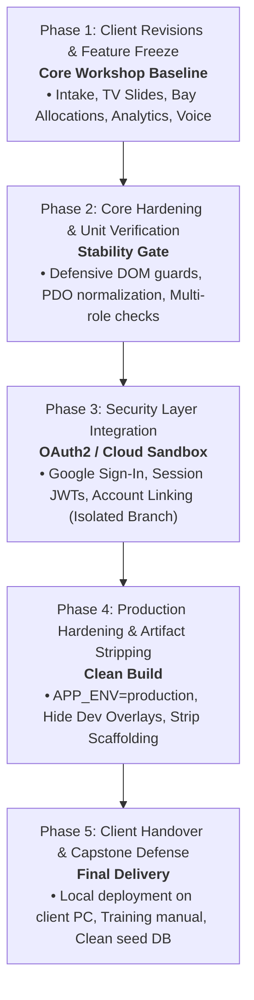

# HonTech Stage-Gated Production Delivery & Sandboxing Standard
**Document Version**: `v1.0.0-Enterprise`  
**Classification**: Standard Operating Procedure (SOP) & Technical Roadmap  
**Target Repository**: `Hontech_Main_Active_Development_PHP_SQL`  
**Active Working Branch**: `branch2-Security-Account-Recovery`  

---

## 1. Executive Summary & Engineering Philosophy

This document outlines the **Stage-Gated Software Development Lifecycle (SDLC)** and **Sandboxing Protocol** for the HonTech AutoCenter Management System.

To prevent scope corruption, debugging bottlenecks, and regression risks, the project strictly adopts a **Milestone Isolation Architecture**:
1. **Core Workshop Floor Baseline First** (Intake $\rightarrow$ Queue $\rightarrow$ Bay Monitoring $\rightarrow$ Ready for Release $\rightarrow$ Analytics).
2. **Dedicated Feature Sandboxing for Experimental Work** (Google OAuth2, Cloud API connectors).
3. **Production Hardening Protocol** (Environment stripping, security locks, and clean deployment).

---

## 2. The 5-Phase Stage-Gate Delivery Lifecycle



---

## 3. Phase Details & Action Protocols

### Phase 1: Core Workshop Engine & Client Revisions Freeze
* **Objective**: Fulfill all requested client workflows without authentication overhead.
* **Scope**:
  - Daily intakes and backjob history.
  - Workshop Bay dynamic ceiling (4–20 bays) and drag-and-drop allocations.
  - Multi-slide TV display (`Service Monitor`, `Queue & Releasing`, `Workshop Lanes`).
  - Automated TV voice announcement system (Web Speech API + airport chimes).
  - High-precision PDF export (Gate Pass & Official Claim Stub).
  - Business analytics, revenue totals, and Service Advisor efficiency metrics.
* **Exit Criteria (The Freeze Gate)**:
  - All 18 revision checklist items (`REV-001` through `REV-018`) verified and green.
  - Client confirms the core workshop flow accurately reflects shop operations.
  - Git commit tagged as: `STABLE-CORE-BASELINE`.

---

### Phase 2: Core Hardening & Defensive Verification
* **Objective**: Ensure the core baseline is completely bug-free across all 4 user roles.
* **Testing Matrix**:
  | Role | Access Level | Primary Verification |
  | :--- | :--- | :--- |
  | **Owner** | Full System & Database Reset | Analytics, revenue, system settings, staff management |
  | **Admin** | Workshop Supervisor | Bay allocations, lockouts, SLA delay logs, intake overrides |
  | **Service Advisor (SA)** | Front Desk & Customer Intake | New job tickets, backjob flagging, customer claim stubs |
  | **Assistant** | View-Only / Mechanic Support | Active bay queue monitoring, TV monitor display |
* **Defensive Engineering Rules**:
  - Guard all DOM lookups (`if (document.getElementById('...'))`).
  - Guard all array manipulations (`const safeList = Array.isArray(data) ? data : [];`).
  - Normalize MySQL PDO snake_case properties (`is_active` [0/1] $\rightarrow$ boolean).

---

### Phase 3: Google OAuth2 & Cloud Security Sandboxing
* **Objective**: Add Google Sign-In and account linking without risking the working core.
* **Sandboxing Strategy (Choose Option A or B)**:

#### Option A: Git Feature Branch (Recommended)
```bash
# 1. From the stable baseline, branch out cleanly:
git checkout -b feature/google-oauth-integration

# 2. Build Google Cloud Console Client ID & OAuth endpoints
# 3. Test Google token verification in backend/controllers/AuthController.php
# 4. If client calls for a demo, switch back instantly:
git checkout branch2-Security-Account-Recovery
```

#### Option B: Dual-Port Physical Sandbox
* **Client Stable Server**: `http://localhost:8000` (Localtunnel live demo)
* **Google Auth Lab**: `http://localhost:8001` (Isolated test instance)

---

### Phase 4: Production Hardening (Artifact Stripping)
* **Objective**: Prepare a clean, enterprise-ready build for the client with all developer scaffolding safely disabled.

```javascript
// Environment Config Switch
const APP_ENV = 'production'; // 'development' | 'production'

function toggleDevToolbox(forceState) {
    // Completely disabled in production build
    if (APP_ENV === 'production') {
        console.warn('Developer tools are disabled in production environment.');
        return;
    }
    // ... development logic
}
```

* **Production Checklist**:
  - [ ] Set `APP_ENV = 'production'`.
  - [ ] Disable keyboard shortcut `Ctrl + D` in production mode.
  - [ ] Remove mock test data and reset database with clean Owner/Admin seeds.
  - [ ] Verify CSRF protection, secure session cookies (`HttpOnly`, `SameSite=Lax`).
  - [ ] Increment script cache buster (`js/app.js?v=5.0-prod`).

---

### Phase 5: Client Handover & Capstone Defense Readiness
* **Deliverables**:
  1. **Source Code**: Stable production tag on GitHub.
  2. **Database Dump**: `hontech_db_schema_v2.sql` + clean seed records.
  3. **Operations Manual**: [HONTECH_ENTERPRISE_DEPLOYMENT_AND_OPERATIONS_MANUAL.md](file:///c:/xampp/htdocs/CapstoneOfficial2_Development_Part-2-Hontech_Main_Active_Development_Branch2-Security-Account-Recovery/CapstoneOfficial2_Development_Part-2-Hontech_Main_Active_Development/Hontech%20Documentation/Technical/HONTECH_ENTERPRISE_DEPLOYMENT_AND_OPERATIONS_MANUAL.md).
  4. **QA Verification Log**: Complete checklist proving all revisions were tested.

---

## 4. Engineering Rules of Engagement Summary

> **1. One Variable at a Time**: Never build experimental security features while workshop tables are shifting.  
> **2. Protect the Baseline**: Always have a known stable Git commit to revert to in seconds.  
> **3. Scaffold in Dev, Strip in Prod**: Developer tools (`Ctrl + D`, simulators, seed resets) accelerate development, but are cleanly deactivated before production release.  
> **4. Problem First $\rightarrow$ Architecture Second $\rightarrow$ Tech Stack Third**: Let business requirements drive design decisions.
