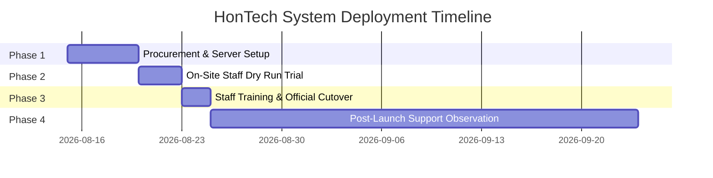

# 📄 HONTECH AutoCenter Operations System
## Client Proposal & System Deployment Strategy (Expanded Edition)

**Prepared for**: HonTech AutoCenter — Management & Ownership  
**Prepared by**: HonTech Systems Development Team  
- **Justin Nolasco J.** *(Lead Developer)*  
- **Mary Dayne Villas T.** *(UI/UX Designer)*  
- **Catherine Ramos G.** *(Documentation Specialist)*  
**Capstone Project Adviser**: Mr. Ar-Jay C. Agbayani  
**Date**: July 9, 2026 (Updated August 2026)

---

## Table of Contents
1. Executive Summary
2. Architecture Strategy & Local Domain Addressing (`http://hontech.ph`)
3. Hardware & Network Setup Requirements
4. Comprehensive Financial Analysis: Local Intranet vs. Cloud
5. Investment, Payment Schedule & Support Structure
6. Security, Data Privacy, MFA & Account Recovery Architecture
7. Multi-Branch Isolation & System Scaling
8. Phased Deployment & Cutover Roadmap
9. Official Project Deliverables
10. Action Items & Client Sign-Off

---

## 1. Executive Summary

Running a busy auto center depends on speed, accuracy, and clear communication. Today, HonTech AutoCenter relies on paper claim stubs and verbal updates between the front desk, service bays, and waiting customers. This creates avoidable bottlenecks: front desk staff cannot see mechanic progress in real time, mechanics wait on manual approvals, and customers in the lounge are left guessing about their vehicle's status.

The **HonTech Operations System** introduces a digital, real-time management platform connecting the front desk, service advisor bays, and waiting lounge on one shared system—without staff needing to leave their stations to stay informed.

### Key Business Value Drivers:
- **Speed & Organization**: Real-time lift bay tracking shows vehicle stage, assigned advisor, and promised SLA completion time.
- **Customer Confidence**: A live broadcast monitor in the waiting lounge keeps customers informed, reducing front desk inquiries by 40%.
- **Zero Recurring Costs**: Built on a Local Intranet Architecture, eliminating monthly cloud hosting and domain subscription fees.
- **Absolute Privacy**: Customer phone numbers, vehicle records, and repair logs stay physically inside the HonTech building at all times.

---

## 2. Architecture Strategy & Local Domain Addressing

We recommend deploying the system on a **Local Intranet Server** inside the shop rather than a public cloud host. This decision eliminates recurring costs, minimizes technical maintenance, and guarantees absolute data privacy.

### Local Network Addressing & Free Domain Strategy:
Instead of requiring staff and TV monitors to type numerical IP addresses (e.g. `192.168.1.105:8000`), we configure a **Clean Local Domain Name** (`http://hontech.ph` or `http://hontech.local`) on the shop's Wi-Fi router network:

```
[ Front Desk PC ] <----\
[ Advisor Tablet ] <-----> [ Local Wi-Fi Router ] <-----> [ Host Server PC (PHP/MySQL) ]
[ Lounge Smart TV ] <---/    (Domain: http://hontech.ph)
```

| Architecture Priority | How Local Deployment Delivers It |
| :--- | :--- |
| **Lower Cost (₱0 Hosting)** | No monthly hosting or domain bills. A one-time hardware purchase replaces years of recurring subscriptions. |
| **Clean Local Addressing** | Access via `http://hontech.ph` over shop Wi-Fi without internet fees or paperwork. |
| **Offline Fault Tolerance** | Operates 100% reliably even during external internet fiber outages. |
| **Data Privacy & Security** | Records stay on-site, never transmitted to third-party data centers. |

---

## 3. Hardware & Network Setup Requirements

### 3.1 Primary Application Server (Local XAMPP Server)
*Machine location: Shop office or main counter. Stays powered on during business hours.*

| Specification | Minimum Requirement | Recommended Specification |
| :--- | :--- | :--- |
| **Form Factor** | Desktop PC or Mini-PC | Compact Industrial Mini-PC |
| **Operating System** | Windows 10 or 11 (64-bit) | Windows 11 Pro (64-bit) |
| **Processor** | Intel Core i3 (10th Gen+) | Intel Core i5 / AMD Ryzen 5 |
| **Memory (RAM)** | 8GB DDR4 | 16GB DDR4 |
| **Storage** | 256GB Solid State Drive (SSD) | 512GB NVMe SSD |
| **Networking** | Wired RJ45 Gigabit Ethernet to Router | Dedicated Ethernet Port |
| **Power Protection** | 650VA UPS Battery Backup | 1000VA UPS Line Interactive |

*Budget Note: Estimated hardware cost is ₱16,500–₱22,000. If HonTech has a spare desktop computer on hand, it can be repurposed to reduce upfront costs to ₱0.*

### 3.2 Staff Terminals (Front Desk & Service Advisors)
- Standard PCs, laptops, or tablets (e.g., iPads / Android tablets).
- Compatible with any modern web browser (Google Chrome, Microsoft Edge, Safari).

### 3.3 Waiting Lounge Broadcast Display
- 40-inch or larger Smart TV equipped with built-in web browser or streaming stick (Chromecast / Fire Stick).

---

## 4. Financial Analysis: Local Intranet vs. Cloud Hosting

Shift from a recurring monthly subscription to a single upfront hardware asset purchase, achieving substantial long-term savings:

| Expense Category | Cloud Deployment (AWS / Render) | Local Intranet Server (Recommended) |
| :--- | :--- | :--- |
| **Server Hardware** | ₱0 (Rented off-site) | ₱16,500 – ₱22,000 (One-time asset) |
| **Monthly Hosting Fee** | ₱1,300 – ₱2,700 / month | **₱0 / month** |
| **Domain Name Fee** | ₱800 / year (`hontech.com`) | **₱0 / year (`http://hontech.ph` LAN)** |
| **Database Storage Limits** | Pay-per-GB, scaled pricing | Unlimited (Up to 256GB SSD) |
| **Internet Bandwidth Costs** | Subject to provider fees | **₱0 (Runs on local shop network)** |
| **5-Year Total Cost Estimate** | **₱80,000 – ₱165,000+** | **≈ ₱22,000 Total** |

> 💰 **Bottom Line**: Over a 5-year operational horizon, local intranet deployment saves HonTech an estimated **₱58,000 to ₱143,000** compared to equivalent cloud hosting.

---

## 5. Investment & Support Structure

### 5.1 One-Time Software Development Investment
- **Milestone 1: Project Initiation (30%)** — Initial deposit for environment configuration, schema setup, and module integration.
- **Milestone 2: Final Turnover (70%)** — Due only after successful dry run testing and official shop cutover.

### 5.2 Complimentary Support & IT Maintenance
- **1–2 Months Free Maintenance**: Full bug fixes, workflow optimization, and staff support post-launch.
- **Optional IT Maintenance Retainer**: Optional ongoing agreement covering routine backups, password resets, and disaster recovery updates.

---

## 6. Security, Data Privacy, MFA & Account Recovery Architecture

Running locally on XAMPP MariaDB delivers military-grade data protection:

1. **Air-Gapped Local Subnet Isolation**: Server ports (`8000` / `3307`) are restricted to the local shop router. External internet hackers cannot scan or access system data.
2. **Multi-Factor Authentication (MFA / 2FA)**: TOTP authenticator app support with QR code enrollment and backup codes for Admin/Owner accounts.
3. **Self-Service 6-Digit OTP Password Recovery**: Staff can reset forgotten passwords via secure 6-digit OTP verification without calling IT support.
4. **15-Minute Automatic Inactivity Protection**: Auto-locks unattended shop terminals while protecting active staff interactions.
5. **Bcrypt Password Encryption**: All employee passwords are encrypted using bcrypt hashing prior to database storage.

---

## 7. Multi-Branch Isolation & System Scaling

The system is architected to support future multi-branch expansion (e.g. Marikina Branch, East Branch):
- **Branch Data Isolation**: Service Advisors and Assistants are restricted to their assigned branch's repair queue and TV display.
- **Owner Global Switchboard**: System Owners can switch views between branches or view aggregated cross-branch analytics.

---

## 8. Phased Deployment & Cutover Roadmap



- **Phase 1: Procurement & Local Server Setup**: Install server PC, router, and TV lounge display. Configure `http://hontech.ph`.
- **Phase 2: On-Site Dry Run (Parallel Trial)**: Staff inputs data into digital system while maintaining paper stubs as safety net.
- **Phase 3: Staff Training & Go-Live Cutover**: Retire paper claim stubs and transition to 100% digital operations.
- **Phase 4: Post-Launch Observation**: 1–2 months complimentary developer monitoring and support.

---

## 9. Official Project Deliverables

Upon final cutover, HonTech AutoCenter receives full ownership assets:
1. **User Manuals**: Illustrated PDF guides for Front Desk & Service Advisor workflows.
2. **Administrator & Security Guide**: Complete documentation for password resets, MFA management, and analytics.
3. **Disaster Recovery & Backup Protocol**: Step-by-step emergency procedures for server restarts, power outages, and paper fallback.
4. **Source Code License & Contract**: Official legal agreement defining code ownership.

---

## 10. Action Items & Client Sign-Off

1. **Hardware Confirmation**: Client confirms server hardware setup (new mini-PC vs repurposed shop desktop).
2. **Lounge Display Confirmation**: Confirm 40"+ Smart TV and mounting location.
3. **Dry Run Date Selection**: Agree on a slow business day (e.g., Tuesday) for Phase 2 testing.
4. **Sign-Off Agreement**: Execute Milestone 1 agreement.

---

### Approval & Sign-Off

_____________________________________                ______________________
**HonTech AutoCenter Management Signature**           **Date**
