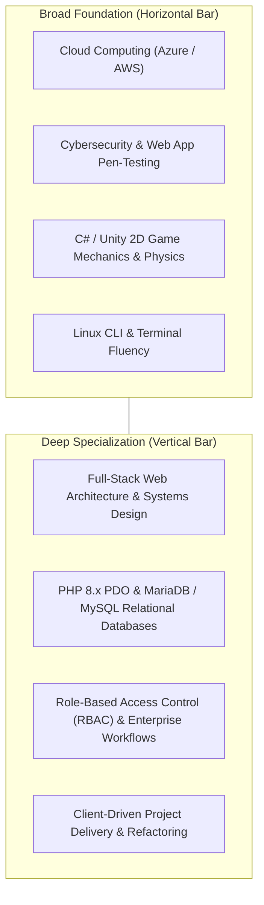

# Student Portfolio, LinkedIn & GitHub Career Branding Master Guide
**Document Version**: `v1.0.0-CareerReady`  
**Classification**: Professional Career Development & Portfolio Blueprint  
**Target Profile**: BSIT Student @ STI College (Preparing for 486-Hour OJT & Software Engineering Career)  

---

## 1. The "T-Shaped Engineer" Brand Identity

In modern tech recruitment, the most sought-after junior engineers are **T-Shaped Developers**:



---

## 2. LinkedIn Profile Optimization Blueprint

### A. Professional Headlines (Choose Your Preferred Style)
* **Option 1 (Balanced & Industry-Ready - Recommended)**:
  > `BSIT Student @ STI College | Full-Stack Web Developer & Unity Game Developer | Open for OJT (486 Hours) & Software Engineering Internships`
* **Option 2 (Technical & Keyword-Rich)**:
  > `Aspiring Software Engineer | PHP • MySQL PDO • C# • Unity 2D • REST APIs • Cloud & Cybersecurity Enthusiast`

### B. "About Me" / Summary Template
```markdown
I am an aspiring Software Engineer and Bachelor of Science in Information Technology (BSIT) student at STI College with a passion for architecting resilient systems, interactive game mechanics, and secure web applications.

Currently building and maintaining the HonTech AutoCenter Management System—an enterprise automotive ERP featuring real-time bay allocation, multi-slide TV customer monitors, automated voice synthesis, and multi-tier RBAC security. Alongside enterprise software, I explore 2D physics, game loops, and procedural generation using Unity Engine and C#.

Tech Stack & Core Competencies:
• Backend & Databases: PHP (PDO), MariaDB / MySQL, REST APIs, JSON Web Tokens (JWT)
• Frontend & UI: Vanilla JavaScript (ES6+), Tailwind CSS, Chart.js, Web Speech API, PDF Generation
• Game Development: Unity Engine (2022.3 LTS), C# OOP, 2D Physics, UI Toolkit
• Security & Cloud: RBAC Authorization, PortSwigger Web Security Labs, Azure Fundamentals (AZ-900)
• Tools & Version Control: Git, GitHub, XAMPP, Postman, PowerShell

Actively seeking a 486-Hour OJT Practicum / Software Engineering Internship where I can contribute to mission-critical codebases and collaborate with high-performing engineering teams.
```

---

## 3. GitHub Profile & Repository Pinning Strategy

### A. Pinned Repositories on GitHub Profile

| Priority | Repository | Category | Core Stack | Description |
| :--- | :--- | :--- | :--- | :--- |
| **Pin 1** | `Hontech_Main_Active_Development_PHP_SQL` | **Flagship Enterprise** | PHP, MySQL PDO, JS, CSS, Chart.js | Full-scale auto center ERP with live bay scheduling, multi-slide TV display, and automated voice system. |
| **Pin 2** | `GameDev_Concept1_CountTheRice_Game` | **Creative Game Dev** | Unity 2022 LTS, C#, 2D Physics | Physics-driven psychological comedy and focus game featuring custom game state loops and procedural certificates. |
| **Pin 3** | `Azure-Cloud-And-Security-Labs` *(Future)* | **Cloud & Security** | Azure, Linux, Bash, Markdown | Documented walk-throughs of TryHackMe rooms, PortSwigger web security labs, and Azure sandbox exercises. |

---

### B. Unity Game Repository Best Practices (`GameDev_Concept1_CountTheRice_Game`)
To ensure your Unity repository looks polished to technical recruiters:
1. **Include a Rich `README.md`**:
   - Game premise & psychological mechanics.
   - Gameplay GIFs / screenshots.
   - Architecture highlights (`FocusEnforcer.cs`, `RiceGrain.cs`, `CertificateExporter.cs`).
   - Instructions on how to clone and open in Unity Hub.
2. **Setup a Clean `.gitignore`**:
   - Ensure the standard Unity `.gitignore` is used so `Library/`, `Temp/`, and `Logs/` folders are not tracked.
3. **Include a WebGL Playable Demo Link**:
   - Host the build on GitHub Pages or **itch.io** so recruiters can play directly in one click.

---

## 4. Interview Talking Points (How to Tell Your Story)

When an interviewer or OJT coordinator asks:
> *"Tell me about yourself and your technical background."*

### 🗣️ The Winning Answer:
> *"I'm a BSIT student specializing in software architecture. My primary work is the HonTech AutoCenter Management System, where I led the transition to MySQL PDO, built multi-slide workshop TV monitors, integrated browser speech synthesis, and developed diagnostic debugging suites.*
> 
> *To broaden my engineering perspective, I also build 2D physics games in Unity using C#. Building game loops and state machines has deepened my understanding of memory performance and Object-Oriented Design, while my cloud and cybersecurity studies ensure everything I build is defensively architected."*

---

## 5. Curated High-Value Learning Links & Free Resources

### ☁️ Cloud Computing
* **Microsoft Learn AZ-900**: Free interactive browser sandbox modules.
* **Azure for Students**: $100 annual free credit via `@sti.edu.ph`.
* **AWS Educate**: Free student cloud labs without credit cards.

### 🛡️ Cybersecurity & Linux
* **TryHackMe (`tryhackme.com`)**: Pre-Security and Complete Beginner interactive rooms.
* **PortSwigger Web Security Academy (`portswigger.net`)**: 100% free web app pen-testing (SQLi, XSS, CSRF, JWT).
* **OverTheWire Bandit (`overthewire.org`)**: Linux CLI SSH wargames.

### 🎓 Student Perks
* **GitHub Student Developer Pack (`education.github.com/pack`)**: Free GitHub Pro, free Azure credits, JetBrains IDE licenses, free `.me` domain.
