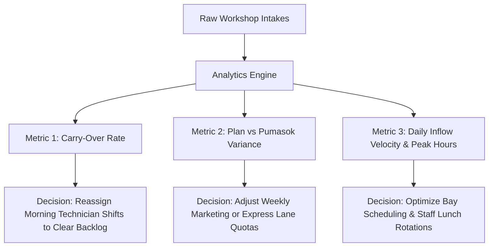

# 📊 Client Report Data & Executive Decision-Making Plan
## Plan vs Pumasok (Carry-Over, GRS, PMS) & Daily Intake Velocity Architecture

> **Author:** Justin Nolasco J. (Lead Systems Architect)  
> **Client Stakeholder:** HonTech AutoCenter Executive Management & Operations Team  
> **Core Focus:** Report Data (Plan vs Pumasok across Carry-Over, GRS, PMS, and Daily Intakes) for Operational Decision-Making.

---

## 1. 🎯 Does the Current System Fulfill the Client's Exact Request?

### **YES! 100% Alignment with Client Specifications.**

During operational interviews, HonTech's leadership requested visibility into two specific reporting dimensions:
1. **Plan vs Pumasok** across **Carry-Over**, **GRS (General Repair)**, and **PMS (Preventive Maintenance)**.
2. **No. of Intake Per Day** with channel splits (Walk-in vs Online) and capacity volume.

---

## 2. 🧠 Executive Decision-Making Matrix: What the Data Tells the Owner

The report is not just numbers; every row and metric drives a **real-world business decision** for the shop owner:

| Report Dimension | Metric Displayed | Key Business Pattern & Operational Decision |
| :--- | :--- | :--- |
| **🔄 Carry-Over** | Pumasok, In Bay, Released, Variance | **Bottleneck Early Warning**: If Carry-Over > 3 cars, bays are clogged from yesterday. **Action:** SA freezes heavy intakes and prioritizes finishing stalled cars to free up revenue bays. |
| **🔧 GRS (General Repair)** | Plan Target vs Actual Pumasok | **Heavy Revenue & Parts Consumption**: GRS takes 4–8 hours per car. **Action:** If GRS exceeds target, Parts Department must pre-order suspension/brake inventory. |
| **🛠️ PMS (Maintenance)** | Target vs Pumasok (On-Time / Delay) | **Daily Cashflow & SLA Speed**: PMS is fast 2-hour cashflow. **Action:** If PMS fulfillment is low (<70%), staff must promote same-day oil change specials. |
| **⚡ Express Lane** | Target vs Actual Inflow | **Customer Retention & Quick Turnover**: Turnaround ≤ 60m. **Action:** Senior/Elder priority lane fast-tracking. |
| **📅 No. of Intake Per Day** | Daily Walk-in vs Online, Capacity % | **Staff Scheduling & Peak Hour Management**: Identifies rush days (e.g. Saturdays 8 AM–11 AM) vs slow weekdays to optimize technician overtime. |

---

## 3. 📋 Current Implementation Review & Deliverables

### A. Report Section 1: Category Inflow & Target Fulfillment Matrix (Plan vs Pumasok)
* **Visual Graph**: Interactive Chart.js comparative bar graph showing:
  * **Slate (`#0f172a`)**: Planned Scheduled Target.
  * **Crimson (`#dc2626`)**: Actual Pumasok.
  * **Emerald (`#10b981`)**: Completed & Released.
* **3-State View Switcher**: `Split View`, `Graph Only`, `Table Only`.
* **Clean 5-Column SaaS Table**:
  1. `Service Category` (Carry-Over, GRS, PMS, Express, Inspection).
  2. `Inflow vs Target` (`X / Y cars` + inline micro-meter + `%`).
  3. `Workflow Distribution` (`X in bay · Y released`).
  4. `Variance (+/-)` (`▼ -X` deficit or `▲ +Y` surplus).
  5. `Service Class Badge`.

### B. Report Section 2: Day-by-Day Daily Intake History Log
* **Chronological Daily Inflow Table**:
  * Date & Day of Week.
  * Walk-in vs Online Reservation split.
  * Total Daily Pumasok.
  * Category breakdown per day (PMS, GRS, Carry-Over, Express).
  * Workshop Capacity Load Percentage (`Day Total / Bay Capacity`).
  * Peak Arrival Hour detection.

---

## 4. 💡 Strategic Patterns & Insights for Your Presentation

When presenting this report to your President / Thesis Panel, highlight these **3 Executive Patterns**:

1. **The "Carry-Over Starvation" Pattern**:
   * *"When yesterday's unfinished cars carry over into today, they occupy Lift 1 and Lift 2, reducing PMS intake capacity by up to 40%. This report warns management before bays get choked."*
2. **The "Channel Shift" Pattern (Walk-in vs Online)**:
   * *"By tracking Walk-in vs Online appointments per day, HonTech can encourage customers to book online during slow mid-week hours, leveling workshop load."*
3. **The "SLA Target Fulfillment" Metric**:
   * *"Rather than guessing if the day was profitable, the President sees an instant percentage score (e.g. 85% Target Fulfillment) comparing planned vehicle quotas against actual workshop output."*

---

## 5. 🔍 Proposed Verification Plan

### Automated & Manual Verification
1. **Filter Date Range Test**: Change date range from Today ➔ This Week ➔ This Month and verify that both the Chart.js graph and Daily Intake breakdown update dynamically.
2. **View Switcher Test**: Toggle `Split View` ➔ `Graph Only` ➔ `Table Only` to ensure responsive rendering without DOM glitching.
3. **Export Test**: Verify 1-click CSV/Print export of both the Category Matrix and the Daily Breakdown tables.
