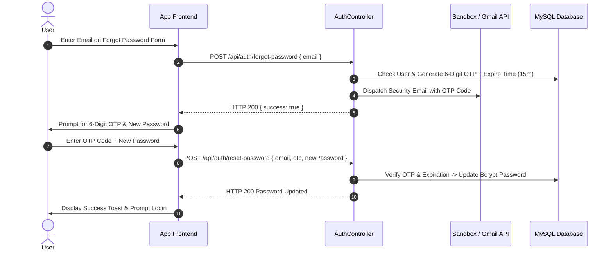

# 🛡️ HONTECH Security, Account Recovery & Google API Master Architecture
## Unified Enterprise Security, Authentication & Disaster Recovery Blueprint

> [!NOTE]
> This master document consolidates all security specifications, authentication controls, account recovery workflows, Google API integrations, and data disaster recovery protocols into a single authoritative reference, removing duplicate and repeated content.

---

## 1. 🔐 Authentication & Access Security Architecture

### 1.1 JSON Web Token (JWT) & HTTP-Only Cookie Protection
- **Token Mechanism**: Authentication state is stored in HTTP-Only, SameSite-Strict cookies (`token`), mitigating Cross-Site Scripting (XSS) and Cross-Site Request Forgery (CSRF) vulnerabilities.
- **Lifetime & Validation**: Tokens are issued with a 24-hour expiration (`App\Middleware\Auth::generateToken()`).
- **Authorization Context**: Every backend API request validates the token payload against active database state (`SELECT is_active, is_deleted FROM users`). Inactive or deleted user accounts are immediately denied access with HTTP 401.

### 1.2 Role-Based Access Control (RBAC)
System capabilities are strictly isolated by role at both API endpoint level (`Auth::requireRole()`) and UI rendering level:

| Role | Access Scope | Key Permissions |
| :--- | :--- | :--- |
| **System Owner** | Global / Cross-Branch | Full administrative access, financial analytics, system settings, global branch switchboard. |
| **System Admin** | Branch-Scoped | Staff account management, local branch records, audit log viewing, local TV configuration. |
| **Service Advisor (SA)** | Branch-Scoped | Job order claiming, repair bay assignment, PMS goal tracking, status updates. |
| **Assistant Staff** | Branch-Scoped | Front desk intake form entry, online booking confirmations, claim stub printing. |

### 1.3 15-Minute Inactivity Protection
- **Inactivity Timer**: Automatic logout triggers after **15 minutes of continuous user inactivity**.
- **Active Interaction Tracking**: Active user events (`mousedown`, `mousemove`, `keydown`, `scroll`, `touchstart`) update `lastUserActivityTimestamp`.
- **Intrusive Popup Prevention**: Background API calls receiving 401 do **NOT** display popups if the user is actively interacting with the system, preventing unexpected interruptions.

### 1.4 Password Hashing & Input Sanitization
- **Credential Storage**: Employee passwords are encrypted using **bcrypt** algorithm (work factor 10) prior to database insertion.
- **SQL / NoSQL Injection Prevention**: All queries utilize PDO prepared statements with bound parameters (`$stmt->execute([$param])`).

---

## 2. 🛡️ Account Recovery & Multi-Factor Authentication (MFA)

### 2.1 Self-Service 6-Digit OTP Password Recovery
The application features a 2-step self-service password recovery protocol:



### 2.2 Multi-Factor Authentication (MFA / 2FA)
- **TOTP Standards**: Compatible with Google Authenticator, Authy, and standard TOTP authenticator apps.
- **MFA Enrollment**: Generates secret key and QR code data string (`otpauth://totp/Hontech:...`).
- **Backup Recovery Codes**: Generates 8 single-use alphanumeric backup codes stored in JSON format for emergency account recovery.

---

## 3. 🌐 Google API Integration & Dynamic Fallback Strategy

### 3.1 Google Identity Services (GIS) / Google SSO
- **OAuth 2.0 Identity**: Users can link their Google Accounts (`google_id`, `google_email`) to their Hontech profile.
- **Dynamic `.env` Switcher**:
  - If `GOOGLE_CLIENT_ID` is set in `.env`: Renders the official Google One-Tap / GIS Client SDK button.
  - If `GOOGLE_CLIENT_ID` is empty: Defaults seamlessly to the built-in **Developer Sandbox Sign-In Modal**.

### 3.2 Security Email Alert Dispatcher (Gmail API / SMTP Relay)
- **Primary Dispatcher**: Routes transactional security emails (OTP reset codes, MFA alerts) through live **Gmail API OAuth2** or Google Workspace SMTP Relay when configured.
- **Developer Sandbox Fallback**: Captures generated security emails into the local sandbox mailbox (`/api/auth/developer/emails`) during testing or offline intranet deployment.

### 3.3 Google Calendar Appointment Sync
- **Master Shop Calendar**: Confirmed customer repair appointments automatically sync to the shop's master Google Calendar (`master.calendar@hontech.com`).
- **Customer Calendar Invites**: Customers are included as event attendees, sending invitation notifications to their mobile devices.

---

## 4. 💾 Data Disaster Recovery & Database Backup Protocols

### 4.1 Google Drive API v3 Automated Recovery (System Level)
To prevent catastrophic data loss from hardware failure or disk corruption:
- **Automated MySQL Dumps**: Scheduled background process executes `mysqldump` on `hontech_db`.
- **AES-256 Encryption**: Dumps are compressed and encrypted prior to transmission.
- **Cloud Upload**: Uploaded to a dedicated, restricted **Google Drive Backup Folder** using Google Drive API v3.
- **1-Click Restore**: Administrators can view available backup checkpoints and execute 1-click database restoration from the System Admin dashboard.

### 4.2 Developer Database Reset & Seeding Protocol
- **Sandbox Reset**: Developer UI overlay includes a **Reset & Seed DB** trigger calling `/api/auth/developer/reset-seed`.
- **Live Feedback**: Outputs real-time database seeder terminal logs directly into the UI overlay.

---

## 5. 🏢 Deployment Architecture & Network Security Controls

### 5.1 On-Premises Local Area Network (LAN) Deployment (Current Stage)
For local shop operations and Capstone presentation:

```
[ Advisor PC ] <----\ (Private Local Wi-Fi / Ethernet)
                     \
[ Assistant PC ] <----> [ On-Site Host Server PC (PHP + MySQL) ]
                     /
[ TV Monitor ] <----/
```

- **Zero Internet Exposure**: Server port is exposed only to the private local subnet (`192.168.x.x`).
- **Offline Operational Capability**: Repairs, queue updates, and TV monitor rotation operate without internet dependency.

### 5.2 Multi-Branch Cloud Scaling Options
When scaling to multiple physical locations (e.g. Marikina Branch, East Branch):
- **Option A (Cloud VPC with Static IP Whitelisting)**: Host backend on cloud VPC; restrict firewall ingress exclusively to the static IP addresses of shop routers.
- **Option B (Site-to-Site IPsec VPN)**: Establish encrypted hardware VPN tunnels between shop routers, keeping server traffic isolated from the public internet.

---

## 📑 Document Revision & Consolidation History

> [!TIP]
> This master document replaces and consolidates:
> 1. `Google_API_Integration_Plan.md`
> 2. `HONTECH_GOOGLE_API_SECURITY_AND_DATA_RECOVERY_AUDIT.md`
> 3. `System_Deployment_and_Security_Architecture.md`
> 
> All duplicate definitions, repeated explanations of OTP flows, and redundant hosting tables have been unified into this single document.
