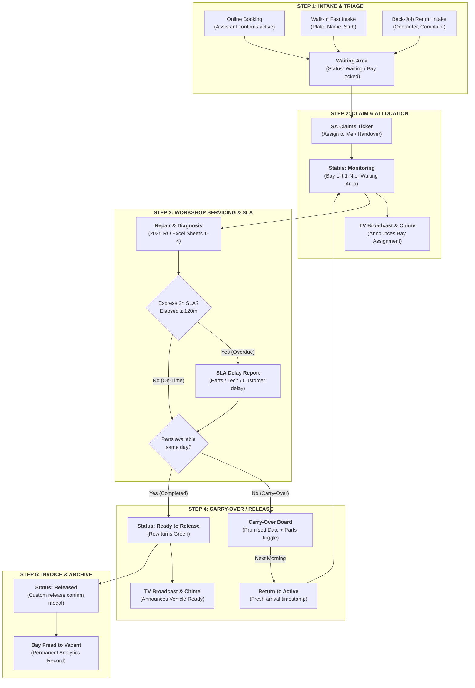

# 🗺️ HonTech System Architecture & Master User Journey Blueprint

**Document Reference:** `HONTECH-ARCH-BLUEPRINT-2026-V1`  
**Classification:** System Architecture, End-to-End User Flow & Foundation Ground Truth  
**Target Repository:** `Hontech_Main_Active_Development_PHP_SQL`  
**Active Working Branch:** `prototype_process`  
**Audience:** Justin Nolasco J., Catherine Ramos G., Mary Dayne Villas T., Antigravity AI, Capstone Panel

---

## 🎯 Purpose of this Blueprint

As the HonTech Operations System evolves across 70+ revisions, this document serves as the **immutable architectural anchor and ground truth**. 

Whenever developers or the AI add features, refactor code, or fix bugs, **this map ensures that every successfully built capability is treated as a solid foundation and that core workflows are never broken, altered, or bypassed.**

---

## 👥 1. The 4-Role RBAC Authority Matrix

```
┌───────────────────────────────────────────────────────────────────────────────────────┐
│                                4-ROLE AUTHORITY MATRIX                                │
├───────────────────┬───────────────────────────────────────────────────────────────────┤
│ 👑 OWNER          │ View-Only Workshop Floor • System Analytics • Staff Audit Access  │
│                   │ Cannot modify bay capacities directly (avoids operational clash). │
├───────────────────┼───────────────────────────────────────────────────────────────────┤
│ 🛡️ ADMINISTRATOR   │ Facility Max Bay Ceiling Configuration (1 to 50 bays) • User Roster│
│                   │ System Settings • SLA Delay Intelligence • Global Audit Logs      │
├───────────────────┼───────────────────────────────────────────────────────────────────┤
│ 🔧 SERVICE ADVISOR│ Active Floor Bay Scaling (1 to Admin Ceiling) • Claim Intakes     │
│ (SA)              │ Bay Lift Allocation • Diagnosis • Carry-Over • TV Announcements   │
├───────────────────┼───────────────────────────────────────────────────────────────────┤
│ 📋 FRONT DESK     │ Online Inquiries • Fast Walk-In Intake • 40-Day Customer Lookup   │
│ ASSISTANT         │ "Confirm Active" conversion • Locked out from Bay floor & Admin   │
└───────────────────┴───────────────────────────────────────────────────────────────────┘
```

---

## 🔄 2. End-to-End Workshop User Journey (Step 1 to Step 8)



### Detailed Step-by-Step Breakdown:

#### 🚗 Step 1: Vehicle Arrival & Intake Pathway
1. **Pathway A (Online Booking):** Customer books online $\to$ Appears in `#container-online-queue` $\to$ Assistant reviews date/time $\to$ When customer arrives, Assistant clicks **"Confirm Active"** $\to$ Converted into live workshop intake with current arrival timestamp.
2. **Pathway B (Walk-In Intake):** Customer drives into bay $\to$ Assistant or SA opens `#section-intake` $\to$ Encodes Customer Name, Plate Number (`ABC-1234`), Contact, Category (PMS, GRS, Both, Others), and Lane $\to$ Generates real-time Claim Stub (`MMDDYY-XXX`).
3. **Pathway C (Back-Job Return):** Customer returns for repeat repair $\to$ SA opens `#section-lookup`, searches plate $\to$ System detects visit within 40 days $\to$ Clicks **"Back-Job Return Intake"** $\to$ `#modal-backjob-reason` captures complaint and odometer $\to$ Dispatches to intake with Back-Job audit tag.

#### ⏱️ Step 2: Waiting Queue & SLA Countdown Starts
- The vehicle lands at the top of `#container-daily-intakes` with status **`Waiting`**.
- Location is **locked** to `Waiting Area`.
- The **2-Hour Express PMS SLA timer** begins counting elapsed minutes (`⏱️ 0m`).

#### 👤 Step 3: Service Advisor Ticket Claiming
- SA clicks **"Assign to Me"** on the intake row to take ownership.
- If taking over an absent SA's vehicle, `#modal-ticket-takeover` captures justification for audit compliance.

#### 🔧 Step 4: Bay Allocation & Monitoring Transition
- SA changes status from `Waiting` $\to$ **`Monitoring`**.
- Location dropdown unlocks $\to$ SA assigns an active bay (e.g. `Bay 2`) or keeps in `Waiting Area`.
- `#section-bays` floor card updates to `Occupied` with license plate.
- **Smart TV Monitor (`tv.html`)** receives real-time update $\to$ Airport chime sounds $\to$ Web Speech announces:  
  *"Attention: Customer [Name], your vehicle [Plate] is assigned to Bay 2."*

#### 📝 Step 5: Diagnosis, 2025 RO Excel Studio & SLA Guard
- SA updates diagnosis in-line. Any field modification triggers `#modal-edit-reason-prompt`, saving changes to `job_audit_logs`.
- SA opens **2025 RO Excel Studio (`#section-form13`)** to draft Job Orders (Sheet 1) or Quotations (Sheet 2) using authentic client spreadsheet layouts.
- **SLA Alert:** If the vehicle exceeds 120 minutes without release, the timer badge turns amber (`⏱️ Express: 2h 15m`), exposing the `Report Reason` button $\to$ Logs to `express_lane_issues`.

#### 📦 Step 6: Overnight Carry-Over (Conditional Branch)
- If the vehicle cannot be finished today (e.g. waiting for parts), SA moves status to **`Carry-Over`**.
- Moves into `#container-carry-over`.
- SA inputs Promised Date and toggles **"Parts & Materials Available?"** (`YES`/`NO`).
- Next morning, SA clicks **"Return Active"** $\to$ Board returns car to Daily Intakes with fresh time.

#### 📢 Step 7: Ready for Release & Lounge Broadcast
- Work is completed $\to$ SA changes status to **`Ready to Release`**.
- Table row highlights in green.
- Standalone Smart TV Monitor shifts vehicle to the "Ready for Release" column $\to$ Airport chime plays $\to$ Voice announces:  
  *"Attention: Customer [Name], your vehicle [Plate] is now ready for release."*

#### 🏁 Step 8: Billing, Customer Release & Analytics Sync
- Customer settles bill in Billing Studio $\to$ SA changes status to **`Released`**.
- Custom red confirmation dialog confirms transaction.
- Vehicle is archived; assigned bay immediately reverts to **`Vacant`**.
- Record permanently populates **Owner Analytics (`#section-dashboard`)** for daily volume, turnaround averages, and back-job intelligence.

---

## 🏛️ 3. Complete Module & Section Inventory

| Section ID | Module Name | Primary Role | Core Capabilities |
| :--- | :--- | :--- | :--- |
| `#section-queue` | **Master Queue Hub** | SA, Assistant, Admin, Owner | Houses the 3 core tables: Online Queue (`#container-online-queue`), Daily Intakes (`#container-daily-intakes`), and Carry-Over (`#container-carry-over`). Features calendar date filtering and auto-reset. |
| `#section-intake` | **Vehicle Intake Form** | SA, Assistant | Rapid intake paperwork encoding, plate validation, claim stub generator, custom category input. |
| `#section-lookup` | **Customer & Back-Job Lookup** | SA, Assistant | 40-day regular lookup, historical customer dossier, 1-click back-job intake dispatcher. |
| `#section-form13` | **2025 RO Excel Studio** | SA, Admin, Owner | 1:1 physical sheet document canvas (Job Order, Quotation, Billing, Checklist Result, Cash Advance) with 100% offline SheetJS export/import. |
| `#section-bays` | **Workshop Bay Floor** | SA, Admin, Owner | Dynamic floor grid. Admin sets ceiling (1-50); SA sets daily active count (1-N). Visual cards show Occupied/Vacant status. |
| `#section-tv` | **Waiting Lounge TV Display** | All Roles / Public | Standalone kiosk (`tv.html`) & in-app TV slide carousel (Lifts, Ready Queue, Lanes) with PIN security and voice chime. |
| `#section-dashboard`| **Executive Analytics** | Owner, Admin | Volume trends, category doughnut charts, period record log, SLA overrun causes, and Centralized Audit Logs & Handovers. |
| `#section-staff` | **Staff Management** | Admin, Owner | Roster table, add personnel, role assignment, account activation/suspension, manual password reset. |
| `#section-profile` | **Account Settings** | All Roles | Edit full name, password update, 4-digit security PIN verification. |
| `#section-settings`| **Workshop Settings** | Admin | Default branch configuration, printer presets, facility bay limits. |
| `#section-support` | **Tutorial & Diagnostics** | All Roles / Developer | Interactive system tour, developer toolbox (`Ctrl + D`), database seed reset, crash overlay export. |

---

## 🛡️ 4. Immutable Architectural Rules for the AI

1. **Rule of Continuous Flow:** Never disconnect a state transition (e.g. changing an intake status must ALWAYS update the bay card, the TV monitor, and the audit log simultaneously).
2. **Rule of Role Bounds:** Never expose Bay Capacity ceiling sliders to the Owner or Service Advisor. Facility ceiling belongs strictly to the Administrator.
3. **Rule of Defensive DOM:** Every DOM access must use `if (document.getElementById('...'))` to prevent runtime freezing.
4. **Rule of Zero Unverified Code:** Any change touching these modules must pass `npm.cmd test` (27 assertions) before being committed to GitHub.
