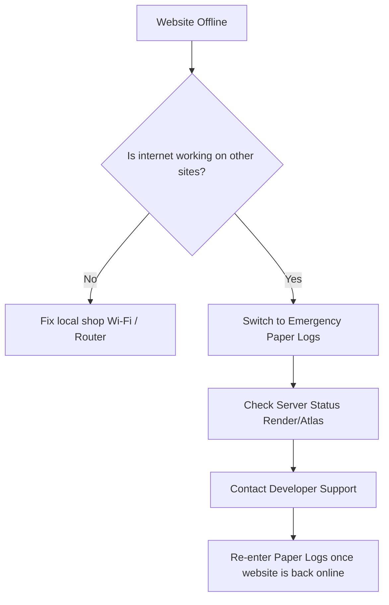

# HonTech Operations System: Timeline, Expenses, Dry Run, & Emergency Playbook

This document serves as your operational blueprint. It details what needs to be done month-by-month, estimated project expenses, how to practice running the system, and what the client should do in case of an emergency shutdown.

---

## 📅 Part 1: Monthly Roadmap (Today to Post-Launch)

### **Month 0: Today (June)**
*   **Focus:** Finalize core features and local verification.
*   **Tasks:**
    *   Verify the local simulated mailbox for forgot-password OTPs.
    *   Check that all user roles (Owner, Service Advisor, Front Desk Assistant) have their correct permissions working locally.
    *   Clean up layout styles and verify mobile responsiveness since Service Advisors and Front Desk staff will access the system via tablets/phones on the shop floor.

### **Month 1: July (Hardening & Staging)**
*   **Focus:** Security checks and "fake-internet" deployment (Staging).
*   **Tasks:**
    *   **Security Fixes:** Stop sending OTP tokens in the HTTP response; force them to be sent via email only.
    *   **Staging Setup:** Create a GitHub repository and deploy the app to **Render.com** (or Railway). Set up a free **MongoDB Atlas** database.
    *   **Group Testing:** Have your team log in to the staging link on their mobile devices and try to break the flows.

### **Month 2: August (The Dry Run / Practice Flow)**
*   **Focus:** Client validation, real services integration, and practice runs.
*   **Tasks:**
    *   **Real Email Setup:** Connect a real SMTP provider (e.g., Gmail with App Passwords, or a free Resend.com account).
    *   **The Dry Run:** Let the HonTech staff practice using the system during a simulated, low-risk business day (see Part 3).

### **Month 3: September (Official Launch & Handoff)**
*   **Focus:** Pointing to the custom domain, training, and launch.
*   **Tasks:**
    *   **Domain Name:** Buy `hontech-autocenter.com` (or similar) and link it to the hosting server.
    *   **SSL:** Verify that HTTPS is running properly.
    *   **Handoff:** Give the Owner their master credentials and train them on staff management.

---

## 💳 Part 2: Budget & Expense Projections

To run this application, the client will have very low operational costs. Here is the estimated budget:

| Service | Purpose | Provider | Monthly/Annual Cost (PHP) | Monthly/Annual Cost (USD) |
| :--- | :--- | :--- | :--- | :--- |
| **Domain Name** | Custom website address | Namecheap / GoDaddy | ₱500 - ₱900 / year | $10 - $15 / year |
| **App Hosting** | Runs the backend server | Render / Railway | **FREE** (Starter Tier) *(Optional: ₱400/mo for faster spin-up)* | **FREE** (Starter Tier) *(Optional: $7/mo)* |
| **Database** | Stores jobs & user data | MongoDB Atlas | **FREE** (512MB M0 Tier) *(Enough for ~100,000+ jobs)* | **FREE** |
| **Email Gateway** | Sends verification codes | Resend / Gmail SMTP | **FREE** (up to 3,000 emails/month) | **FREE** |
| **Total Startup Cost**| To put the site live | | **~₱700 (One-time domain)** | **~$12** |

---

## ⚙️ Part 3: The Practice Flow (Staff Dry Run Checklist)

Before the system goes live to real customers, the HonTech staff should run a **30-minute simulation** to get comfortable with the system.

### **Dry Run Instructions:**
1.  **Preparation:** Have the Owner log in and create mock accounts for the staff roles (Front Desk Assistant, Service Advisor).
2.  **The Test Scenario:**
    *   **Step 1 (Front Desk):** Log in on a phone or tablet. Register a fake customer and a vehicle (e.g., "Juan Dela Cruz - Toyota Vios"), select category "PMS", and generate a claim stub.
    *   **Step 2 (Service Advisor):** Log in, view the "Unassigned" jobs table, and click "Claim" on Juan Dela Cruz's vehicle.
    *   **Step 3 (Service Advisor):** Open Juan's job card, assign the vehicle to "Lift 1" (which starts the work timer), enter a diagnostic evaluation, select parts status (e.g. WCA or Yes), and complete the job (marking it as Successful or Failed).
    *   **Step 4 (Waiting Lounge TV):** Open the TV Monitor view to verify that Juan's Toyota Vios moved across the monitor slides (from Lift 1 bay monitor to the upcoming/released queue monitor columns) in real-time.
    *   **Step 5 (Front Desk / SA):** Finalize checkout and release the vehicle.

---

## 🚨 Part 4: Emergency Playbook: "What if the Website Shuts Down?"

If the website suddenly crashes, goes offline, or stops responding, the shop **must not stop operating**. Give this exact printed checklist to the shop's Front Desk and Owner.

### **1. Immediate Action (Staff Instructions)**
*   **Check the Internet First:** Open `google.com` on the device. If Google won't load, the problem is the shop's Wi-Fi, not the website. Switch your tablet/device to cellular data (LTE/5G) and try accessing the site again.
*   **Switch to the Emergency Paper Logs:** If the internet is working but the website is completely offline (e.g., showing a 404 or 500 error), **immediately start writing down arrivals on paper**. Note down:
    *   Customer Name & Phone Number
    *   License Plate & Car Model
    *   Time of Check-In
    *   Work Requested

### **2. Diagnostics (Owner Instructions)**
*   **Check Hosting Status:** Log into the **Render.com** (or Railway) dashboard. Look at the service status to see if the server is restarting, suspended due to limits, or crashed.
*   **Check Database Status:** Log into **MongoDB Atlas** to make sure the database is online.

### **3. Data Recovery (After the Website is Back)**
*   Once the system is back online, the Front Desk Assistant must manually enter the backlog of paper check-ins to ensure customer records and analytics remain accurate.
