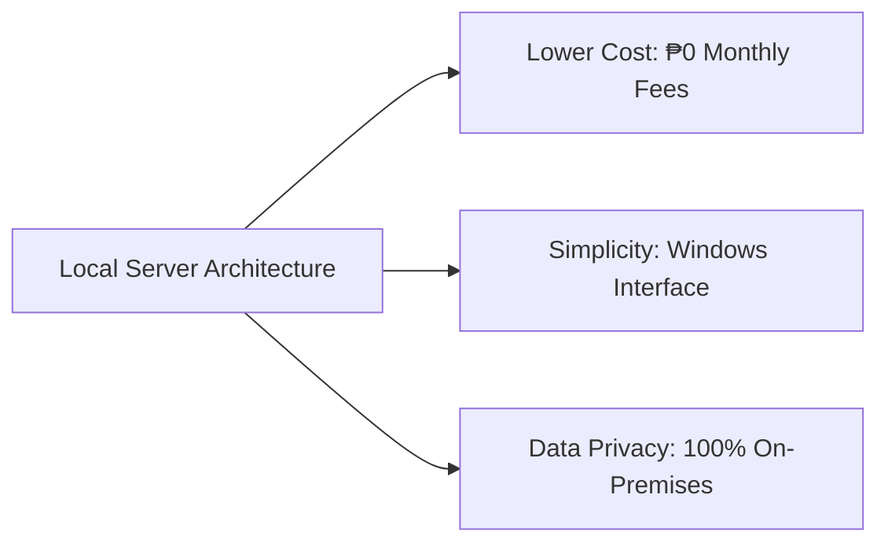
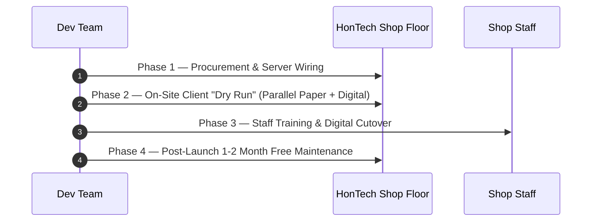

# 📄 HONTECH AUTOCENTER
## HonTech Operations System — Client Proposal & Deployment Strategy

> **Prepared For:** HonTech AutoCenter — Management & Ownership  
> **Prepared By:** HonTech Systems Development Team  
> - **Justin Nolasco J.** *(Lead Developer)*  
> - **Mary Dayne Villas T.** *(UI/UX Designer)*  
> - **Catherine Ramos G.** *(Documentation Specialist)*  
> - **Mr. Ar-Jay C. Agbayani** *(Capstone Project Adviser)*  
> **Date:** July 9, 2026  
> **Document Version:** 1.0 (Final Executive Proposal)

---

## 📋 Table of Contents
1. [Executive Summary](#1-executive-summary)
2. [Architecture Strategy](#2-architecture-strategy)
3. [Hardware Requirements](#3-hardware-requirements)
4. [Financial Analysis: Local vs. Cloud](#4-financial-analysis-local-vs-cloud)
5. [Investment & Support Structure](#5-investment--support-structure)
6. [Security, Data Privacy & Maintenance](#6-security-data-privacy--maintenance)
7. [Deployment Roadmap](#7-deployment-roadmap)
8. [Project Deliverables](#8-project-deliverables)
9. [Next Steps & Client Requirements](#9-next-steps--client-requirements)
10. [Client Approval Sign-Off](#10-client-approval-sign-off)

---

## 1. Executive Summary

Running a busy auto center depends on speed and clear communication. Today, HonTech AutoCenter relies on physical paper claim stubs and verbal updates between the front desk, the service bays, and waiting customers. This creates avoidable operational bottlenecks:
- The front desk cannot see what mechanics are doing in real time.
- Mechanics wait on service advisor approvals that get lost in the shop shuffle.
- Waiting lounge customers are left guessing about the progress of their vehicles.

The **HonTech Operations System** is a fully digital, real-time management dashboard that connects the front desk, service bays, and customer waiting lounge on one shared platform—without anyone needing to leave their station to stay informed.

> [!IMPORTANT]
> ### Why This Matters to HonTech
> - ⚡ **Speed & Organization:** Staff always know exactly which vehicles are on which lifts and what stage each job is in.
> - 🤝 **Customer Trust:** A live status monitor in the lounge keeps customers calm, informed, and confident in the shop.
> - 💰 **Cost Efficiency:** Built to run on a local intranet network, eliminating recurring monthly cloud hosting fees.
> - 🛡️ **Absolute Data Privacy:** Customer names, phone numbers, and repair logs stay physically inside the HonTech building at all times.

---

## 2. Architecture Strategy

We recommend deploying the HonTech Operations System on a **Local Intranet Server** rather than a third-party cloud hosting platform. This decision is grounded in three core priorities that matter most to HonTech AutoCenter:

| Priority | How Local Deployment Delivers It |
| :--- | :--- |
| **Lower Cost** | **₱0 monthly hosting or domain fees** — a one-time hardware purchase replaces years of recurring bills. |
| **Simplicity** | Managed entirely through a familiar **Windows interface** — no command-line or Linux knowledge needed. |
| **Data Privacy** | All records stay on-site on the shop's own server PC, never transmitted to third-party cloud servers. |

---

## 3. Hardware Requirements

To run the local server architecture, HonTech will need to prepare the following on-site hardware:

### 3.1 Primary Application Server (Local XAMPP Server)
*This machine acts as the brain of the operation and must remain powered on during all business hours.*

| Specification | Requirement Details |
| :--- | :--- |
| **Form Factor** | Desktop PC or Mini-PC *(Avoid laptops to prevent battery swelling from 24/7 plugged-in use)* |
| **Operating System** | Windows 10 or Windows 11 (64-bit) |
| **Processor (CPU)** | Intel Core i3 (10th Gen+) or AMD Ryzen 3 |
| **Memory (RAM)** | 8GB DDR4 minimum (16GB recommended) |
| **Storage** | 256GB SSD required for fast database read/write speeds |
| **Networking** | Wired RJ45 Ethernet connection to shop router *(Wi-Fi not recommended for server)* |

> [!TIP]
> **Budget Option:** A new desktop meeting these specifications costs approximately **₱16,500 – ₱22,000**. If HonTech has an unused desktop on hand, it can be wiped and repurposed as the server to save costs!

### 3.2 Staff Terminals (Front Desk & Service Advisors)
- Standard PCs, budget laptops, or tablets (e.g., iPads).
- Any device capable of running a modern web browser (Google Chrome, Microsoft Edge, or Safari).

### 3.3 Waiting Lounge Broadcast Monitor
- **40-inch or larger Smart TV**.
- Built-in web browser or streaming stick (Chromecast / Amazon Fire Stick) to display the live dashboard.

---

## 4. Financial Analysis: Local vs. Cloud

Choosing a local server shifts the cost structure from a recurring monthly expense to a single upfront asset purchase — delivering substantial savings over time.

| Expense Category | Cloud Deployment (AWS / DigitalOcean) | Local Intranet Server (XAMPP) |
| :--- | :--- | :--- |
| **Server Hardware** | ₱0 (Rented off-site) | **₱16,500 – ₱22,000** (One-Time Purchase) |
| **Monthly Hosting Fee** | ₱1,300 – ₱2,700 / month | **₱0 / month** |
| **Domain Name Fee** | ₱800 / year (`hontech.com`) | **₱0 / year** (Uses Local IP / Domain) |
| **Database Storage Limits** | Pay-per-GB scaled pricing | **Unlimited** (Up to 256GB Local SSD) |
| **Internet Bandwidth Costs** | Subject to provider data fees | **₱0** (Runs entirely on local network) |
| **5-Year Total Estimate** | **₱80,000 – ₱165,000+** | **≈ ₱22,000 Total** |

> [!SUCCESS]
> **Bottom Line:** Over a 5-year horizon, the local intranet deployment saves HonTech an estimated **₱58,000 to ₱143,000** compared to an equivalent cloud-hosted solution.

---

## 5. Investment & Support Structure

### 5.1 System Development (One-Time Cost)
To keep the transition manageable, the software development fee is divided into two clear milestones:
- **Project Initiation (30%):** Initial deposit to begin hardware preparation, server configuration, and environment setup.
- **Final Turnover (70%):** Remaining balance due only once the client is fully satisfied with the Dry Run and the system is actively supporting shop operations.

### 5.2 Complimentary Support & Future Maintenance
- **1–2 Months Free Maintenance (Tentative):** The first 1–2 months after launch include complimentary maintenance and bug fixes while staff adjust to the digital workflow.
- **Ongoing IT Retainer (Optional):** After the free period, HonTech may opt into a maintenance contract covering routine database backups, password resets, and disaster recovery. Even with a modest retainer, total savings versus cloud hosting still exceed **₱165,000+** over 5 years.

---

## 6. Security, Data Privacy & Maintenance

Running on a local server brings meaningful security and operational advantages:

- 🔒 **Physical Security:** The customer database (names, phone numbers, vehicle records) physically never leaves the HonTech building.
- 🛡️ **Air-Gapped Isolation:** The server is not exposed to the public internet, protecting it from remote cyber threats and bot attacks.
- 📂 **Data Sovereignty:** HonTech owns 100% of its data with zero reliance on third-party cloud providers.
- 🖥️ **Zero Command-Line Administration:** Managed through a standard Windows interface — no Linux knowledge required.
- ⚡ **One-Click Boot:** Server startup is as simple as powering on the PC and starting XAMPP.
- 📶 **No Cloud Outages:** The system stays 100% operational even if the shop's external internet connection goes down.

---

## 7. Deployment Roadmap

### Phase 1 — Procurement & Setup
- Procure server PC (or repurpose a spare unit); assess lounge TV setup.
- Physically install and wire server PC to local router via RJ45 Ethernet.
- Install XAMPP, migrate database, and verify terminal loading speeds.

### Phase 2 — On-Site Client Testing ("Dry Run")
- Staff continue using paper stubs for safety while simultaneously entering data into the digital system.
- **Goal:** Stress-test software and familiarize staff with the workflow without risking live business operations.

### Phase 3 — Staff Training & Go-Live Cutover
- Conduct final staff training sessions based on Dry Run observations.
- **Cutover:** Officially retire paper claim stubs. All intake and status tracking become 100% digital.

### Phase 4 — Post-Launch Observation (Free Maintenance Period)
- Developer monitors system for 1–2 months to ensure operational stability, fix bugs, and support staff adoption.

---

## 8. Project Deliverables

Upon final payment and official Go-Live cutover, HonTech will receive:
1. 📖 **User Manuals:** Step-by-step PDF guides with screenshots for front desk and service advisor staff.
2. 🔑 **Administrator & Security Guide:** Instructions for the owner on password resets, analytics, and employee access control.
3. 🚨 **Emergency Protocol Document:** Step-by-step procedures for power outages, server restarts, and temporary paper fallbacks.
4. 📄 **Source Code License / Contract:** Legal document defining code ownership and terms of use.

---

## 9. Next Steps & Client Requirements

The following action items will conclude the proposal meeting and set the project in motion:

1. **Approval & Sign-Off:** Client agrees to the hardware list and payment structure.
2. **Hardware Procurement:** Client purchases or prepares the lounge TV and server PC.
3. **Payment:** Collection of the Phase 1 deposit (30%).
4. **Schedule the Dry Run:** Pick a slow business day (e.g., a Tuesday) to begin Phase 2.

---

## 10. Client Approval Sign-Off

**Approved By:**

___________________________________________  
**Client Signature — HonTech AutoCenter Management**  

**Date:** ________________________
