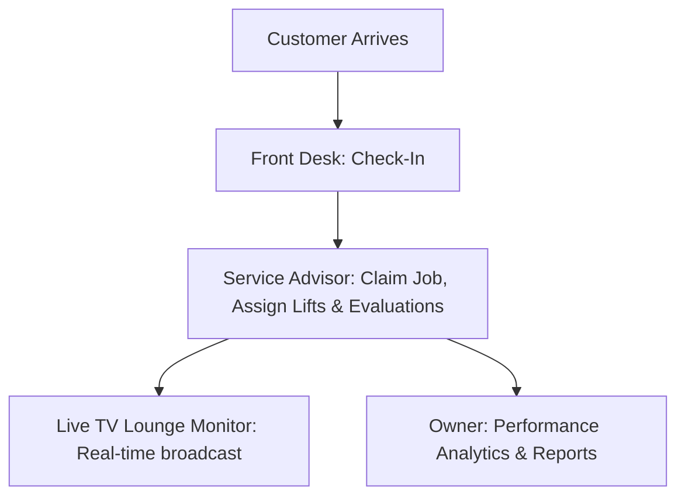

# HonTech AutoCenter Operations System: Client Presentation & Walkthrough Booklet

This guide is designed as a structured pitch and explanatory script that you can present to your client (HonTech AutoCenter management and staff). It translates complex technical architecture into clear, business-driven value.

---

# 📖 Slide 1: The Vision & "The Why" (The Reason)

### **What to Say to the Client:**
> *"First, let's talk about why we are building this. Running a busy auto center is a balancing act. Right now, you rely on paper check-in sheets, manual claim stubs, and verbal updates. 
> 
> This manual process creates three major bottlenecks:*
> 1. **Information Silos:** The front desk doesn't immediately know what the technicians in the bays are working on.
> 2. **Customer Anxiety:** Customers in the waiting lounge constantly ask, 'Is my car ready yet?' because they have no line of sight into the garage.
> 3. **Paper Trail Fatigue:** Retrieving past repair history or calculating monthly shop performance means digging through folders of paper.
> 
> *Our system, the **HonTech Operations System**, digitalizes this entire journey from the second a car rolls in to the moment it drives out, bringing transparency, speed, and analytics to your shop."*

---

# 📊 Slide 2: Data Gathering & Design
### **What to Say to the Client:**
> *"We didn't build this system in a vacuum. We studied your actual day-to-day operations and mapped out exactly how vehicles, paperwork, and people move through HonTech. 
> 
> We gathered this data by:*
> *   **Analyzing Workflows:** Mapping the exact transition of a car from check-in, to diagnostics, to parts approval, to repair, and final checkout.
> *   **Role Interviews:** Determining exactly what information the Front Desk, the Advisors, and the Technicians need at any given moment.
> *   **Security Audits:** Making sure sensitive customer records, employee credentials, and pricing structures are locked down and protected by modern encryption standards."*

---

# 💡 Slide 3: The Prototype Promise
### **What to Say to the Client:**
> *"Before launching a massive, expensive system, we promised you a working prototype. This prototype is built on a high-performance stack: **Node.js, MongoDB, and SASS/HTML5**. 
> 
> It's designed to be:*
> *   **Lightning Fast:** Loads instantly even on older shop tablets or computers.
> *   **Responsive:** Works on phones, tablets, and desktop monitors.
> *   **Live-Updating:** No need to constantly hit refresh; when a technician updates a status, the entire shop sees it instantly."*

---

# 🗂️ Slide 4: Role-Based Workflows & Permissions

> *"To keep operations organized, the system enforces three distinct roles. Each employee only sees what they need to see to do their job, keeping the interface clean, preventing mistakes, and establishing clear workflows."*

---

### **1. The Owner / System Admin**
*   **Mission:** Oversee workshop health, analyze performance metrics, and manage the staff roster.
*   **Permissions:** Full access to everything. Can create/delete employee accounts, reset staff passwords, edit roles, and view success rate metrics and period logs.
*   **Key Activities:**
    *   Reviewing daily/monthly analytics (PMS Goal Success rates, Success/Failure counters).
    *   Adding new staff or toggling access status on the staff roster.
    *   Filtering completed jobs logs by date range and search keywords.

---

### **2. The Front Desk Assistant**
*   **Mission:** Act as the gateway of the shop. Manage booking check-ins and register vehicles quickly.
*   **Permissions:** Can create customer profiles, log walk-ins, schedule online appointments, and activate bookings. Cannot alter diagnostics, assign lifts, or delete logs.
*   **Key Activities:**
    *   Registering new customers (name, phone, license plate, vehicle make/model, concern).
    *   Inputting categories (supporting `PMS`, `GR`, `Check-Up`, and dynamic custom `Others`).
    *   Issuing printed/digital claim stubs to arriving customers.

---

### **3. The Service Advisor (SA)**
*   **Mission:** Translate customer problems into actionable repair plans, allocate bay lifts, perform diagnostics, and evaluate repairs.
*   **Permissions:** Full control over active jobs assigned to their profile. Can claim unassigned jobs, assign/start vehicles on Lift 1-4 or GRS, write evaluations, select parts statuses (including WCA), and complete jobs as Successful or Failed.
*   **Key Activities:**
    *   Claiming unassigned intakes and managing their personal active queue.
    *   Assigning vehicles to lift bays and recording diagnostic evaluations.
    *   Updating parts availability (Pending, Yes, No, and WCA - Waiting Customer Approval).
    *   Completing jobs and logging goal metrics (PMS Success/Failure).

---

# 📺 Slide 5: The Waiting Lounge Experience (The Broadcast Monitor)

### **What to Say to the Client:**
> *"Finally, we have the customer waiting lounge experience. Instead of customers walking up to the front desk to ask about their cars, we built a **Live Status Broadcast Monitor**. 
> 
> This is a rotating screen displayed on a TV in your waiting area. It shows:*
> *   Which cars are currently being worked on.
> *   What phase they are in (Maintenance, Diagnostic, Repairs, Quality Check).
> *   Which vehicles are ready for pickup.
> 
> *It builds immense trust and keeps your lounge calm, professional, and modern."*
