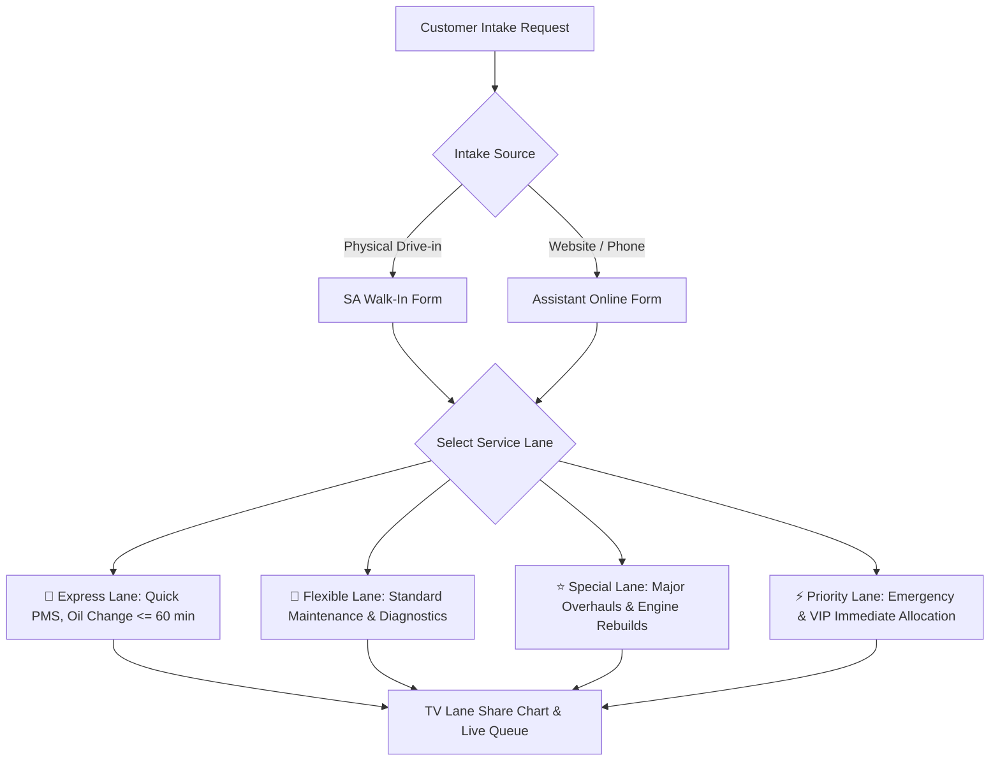

# 🛠️ Workshop Capacity, Bay Management & Role-Based Access Control (RBAC) Specification

**Document Identifier**: `HONTECH-TECH-SPEC-2026-BAY-RBAC`  
**System**: HonTech AutoCenter Operations & Queue Management System  
**Branch**: `branch2-Security-Account-Recovery`  
**Last Updated**: August 22, 2026  
**Status**: Official Active Technical Architecture  

---

## 1. Executive Summary & Purpose

This document provides the authoritative technical, operational, and architectural specification for the **Dynamic Workshop Bay Capacity Management System**, the dedicated **Workshop Bays Module (`#section-bays`)**, the **Role-Based Access Control (RBAC) Governance Matrix**, and the **4-Tier Booking Lane Architecture** implemented in the HonTech Management System.

These features enable HonTech AutoCenter to dynamically scale physical workshop capacity from **4 to 10 service bays**, maintain real-time vehicle allocation visibility across customer-facing TV monitors and staff tablets, and enforce strict role separation between Service Advisors (front-of-house customer intake) and Assistant Staff (online booking & scheduling).

---

## 2. Dynamic Workshop Bay Capacity Architecture (4 to 10 Bays)

### 2.1 Problem Statement & Solution
Traditional automotive shop management systems hardcode floor capacities to fixed bay counts (e.g., 4 bays), causing system breakdowns when an auto shop expands floor hoists or opens temporary service areas. 

HonTech resolves this by introducing **Dynamic Workshop Bay Scaling (4 to 10 Bays)**, allowing administrators to configure total active floor bays on the fly without database schema migrations or software restarts.

### 2.2 Core Logic & State Management
* **Storage Key**: `localStorage.getItem('hontech_workshop_bay_count')`
* **Default Value**: `4` (Standard AutoCenter Setup)
* **Clamping Boundaries**: `Math.min(10, Math.max(4, count))`
* **Helper Functions (`frontend/js/app.js`)**:
  ```javascript
  function getWorkshopBayCount() {
      const stored = parseInt(localStorage.getItem('hontech_workshop_bay_count'), 10);
      if (!isNaN(stored) && stored >= 4 && stored <= 10) {
          return stored;
      }
      return 4; // Default 4 service bays
  }

  function handleWorkshopBayCountChange(newCount) {
      const num = Math.min(10, Math.max(4, parseInt(newCount, 10) || 4));
      localStorage.setItem('hontech_workshop_bay_count', num.toString());
      
      // Update UI components across modules
      renderStaffTables();
      renderTV();
      renderWorkshopBaysModule();
      showSystemToast(`Workshop capacity configured to ${num} service bays.`, 'success', 'Bays Configured');
  }
  ```

### 2.3 Responsive TV Display Monitor Grid Layout Matrix
When the total bay count changes, **Slide 1: Bay Monitoring (`#tv-slide-1`)** dynamically recomputes its CSS Grid columns on `#tv-grs-list` to ensure optimal readability on large kiosk and wall-mounted TV screens:

| Configured Capacity | Grid Layout Class | Card Dimensions & Styling | TV Slide Subtitle |
| :--- | :--- | :--- | :--- |
| **4 Bays** | `grid-cols-2 gap-5` | Large, high-visibility 2x2 layout | `Active Bays (1-4) & Real-Time Allocations` |
| **5–6 Bays** | `grid-cols-3 gap-4` | 3-column widescreen grid | `Active Bays (1-6) & Real-Time Allocations` |
| **7–8 Bays** | `grid-cols-4 gap-3.5` | 4-column multi-bay overview | `Active Bays (1-8) & Real-Time Allocations` |
| **9–10 Bays** | `grid-cols-5 gap-3` | 5-column maximum capacity floor view | `Active Bays (1-10) & Real-Time Allocations` |

### 2.4 Service Advisor Location Dropdowns & Collision Detection
The Location / Bay selector in the Daily Intakes table (`#table-body`) dynamically iterates from `1` to `getWorkshopBayCount()`. It cross-references other active jobs and marks occupied bays with `disabled` and the occupying vehicle's plate number (e.g., `Bay 2 (Occupied - NBH-1234)`), preventing accidental double-booking of physical service bays.

---

## 3. Dedicated Workshop Bays Module (`#section-bays`)

### 3.1 Overview
Rather than confining bay controls to account settings, a dedicated primary navigation module **`Workshop Bays`** (`<i data-lucide="layout-grid"></i>`) is integrated into both the **Left Sidebar** and **Top Navigation**.

### 3.2 Component Breakdown
1. **Hero Header & Real-Time Telemetry**:
   - **Total Bays**: Live count of active configured bays.
   - **In Service**: Real-time counter of vehicles currently occupying a bay (`j.location.startsWith('Bay')`).
   - **Available**: Real-time count of free bays (`Total - In Service`).
   - **Utilization Rate (%)**: Real-time floor occupancy percentage formula:
     $$\text{Utilization} = \left( \frac{\text{Occupied Bays}}{\text{Total Configured Bays}} \right) \times 100$$
2. **Capacity Configuration Card (Admin & Owner)**:
   - Numerical capacity selector (4 to 10 Bays).
   - **1-Click Quick Presets**: `4 Bays (Standard)`, `6 Bays`, `8 Bays`, and `10 Bays (Max)`.
3. **Interactive Workshop Floor Plan Grid (`#bays-floor-grid`)**:
   - **Occupied Bay Cards**: Display vehicle plate, model, customer name, service category, assigned lane type, service advisor, status, and direct 1-click **"Unassign Bay"** and **"Record"** actions.
   - **Available Bay Cards**: Clean dashed cards indicating `READY FOR ALLOCATION` with a shortcut to assign waiting vehicles.
4. **Unassigned Waiting Queue Allocation Drawer (`#bays-waiting-list`)**:
   - Lists vehicles in `Waiting Area` status and provides a dynamic 1-click dropdown listing only currently **Free Bays** for instant floor allocation.

---

## 4. Role-Based Access Control (RBAC) Governance Matrix

To maintain clean operational boundaries and prevent workflow conflicts between front-of-house customer service and online intake coordinators, access rights are strictly enforced:

| Feature / Module | 👑 Owner | 👔 Admin | 🛠️ Service Advisor (SA) | 📋 Assistant Staff | 🔧 Technician |
| :--- | :---: | :---: | :---: | :---: | :---: |
| **Analytics Overview (`dashboard`)** | ✅ Full | ✅ Full | ❌ Hidden | ❌ Hidden | ❌ Hidden |
| **Workshop Bays Module (`bays`)** | ✅ Full | ✅ Full | 👁️ View / Assign | 👁️ View Only | ❌ Hidden |
| **Bay Capacity Scaling (4–10)** | ✅ Config | ✅ Config | ❌ Hidden | ❌ Hidden | ❌ Hidden |
| **Staff Management (`staff`)** | ✅ Full | ✅ Full | ❌ Hidden | ❌ Hidden | ❌ Hidden |
| **Walk-In Intake Form (`intake`)** | ❌ | ❌ | ✅ **Full Control** | ❌ *(Has Online Form)* | ❌ |
| **Online Booking Form (`intake`)** | ❌ | ❌ | ❌ *(Has Walk-In Form)* | ✅ **Full Control** | ❌ |
| **Online Inquiries Table (`#container-online-queue`)** | 👁️ View-Only | 👁️ View-Only | ❌ **Hidden (No Access)** | ✅ **Full Control** | ❌ Hidden |
| **Daily Intakes / Queue (`queue`)** | ✅ Full | ✅ Full | ✅ Full | ✅ Master View | ❌ *(Has Tech Board)* |
| **Technician Board (`tech-board`)** | ❌ | ❌ | ❌ | ❌ | ✅ **Full Control** |
| **TV Display Monitor (`tv`)** | ✅ Full | ✅ Full | ✅ Full | ✅ Full | ✅ Full |
| **Password Resets & Security Logs** | ✅ Full | ✅ Full | ❌ Hidden | ❌ Hidden | ❌ Hidden |

### 4.1 Key RBAC Rule: Online Booking Module Authority
* **Assistant Staff Only**: SAs are strictly decoupled from the Online Booking Queue (`#container-online-queue`) so they remain 100% focused on physical drive-in customers.
* **Confirming Bookings**: When an Assistant clicks **"Confirm Active"**, the booking transitions from `Pending` to active queue status, auto-populating into the Service Advisor's Daily Intakes view.

---

## 5. 4-Tier Booking Lane Architecture

To support diverse automotive turnaround times, all intake forms and queue tables support 4 distinct lane types:



1. **🚀 Express Lane**: Optimized for quick turnaround PMS (Periodic Maintenance Service), oil changes, and fluid top-ups with strict turnaround goals ($\le 60\text{ min}$).
2. **🔄 Flexible Lane** *(Default)*: Standard multi-point inspections, brake service, electrical troubleshooting, and general repairs.
3. **⭐ Special Lane**: Dedicated to complex jobs requiring specialized diagnostic tooling, engine teardowns, transmission rebuilding, or third-party machining.
4. **⚡ Priority Lane**: Immediate floor allocation for critical fleet vehicles, government clients, and emergency breakdowns.

---

## 6. Local Intranet & Multi-Device Deployment Architecture

### 6.1 Server Binding & Port Configuration
* **Router Script**: `router.php`
* **Host Binding**: `0.0.0.0:8000` (Allows inbound traffic across all local network adapters).
* **Local Host Access**: `http://localhost:8000`
* **Mobile / LAN Access**: `http://<HOST-IP-ADDRESS>:8000` (e.g. `http://10.239.104.46:8000`)

### 6.2 1-Click LAN Server Launcher (`start_lan_server.bat`)
A Windows batch script that automatically queries `ipconfig`, extracts the active IPv4 address, displays mobile connection URLs, and starts the PHP built-in web server with zero manual terminal commands.

### 6.3 Dynamic QR Code Device Pairing
Clicking **📱 Connect Phone (QR)** on the login screen dynamically generates a live QR code embedding the host's LAN URL, allowing technicians and advisors to point their phone cameras and authenticate in seconds.

---

## 7. Data Privacy & Terms Compliance (RA 10173)

All vehicle plate numbers, customer contact numbers, and diagnostic records are protected in compliance with the **Philippine Data Privacy Act of 2012 (RA 10173)**:
* **Interactive Terms Modal**: Accessible directly from `#terms-modal` on the login screen and application footer.
* **30-Minute Inactivity Protection**: Auto-expires unauthenticated staff sessions to prevent unauthorized bay modification on unattended workshop tablets.
* **Defensive DOM Shielding**: All UI controllers enforce strict null guards to prevent uncaught runtime script crashes during fast role switching.
