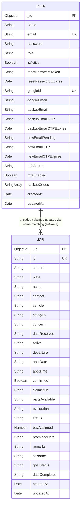

# HonTech AutoCenter Operations System: Database Schema & Entity Relationship Diagram (ERD)

This document outlines the database architecture, schema definitions, and Entity Relationship Diagram (ERD) for the **HonTech AutoCenter Inc. Operations System**. The system utilizes **MongoDB** (a NoSQL document database) via the **Mongoose ODM (Object Document Mapper)** in the Node.js backend.

---

## 1. Database Architecture Overview
The database uses two primary collections:
1. **`users` Collection**: Manages workshop staff accounts, Roles (RBAC), multi-factor authentication (MFA), and third-party login integration (Google OAuth).
2. **`jobs` Collection**: Represents the core vehicle service records (intake, live queue status, service bays, technicians, and parts statuses).

### Data Relationships
In a document-oriented database like MongoDB:
* The connection between the collections is loose/dynamic. Instead of strict foreign keys, the **`jobs`** collection stores the **`saName`** (Service Advisor's Name) as a string reference when walk-ins are logged.
* Completed jobs remain in the database (`status: "Completed"`) to serve as historical records for the shop owner's **Analytics Dashboard**.

---

## 2. Detailed Schema Definitions

### 2.1 Users Collection Schema (`User` Model)
Manages credentials, access scopes (RBAC), security configurations, and linking states.

| Field Name              | Data Type     | Required | Unique           | Default Value | Description / Validations                               |
| :---------------------- | :------------ | :------: | :--------------: | :-----------: | :------------------------------------------------------ |
| `_id`                   | ObjectId      | **Yes**  | **Yes**          | *Auto*        | MongoDB unique identifier.                              |
| `name`                  | String        | **Yes**  | No               | None          | Full name of the staff member (trimmed).                |
| `email`                 | String        | **Yes**  | **Yes**          | None          | Primary email (lowercase, trimmed).                     |
| `password`              | String        | **Yes**  | No               | None          | Hashed password (using `bcryptjs` with 10 salt rounds). |
| `role`                  | String        | **Yes**  | No               | None          | Access level. Enum: `['owner', 'assistant', 'sa']` *(Technician role has been consolidated/removed)*. |
| `isActive`              | Boolean       | No       | No               | `true`        | Status flag for shop owner to suspend/restore staff access. |
| `resetPasswordToken`    | String        | No       | No               | None          | Verification token for forgot-password recoveries.      |
| `resetPasswordExpires`  | Date          | No       | No               | None          | Expiration timestamp for password reset token.          |
| `googleId`              | String        | No       | **Yes** (Sparse) | None          | Google OAuth unique identifier (if linked).             |
| `googleEmail`           | String        | No       | No               | None          | Associated Google email.                                |
| `backupEmail`           | String        | No       | No               | None          | Secondary email for multi-factor recovery.              |
| `backupEmailOTP`        | String        | No       | No               | None          | One-Time Password for backup email validation.          |
| `backupEmailOTPExpires` | Date          | No       | No               | None          | Expiry time of the backup email verification OTP.       |
| `newEmailPending`       | String        | No       | No               | None          | New email address staging field during changes.         |
| `newEmailOTP`           | String        | No       | No               | None          | OTP sent to verify a new email change.                  |
| `newEmailOTPExpires`    | Date          | No       | No               | None          | Expiry time of the email change OTP.                    |
| `mfaSecret`             | String        | No       | No               | None          | TOTP (Google Authenticator) shared secret string.       |
| `mfaEnabled`            | Boolean       | No       | No               | `false`       | Status flag indicating if Multi-Factor Auth is active.  |
| `backupCodes`           | Array[String] | No       | No               | `[]`          | List of single-use recovery backup codes.               |
| `createdAt`             | Date          | **Yes**  | No               | *Auto*        | Timestamp when account was registered.                  |
| `updatedAt`             | Date          | **Yes**  | No               | *Auto*        | Timestamp when account details were last changed.       |

---

### 2.2 Jobs Collection Schema (`Job` Model)
Tracks vehicle queue status, diagnostic inputs, scheduling, and lift allocations.

| Field Name       | Data Type | Required | Unique  | Default Value | Description / Validations                                                                 |
| :--------------- | :-------- | :------: | :-----: | :-----------: | :---------------------------------------------------------------------------------------- |
| `_id`            | ObjectId  | **Yes**  | **Yes** | *Auto*        | MongoDB unique identifier.                                                                |
| `id`             | String    | **Yes**  | **Yes** | None          | Primary custom key. Format: `WLK-XXXX` or `ONL-XXXX`.                                     |
| `source`         | String    | **Yes**  | No      | None          | Intake channel. Enum: `['Walk-in', 'Online']`.                                            |
| `plate`          | String    | **Yes**  | No      | None          | Vehicle plate number (saved in UPPERCASE, trimmed).                                       |
| `name`           | String    | **Yes**  | No      | None          | Customer's full name (trimmed).                                                           |
| `contact`        | String    | No       | No      | None          | Customer's telephone/mobile number.                                                       |
| `vehicle`        | String    | **Yes**  | No      | None          | Vehicle make and model (e.g., "Toyota Vios").                                             |
| `category`       | String    | **Yes**  | No      | None          | Service type. E.g., `PMS`, `GR`, `Check-Up`, or `Others` (which saves typed custom service categories). |
| `concern`        | String    | No       | No      | None          | Specific concerns or request details.                                                     |
| `dateReceived`   | String    | **Yes**  | No      | None          | Date received. Format: `YYYY-MM-DD`.                                                      |
| `arrival`        | String    | No       | No      | `""`          | Local intake arrival timestamp. Format: `HH:MM`.                                          |
| `departure`      | String    | No       | No      | `""`          | Local checkout departure timestamp. Format: `HH:MM`.                                      |
| `apptDate`       | String    | No       | No      | `""`          | Date scheduled (Online only). Format: `YYYY-MM-DD`.                                       |
| `apptTime`       | String    | No       | No      | `""`          | Time scheduled (Online only). Format: `HH:MM`.                                            |
| `confirmed`      | Boolean   | No       | No      | `false`       | Status of appointment approval (Online only).                                             |
| `claimStub`      | String    | No       | No      | `""`          | Sequential barcode stub number. Format: `MMDDYY-XXX`.                                     |
| `partsAvailable` | String    | No       | No      | `"Pending"`   | Part staging state. Enum: `['Pending', 'Yes', 'No', 'WCA']` (WCA = Waiting Customer Approval). |
| `evaluation`     | String    | No       | No      | `""`          | Diagnostic findings/remarks entered directly by the Service Advisor.                      |
| `status`         | String    | **Yes**  | No      | `"Pending"`   | Status state: `Pending`, `Waiting`, `Lift 1` to `Lift 4`, `GRS`, `Ready to Release`, `Carry Over`, `Released`, `Completed`. |
| `bayAssigned`    | Number    | No       | No      | `null`        | Hydraulic lift index. `0` to `3` representing Lift 1 to 4.                                |
| `promisedDate`   | String    | No       | No      | `""`          | Targeted collection date for carry-overs. Format: `YYYY-MM-DD`.                           |
| `remarks`        | String    | No       | No      | `""`          | General notes or delay explanations.                                                      |
| `saName`         | String    | No       | No      | `""`          | Name of the Service Advisor who claimed/encoded the job.                                  |
| `goalStatus`     | String    | No       | No      | `"N/A"`       | Completion goal metric. Enum: `['Successful', 'Failed', 'N/A']`. Auto-calculated for PMS. |
| `dateCompleted`  | String    | No       | No      | `""`          | Completion stamp for reporting. Format: `YYYY-MM-DD`.                                     |
| `createdAt`      | Date      | **Yes**  | No      | *Auto*        | Timestamp when job record was registered.                                                 |
| `updatedAt`      | Date      | **Yes**  | No      | *Auto*        | Timestamp when job record was last modified.                                              |

---

## 3. Entity Relationship Diagram (ERD)

The following diagram illustrates the relationship structure between our models.



---

## 4. Key Architectural Database Rules in Code

### A. Pre-Save Middlewares (Encryption)
Before any `User` record is written to the database, a Mongoose pre-save hook runs to hash the raw password using `bcryptjs`:
```javascript
userSchema.pre('save', async function (next) {
  if (!this.isModified('password')) return next();
  try {
    const salt = await bcrypt.genSalt(10);
    this.password = await bcrypt.hash(this.password, salt);
    next();
  } catch (error) {
    next(error);
  }
});
```

### B. Auto-Generators (Sequences)
When a walk-in is created or online appointment check-in occurs, the system query checks database records for today to generate a sequential number for `claimStub` (`MMDDYY-XXX` format):
```javascript
const generateStubNumber = async () => {
  const d = new Date();
  const mm = String(d.getMonth() + 1).padStart(2, '0');
  const dd = String(d.getDate()).padStart(2, '0');
  const yy = String(d.getFullYear()).slice(2);
  const datePrefix = `${mm}${dd}${yy}`;
  
  const pattern = new RegExp(`^${datePrefix}-`);
  const count = await Job.countDocuments({ claimStub: pattern });
  return `${datePrefix}-${(count + 1).toString().padStart(3, '0')}`;
};
```

### C. Unique Indices & Constraints
* **`User.email`**: Uniqueness is strictly enforced at the database level.
* **`User.googleId`**: Defined as a **sparse, unique index** to allow multiple accounts to exist without linked Google IDs (preventing null duplication conflicts).
* **`Job.id`**: Employs random alphanumeric values prefixed with `WLK-` or `ONL-` (e.g., `WLK-3498`) to enforce secondary reference integrity.
