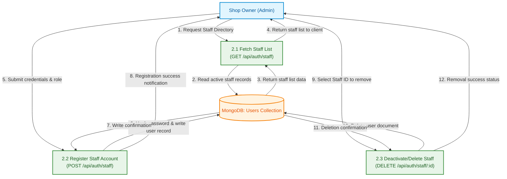

# HonTech AutoCenter Operations System: Data Flow Diagrams (DFD)

This document contains individual Data Flow Diagrams (DFDs) representing the distinct business processes and data paths of the **HonTech AutoCenter Inc. Operations System**. 

---

## 1. DFD – User Authentication & Session Flow
This diagram details how staff users (Owner, Assistant, Service Advisor) authenticate, query their active profile, and establish secure sessions via JWT.

```mermaid
flowchart TD
    %% Nodes definition
    User["Staff User (Owner/Assistant/SA)"]:::entity
    
    P1["1.1 Validate Credentials & Create JWT<br/>(POST /api/auth/login)"]:::process
    P2["1.2 Authenticate Session & Extract Role<br/>(middleware/auth.js)"]:::process
    P3["1.3 Terminate Session<br/>(POST /api/auth/logout)"]:::process
    
    DS1[("MongoDB: Users Collection")]:::datastore

    %% Data Flows
    User -->|1. Credentials (Email/Password)| P1
    P1 -->|2. Query user email| DS1
    DS1 -->|3. Return hashed password & role| P1
    P1 -->|4. Set secure HTTP-only JWT Cookie| User
    
    User -->|5. API Request with JWT Cookie| P2
    P2 -->|6. Verify token & attach user object| P2
    P2 -->|7. Authorized Request Payload| P3
    
    User -->|8. Request Logout| P3
    P3 -->|9. Clear JWT Cookie| User

    %% Style classes
    classDef entity fill:#e1f5fe,stroke:#0288d1,stroke-width:2px,color:#01579b;
    classDef process fill:#e8f5e9,stroke:#388e3c,stroke-width:2px,color:#1b5e20;
    classDef datastore fill:#fff3e0,stroke:#f57c00,stroke-width:2px,color:#e65100;
```


This code is currently working: 
flowchart TD
    %% Nodes definition
    User["Staff User (Owner/Assistant/SA)"]:::entity
    
    P1["1.1 Validate Credentials & Create JWT<br/>(POST /api/auth/login)"]:::process
    P2["1.2 Authenticate Session & Extract Role<br/>(middleware/auth.js)"]:::process
    P3["1.3 Terminate Session<br/>(POST /api/auth/logout)"]:::process
    
    DS1[("MongoDB: Users Collection")]:::datastore

    %% Data Flows
    User -->|"1. Credentials (Email/Password)"| P1
    P1 -->|"2. Query user email"| DS1
    DS1 -->|"3. Return hashed password & role"| P1
    P1 -->|"4. Set secure HTTP-only JWT Cookie"| User
    
    User -->|"5. API Request with JWT Cookie"| P2
    P2 -->|"6. Verify token & attach user object"| P2
    P2 -->|"7. Authorized Request Payload"| P3
    
    User -->|"8. Request Logout"| P3
    P3 -->|"9. Clear JWT Cookie"| User

    %% Style classes
    classDef entity fill:#e1f5fe,stroke:#0288d1,stroke-width:2px,color:#01579b;
    classDef process fill:#e8f5e9,stroke:#388e3c,stroke-width:2px,color:#1b5e20;
    classDef datastore fill:#fff3e0,stroke:#f57c00,stroke-width:2px,color:#e65100;
    
---

## 2. DFD – Staff Management Flow
This diagram details the administrative capabilities restricted to the **Owner** for listing, creating, and deleting staff accounts.


Working code : 


flowchart TB
    Owner["Shop Owner (Admin)"] -- "1. Request Staff Directory" --> P1["2.1 Fetch Staff List<br>(GET /api/auth/staff)"]
    P1 -- "2. Read active staff records" --> DS1[("MongoDB: Users Collection")]
    DS1 -- "3. Return staff list data" --> P1
    P1 -- "4. Return staff list to client" --> Owner
    Owner -- "5. Submit credentials & role" --> P2["2.2 Register Staff Account<br>(POST /api/auth/staff)"]
    P2 -- "6. Hash password & write user record" --> DS1
    DS1 -- "7. Write confirmation" --> P2
    P2 -- "8. Registration success notification" --> Owner
    Owner -- "9. Select Staff ID to remove" --> P3["2.3 Deactivate/Delete Staff<br>(DELETE /api/auth/staff/:id)"]
    P3 -- "10. Delete user document" --> DS1
    DS1 -- "11. Deletion confirmation" --> P3
    P3 -- "12. Removal success status" --> Owner

     P1:::process
     DS1:::datastore
     P2:::process
     P3:::process
    classDef process fill:#e8f5e9,stroke:#388e3c,stroke-width:2px,color:#1b5e20
    classDef datastore fill:#fff3e0,stroke:#f57c00,stroke-width:2px,color:#e65100
    style P1 fill:#ffffff,color:#000000
    style DS1 stroke:#000000,color:#000000,fill:#ffffff
    style P2 color:#000000,stroke:#000000
    style P3 color:#000000

---

## 3. DFD – Walk-in Job Intake Flow
This diagram details how the Service Advisor, Owner, or Assistant performs vehicle intake for walk-in clients, resulting in an active job in the **Waiting** status and generating a unique physical claim stub.

```mermaid
flowchart TD
    %% Nodes definition
    Staff["Intake Operator<br/>(Owner/Assistant/SA)"]:::entity
    Customer["Walk-in Customer"]:::entity
    
    P1["3.1 Capture Vehicle & Customer Info<br/>(POST /api/jobs)"]:::process
    P2["3.2 Generate Sequential Claim Stub<br/>(generateStubNumber)"]:::process
    P3["3.3 Save Job to Queue<br/>(Job.save)"]:::process
    
    DS1[("MongoDB: Jobs Collection")]:::datastore

    %% Data Flows
    Customer -->|1. Vehicle details, plate, concern| Staff
    Staff -->|2. Submit intake details| P1
    
    P1 -->|3. Query today's jobs count| P2
    P2 -->|4. Check existing daily records| DS1
    DS1 -->|5. Return count of today's stub codes| P2
    P2 -->|6. Return formatted stub code (e.g. MMDDYY-XXX)| P1
    
    P1 -->|7. Save new job (WLK-XXXX) with status 'Waiting'| P3
    P3 -->|8. Write job record to database| DS1
    DS1 -->|9. Write confirmation| P3
    P3 -->|10. Return job details & stub| Staff
    Staff -->|11. Issue physical claim stub| Customer

    %% Style classes
    classDef entity fill:#e1f5fe,stroke:#0288d1,stroke-width:2px,color:#01579b;
    classDef process fill:#e8f5e9,stroke:#388e3c,stroke-width:2px,color:#1b5e20;
    classDef datastore fill:#fff3e0,stroke:#f57c00,stroke-width:2px,color:#e65100;
```


Working code: 


---
config:
  layout: fixed
---
flowchart TB
    Customer["Walk-in Customer"] -- "1. Vehicle details, plate, concern" --> Staff["Intake Operator<br>(Owner/Assistant/SA)"]
    Staff -- "2. Submit intake details" --> P1["3.1 Capture Vehicle &amp; Customer Info<br>(POST /api/jobs)"]
    P1 -- "3. Query today's jobs count" --> P2["3.2 Generate Sequential Claim Stub<br>(generateStubNumber)"]
    P2 -- "4. Check existing daily records" --> DS1[("MongoDB: Jobs Collection")]
    DS1 -- "5. Return count of today's stub codes" --> P2
    P2 -- "6. Return formatted stub code (e.g. MMDDYY-XXX)" --> P1
    P1 -- "7. Save new job (WLK-XXXX) with status 'Waiting'" --> P3["3.3 Save Job to Queue<br>(Job.save)"]
    P3 -- "8. Write job record to database" --> DS1
    DS1 -- "9. Write confirmation" --> P3
    P3 -- "10. Return job details & stub" --> Staff
    Staff -- "11. Issue physical claim stub" --> Customer

     DS1:::datastore
    classDef datastore fill:#fff3e0,stroke:#f57c00,stroke-width:2px,color:#e65100
    style Customer fill:#ffffff,stroke:#000000,color:#000000
    style Staff color:#000000,stroke:#000000,fill:#ffffff
    style P2 fill:#ffffff,stroke:#000000
    style DS1 fill:#ffffff,stroke:#000000,color:#333
    style P3 stroke:#333,color:#000000
---

## 4. DFD – Online Booking & Appointment Activation Flow
This diagram represents the flow for online appointment scheduling by customers, confirmation by staff, and subsequent activation (generating a claim stub) when the customer physically arrives at the shop.

```mermaid
flowchart TD
    %% Nodes definition
    Customer["Online Customer"]:::entity
    Staff["Operator (Owner/Assistant/SA)"]:::entity
    
    P1["4.1 Submit Appointment Booking<br/>(POST /api/jobs)"]:::process
    P2["4.2 Confirm Appointment<br/>(PATCH /api/jobs/:id/field)"]:::process
    P3["4.3 Activate Appointment on Arrival<br/>(PATCH /api/jobs/:id/status)"]:::process
    P4["4.4 Generate Claim Stub<br/>(generateStubNumber)"]:::process
    
    DS1[("MongoDB: Jobs Collection")]:::datastore

    %% Data Flows
    Customer -->|1. Vehicle details, apptDate, apptTime| P1
    P1 -->|2. Create 'Online' job with status 'Pending'| DS1
    DS1 -->|3. Save confirmation| P1
    P1 -->|4. Return appointment confirmation| Customer
    
    Staff -->|5. Review & Toggle 'Confirmed' field| P2
    P2 -->|6. Update confirmed: true| DS1
    DS1 -->|7. Save update confirmation| P2
    P2 -->|8. Success status| Staff
    
    Customer -->|9. Physical Arrival at Shop| Staff
    Staff -->|10. Trigger Check-In (status 'Waiting')| P3
    
    P3 -->|11. Request Claim Stub details| P4
    P4 -->|12. Fetch count of today's jobs| DS1
    DS1 -->|13. Return count of today's stub codes| P4
    P4 -->|14. Return formatted stub code (MMDDYY-XXX)| P3
    
    P3 -->|15. Update status to 'Waiting' and save stub| DS1
    DS1 -->|16. Acknowledge save| P3
    P3 -->|17. Output Claim Stub & activate job card| Staff

    %% Style classes
    classDef entity fill:#e1f5fe,stroke:#0288d1,stroke-width:2px,color:#01579b;
    classDef process fill:#e8f5e9,stroke:#388e3c,stroke-width:2px,color:#1b5e20;
    classDef datastore fill:#fff3e0,stroke:#f57c00,stroke-width:2px,color:#e65100;
```
Working code: 
---
config:
  layout: dagre
---
flowchart TB
    Customer["Online Customer"] -- "1. Vehicle details, apptDate, apptTime" --> P1["4.1 Submit Appointment Booking<br>(POST /api/jobs)"]
    P1 -- "2. Create 'Online' job with status 'Pending'" --> DS1[("MongoDB: Jobs Collection")]
    DS1 -- "3. Save confirmation" --> P1
    P1 -- "4. Return appointment confirmation" --> Customer
    Staff["Operator (Owner/Assistant/SA)"] -- "5. Review & Toggle 'Confirmed' field" --> P2["4.2 Confirm Appointment<br>(PATCH /api/jobs/:id/field)"]
    P2 -- "6. Update confirmed: true" --> DS1
    DS1 -- "7. Save update confirmation" --> P2
    P2 -- "8. Success status" --> Staff
    Customer -- "9. Physical Arrival at Shop" --> Staff
    Staff -- "10. Trigger Check-In (status 'Waiting')" --> P3["4.3 Activate Appointment on Arrival<br>(PATCH /api/jobs/:id/status)"]
    P3 -- "11. Request Claim Stub details" --> P4["4.4 Generate Claim Stub<br>(generateStubNumber)"]
    P4 -- "12. Fetch count of today's jobs" --> DS1
    DS1 -- "13. Return count of today's stub codes" --> P4
    P4 -- "14. Return formatted stub code (MMDDYY-XXX)" --> P3
    P3 -- "15. Update status to 'Waiting' and save stub" --> DS1
    DS1 -- "16. Acknowledge save" --> P3
    P3 -- "17. Output Claim Stub & activate job card" --> Staff

     Customer:::entity
     P1:::process
     DS1:::datastore
     Staff:::entity
     P2:::process
     P3:::process
     P4:::process
    classDef entity fill:#e1f5fe,stroke:#0288d1,stroke-width:2px,color:#01579b
    classDef process fill:#e8f5e9,stroke:#388e3c,stroke-width:2px,color:#1b5e20
    classDef datastore fill:#fff3e0,stroke:#f57c00,stroke-width:2px,color:#e65100
    style Customer fill:transparent,color:#000000,stroke:#ffffff
    style P1 fill:#ffffff,stroke:#000000,color:#000000
    style DS1 stroke:#000000,fill:#ffffff,color:#000000
    style Staff fill:#ffffff,stroke:#000000,color:#333
    style P2 color:#000000,stroke:#000000,fill:#ffffff
    style P3 fill:#ffffff,stroke:#000000,stroke-width:2px,stroke-dasharray: 0,color:#000000
    style P4 stroke:#000000,color:#000000,fill:#ffffff
---

## 5. DFD – Service Advisor Queue & Execution Flow
This diagram traces how a Service Advisor claims unassigned jobs, assigns lift status, submits evaluations, updates parts status (Yes/No/Pending/WCA), and completes jobs as Successful or Failed.

```mermaid
flowchart TD
    %% Nodes definition
    SA["Service Advisor"]:::entity
    
    P1["5.1 Fetch Queue & Claim Jobs<br/>(GET & PATCH /api/jobs)"]:::process
    P2["5.2 Submit Diagnostic Evaluation & Assign Lifts<br/>(PATCH /api/jobs/:id/field & :id/status)"]:::process
    P3["5.3 Update Parts & Mark Complete<br/>(PATCH /api/jobs/:id/field & :id/status)"]:::process
    
    DS1[("MongoDB: Jobs Collection")]:::datastore

    %% Data Flows
    SA -->|1. Open Advisor Dashboard| P1
    P1 -->|2. Read active & unassigned jobs| DS1
    DS1 -->|3. Return jobs queue| P1
    P1 -->|4. Claim job (sets saName to Advisor name)| DS1
    
    SA -->|5. Input evaluations & select Lift 1-4| P2
    P2 -->|6. Save evaluation & update status/bayAssigned| DS1
    DS1 -->|7. Acknowledge status change| P2
    
    SA -->|8. Set partsAvailable (Yes/No/Pending/WCA) & complete job| P3
    P3 -->|9. Auto-calculate PMS Success/Failure time & set status 'Completed'| DS1
    DS1 -->|10. Save archived completed job record| P3
    P3 -->|11. Success notice & clear from active dashboard| SA

    %% Style classes
    classDef entity fill:#e1f5fe,stroke:#0288d1,stroke-width:2px,color:#01579b;
    classDef process fill:#e8f5e9,stroke:#388e3c,stroke-width:2px,color:#1b5e20;
    classDef datastore fill:#fff3e0,stroke:#f57c00,stroke-width:2px,color:#e65100;
```

---

## 6. DFD – Service Bay Assignment & Collision Prevention Flow
This diagram details the safety check logic when assigning a vehicle to a hydraulic lift. The system checks if another job is currently occupying the target lift to prevent structural scheduling collisions.

```mermaid
flowchart TD
    %% Nodes definition
    Staff["Operator (Owner/Assistant/SA)"]:::entity
    
    P1["6.1 Request Bay Assignment<br/>(PATCH /api/jobs/:id/status)"]:::process
    P2["6.2 Query Lift Occupancy<br/>(Collision Check)"]:::process
    P3["6.3 Update Bay Status<br/>(Assign Lift)"]:::process
    
    DS1[("MongoDB: Jobs Collection")]:::datastore

    %% Data Flows
    Staff -->|1. Assign job to Lift X (status: Lift X, bay: 0-3)| P1
    P1 -->|2. Check target bay index (excluding current job)| P2
    P2 -->|3. Search active jobs with status 'Lift/In Service' at bay| DS1
    DS1 -->|4. Return matching document (if any)| P2
    
    P2 -->|5a. Lift Occupied: Return occupying vehicle details| P1
    P1 -->|6a. Output collision error: 'Lift already occupied'| Staff:::error
    
    P2 -->|5b. Lift Empty: Confirm vacancy| P3
    P3 -->|6b. Write status 'Lift X' and bay index| DS1
    DS1 -->|7b. Acknowledge update| P3
    P3 -->|8b. Success message & update display| Staff

    %% Style classes
    classDef entity fill:#e1f5fe,stroke:#0288d1,stroke-width:2px,color:#01579b;
    classDef process fill:#e8f5e9,stroke:#388e3c,stroke-width:2px,color:#1b5e20;
    classDef datastore fill:#fff3e0,stroke:#f57c00,stroke-width:2px,color:#e65100;
    classDef error fill:#ffebee,stroke:#c62828,stroke-width:2px,color:#b71c1c;
```
working code ;
flowchart TB
    Staff["Operator (Owner/Assistant/SA)"] -- "1. Assign job to Lift X (status: Lift X, bay: 0-3)" --> P1["6.1 Request Bay Assignment<br>(PATCH /api/jobs/:id/status)"]
    P1 -- "2. Check target bay index (excluding current job)" --> P2["6.2 Query Lift Occupancy<br>(Collision Check)"]
    P2 -- "3. Search active jobs with status 'Lift/In Service' at bay" --> DS1[("MongoDB: Jobs Collection")]
    DS1 -- "4. Return matching document (if any)" --> P2
    P2 -- "5a. Lift Occupied: Return occupying vehicle details" --> P1
    P1 -- "6a. Output collision error: 'Lift already occupied'" --> Staff
    P2 -- "5b. Lift Empty: Confirm vacancy" --> P3["6.3 Update Bay Status<br>(Assign Lift)"]
    P3 -- "6b. Write status 'Lift X' and bay index" --> DS1
    DS1 -- "7b. Acknowledge update" --> P3
    P3 -- "8b. Success message & update display" --> Staff

    style Staff stroke:#000000 
---

## 7. DFD – Job Completion & Release Flow
This diagram outlines the vehicle release phase and the final archiving/clean-up phase where active job tracking is updated.

```mermaid
flowchart TD
    %% Nodes definition
    Staff["Operator (Owner/Assistant/SA)"]:::entity
    Customer["Customer"]:::entity
    
    P1["7.1 Mark Vehicle Released<br/>(PATCH /api/jobs/:id/status)"]:::process
    P2["7.2 Archive Job as Completed<br/>(PATCH /api/jobs/:id/status)"]:::process
    P3["7.3 Hard-Delete Job Record<br/>(DELETE /api/jobs/:id)"]:::process
    
    DS1[("MongoDB: Jobs Collection")]:::datastore

    %% Data Flows
    Staff -->|1. Toggle job status to 'Released'| P1
    P1 -->|2. Log local HH:MM departure time| DS1
    DS1 -->|3. Confirm update| P1
    P1 -->|4. Return updated record| Staff
    Staff -->|5. Present vehicle & key return| Customer
    
    Staff -->|6. Trigger 'Complete Job' (Archive)| P2
    P2 -->|7. Set status 'Completed' & dateCompleted| DS1
    DS1 -->|8. Record saved acknowledgment| P2
    P2 -->|9. Filter out from active queue display| Staff

    Staff -->|10. Trigger 'Delete Record'| P3
    P3 -->|11. Remove document (findOneAndDelete)| DS1
    DS1 -->|12. Deletion acknowledgment| P3
    P3 -->|13. Remove completely from database| Staff

    %% Style classes
    classDef entity fill:#e1f5fe,stroke:#0288d1,stroke-width:2px,color:#01579b;
    classDef process fill:#e8f5e9,stroke:#388e3c,stroke-width:2px,color:#1b5e20;
    classDef datastore fill:#fff3e0,stroke:#f57c00,stroke-width:2px,color:#e65100;
```

working code ; flowchart TB
    Staff["Operator (Owner/Assistant/SA)"] -- "1. Toggle job status to 'Released'" --> P1["7.1 Mark Vehicle Released<br>(PATCH /api/jobs/:id/status)"]
    P1 -- "2. Log local HH:MM departure time" --> DS1[("MongoDB: Jobs Collection")]
    DS1 -- "3. Confirm update" --> P1
    P1 -- "4. Return updated record" --> Staff
    Staff -- "5. Present vehicle & key return" --> Customer["Customer"]
    
    Staff -- "6. Trigger 'Complete Job' (Archive)" --> P2["7.2 Archive Job as Completed<br>(PATCH /api/jobs/:id/status)"]
    P2 -- "7. Set status 'Completed' & dateCompleted" --> DS1
    DS1 -- "8. Record saved acknowledgment" --> P2
    P2 -- "9. Filter out from active queue display" --> Staff

    Staff -- "10. Trigger 'Delete Record'" --> P3["7.3 Hard-Delete Job Record<br>(DELETE /api/jobs/:id)"]
    P3 -- "11. Remove document (findOneAndDelete)" --> DS1
    DS1 -- "12. Deletion acknowledgment" --> P3
    P3 -- "13. Remove completely from database" --> Staff

    style Staff color:#000000,stroke:#000000,fill:#ffffff
    style Customer fill:#ffffff,color:#000000,stroke:#000000
    style P2 color:#000000,stroke:#000000,fill:#ffffff
    style P3 color:#000000,stroke:#000000,fill:#ffffff
    

---

## 8. DFD – Real-Time TV Monitor Display Flow
This diagram shows how data flows to the passive customer display, updating waiting customers on their vehicle's status without allowing interaction.

```mermaid
flowchart TD
    %% Nodes definition
    Monitor["Live TV Monitor Display"]:::entity
    
    P1["8.1 Fetch Queue Data<br/>(GET /api/jobs)"]:::process
    P2["8.2 Render Dashboard Grid<br/>(tv.js)"]:::process
    
    DS1[("MongoDB: Jobs Collection")]:::datastore

    %% Data Flows
    Monitor -->|1. Automatic query (SSE/Polling)| P1
    P1 -->|2. Fetch active jobs sorted by update time| DS1
    DS1 -->|3. Return active job list| P1
    P1 -->|4. Return active job array| P2
    P2 -->|5. Redraw layout (plates, status, lift number)| Monitor

    %% Style classes
    classDef entity fill:#e1f5fe,stroke:#0288d1,stroke-width:2px,color:#01579b;
    classDef process fill:#e8f5e9,stroke:#388e3c,stroke-width:2px,color:#1b5e20;
    classDef datastore fill:#fff3e0,stroke:#f57c00,stroke-width:2px,color:#e65100;
```
