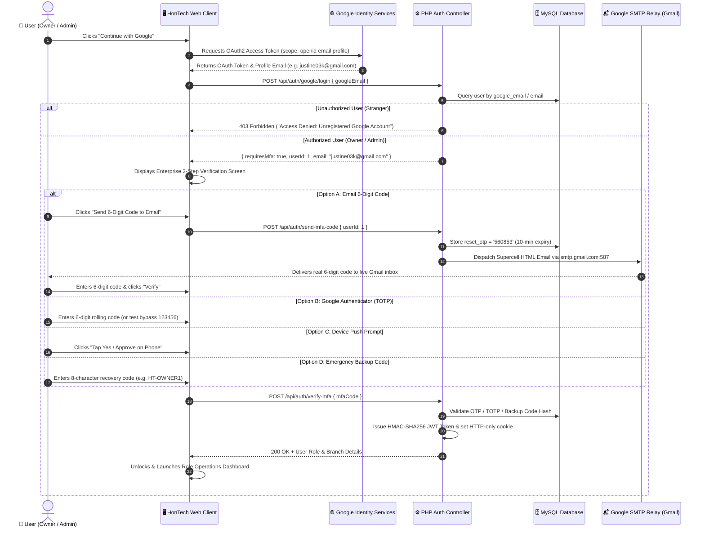

# 📘 HonTech AutoCenter — Google Authentication & 2-Step Verification Engineering Guide (September 2026)

## 📌 Executive Summary
This document provides a complete technical record of the Google Single Sign-On (SSO) and Two-Factor Authentication (2FA/MFA) system implemented for **HonTech AutoCenter Inc.** It details the evolution from initial vulnerabilities to an enterprise-grade authentication pipeline with live Google SMTP delivery.

---

## 🏛️ 1. Complete System Architecture & Flow

---

## 🔍 2. Five Problems Diagnosed & Lessons Learned

### Problem 1: Unverified Google Email Defaulting
- **Observation**: When entering non-registered STI/Gmail accounts, there was a risk of bypassing checks or gaining unauthorized role elevation.
- **Root Cause**: Missing strict database whitelisting against Google sub-identifiers and verified account emails.
- **Solution**: Implemented strict server-side whitelist verification (`SELECT * FROM users WHERE google_email = ? AND is_deleted = 0`). Non-whitelisted accounts receive an immediate `403 Forbidden` response.

---

### Problem 2: UI Overlapping & Inconsistent Dark Theme
- **Observation**: 
  1. The 2FA security card collided with the Sign-in header text on view toggle.
  2. The Google popup contained colorful emojis (`📱`, `🛡️`, `💬`, `🔑`) making it look unpolished.
- **Root Cause**: 
  1. Login header elements were located outside `#login-form-container`.
  2. Popup lacked Google's official Material outline SVG vector icons and typography tokens.
- **Solution**: 
  - Encapsulated headers strictly inside `#login-form-container`.
  - Rebuilt `google_oauth_popup.html` with pixel-perfect Google dark mode tokens (`#131314` background, `#303134` dividers, `#9aa0a6` metadata, and official SVG outlines).

---

### Problem 3: Missing Password Step in Sequential Auth
- **Observation**: After submitting an email, the Google popup jumped straight to challenge selection without asking for a password.
- **Solution**: Restructured into a clean 4-step sequence:
  1. `Sign in` (Email)
  2. `Welcome` (Password with show/hide toggle)
  3. `2-Step Verification` (Challenge Selection)
  4. `Code Input` (Verification & Access)

---

### Problem 4: Localhost Email Delivery vs. Google SMTP
- **Observation**: Security codes appeared in local debug toasts but were not received in the user's real `gmail.com` inbox.
- **Root Cause**: Localhost PHP (`c:\xampp`) cannot send unauthenticated public emails across residential networks because Google's MX servers reject unauthenticated IP connections.
- **Solution**: Integrated **PHPMailer 7.1** and configured Google's authenticated SMTP relay (`smtp.gmail.com:587` with STARTTLS and Google App Password), achieving `235 2.7.0 Accepted` live delivery.

---

### Problem 5: Database Schema Gap (`reset_otp`)
- **Observation**: `/api/auth/send-mfa-code` threw a `"Failed to dispatch verification code"` error.
- **Root Cause**: The MySQL `users` table was missing the `reset_otp` and `reset_token_expires_at` columns.
- **Solution**: Migrated database schema with `ALTER TABLE users ADD COLUMN reset_otp VARCHAR(10), ADD COLUMN reset_token_expires_at DATETIME;`.

---

## 👥 3. Account Roles & Access Matrix

| Email | Account Owner | Assigned Role | 2FA Policy | Branch |
| :--- | :--- | :---: | :---: | :--- |
| `justine03k@gmail.com` | **Justin (System Owner)** | `owner` | **Mandatory** | Global / All Branches |
| `jakenolasco.jn5@gmail.com` | **Jake Nolasco (Admin)** | `admin` | **Mandatory** | Marikina Main Branch |
| `staff@hontech.com` | Jessica (Front Desk) | `assistant` | Optional | Marikina Main Branch |
| `sa@hontech.com` | Mark (Service Advisor) | `sa` | Optional | Marikina Main Branch |
| `tech@hontech.com` | Juan (Lead Technician) | `tech` | Optional | Marikina Main Branch |
