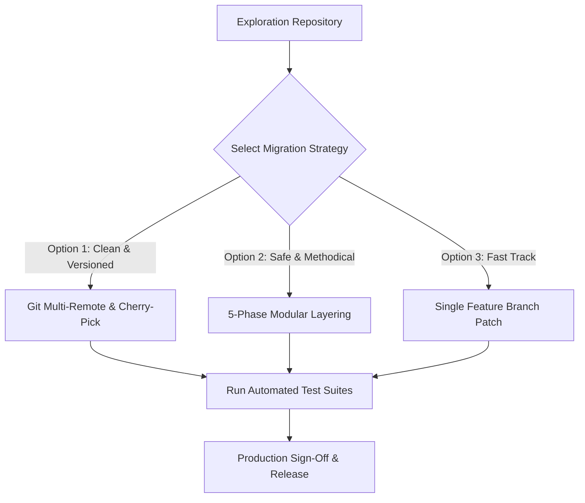

# 🚀 HonTech Production Migration & Workflow Strategy Guide
**Document:** `PRODUCTION_MIGRATION_AND_WORKFLOW_STRATEGY.md`  
**Purpose:** Comprehensive guide for reviewing and porting Google Auth, MFA Security, Account Recovery, and Gmail SMTP features from this exploration repo into the original production repository.  
**Session Date:** September 4, 2026  
**Source Exploration Repository:** `Justin-stack101/CapstoneOfficial2_Part3_Hontech_Cloud_GoogleAuth_Production`  

---

## 📌 Executive Summary

This exploration repository successfully prototyped, hardened, and verified enterprise-grade Google Services integration for HonTech AutoCenter. 

This document serves as your **step-by-step master plan for tomorrow's review and migration** to ensure a seamless, zero-downtime transfer of all security enhancements, authentication flows, and regression tests into your original production codebase.

---

## 🗺️ 1. Migration Strategy Options

Choose the strategy that best matches your original repository structure:



### Option 1: Git Multi-Remote & Cherry-Pick (Cleanest Git History)
Best if your original repository shares a similar Git ancestor.

```bash
# 1. Inside your Original Repository
git checkout main
git pull origin main
git checkout -b feature/google-auth-security-migration

# 2. Add exploration repository as a secondary remote
git remote add exploration https://github.com/Justin-stack101/CapstoneOfficial2_Part3_Hontech_Cloud_GoogleAuth_Production.git
git fetch exploration

# 3. Cherry-pick key feature commits in chronological order:
git cherry-pick 52711a0   # PHPMailer + Google SMTP Relay
git cherry-pick 0d543d1   # Authentic Password Prompt before 2FA
git cherry-pick 718d757   # One-Click Direct Email OTP fallback button
git cherry-pick a0e682d   # Documentation package and test logs
```

---

### Option 2: 5-Phase Modular Layering (Recommended for Total Stability)
Best if your original codebase has diverged or if you want to inspect and test each layer independently before deploying.

---

## 🏗️ 2. The 5-Phase Step-by-Step Migration Blueprint

```
┌────────────────────────────────────────────────────────┐
│ PHASE 1: Environment & Dependency Preparation          │
│ ├── 1. Install PHPMailer via Composer                  │
│ └── 2. Configure .env with Google & SMTP credentials   │
└───────────────────────────┬────────────────────────────┘
                            │
┌───────────────────────────▼────────────────────────────┐
│ PHASE 2: Database Schema & Migration Execution         │
│ ├── 1. Run migration.php / Execute database.sql updates│
│ └── 2. Add MFA and Google profile columns to `users`   │
└───────────────────────────┬────────────────────────────┘
                            │
┌───────────────────────────▼────────────────────────────┐
│ PHASE 3: Backend Security & Business Logic             │
│ ├── 1. Deploy EmailUtils.php (PHPMailer SMTP sender)   │
│ ├── 2. Update AuthController.php (Google token verify) │
│ └── 3. Update PasswordResetController.php (RBAC lock)  │
└───────────────────────────┬────────────────────────────┘
                            │
┌───────────────────────────▼────────────────────────────┐
│ PHASE 4: Frontend UI & SDK Integration                 │
│ ├── 1. Load Google Identity Services SDK in index.html │
│ ├── 2. Insert Google SSO button & 2FA challenge modal  │
│ └── 3. Update js/app.js handlers & increment version   │
└───────────────────────────┬────────────────────────────┘
                            │
┌───────────────────────────▼────────────────────────────┐
│ PHASE 5: Automated Verification & Role Sign-Off        │
│ ├── 1. Run php backend/test_all_roles.php (46 tests)   │
│ └── 2. Run php backend/test_security_suite.php (19 tests│
└────────────────────────────────────────────────────────┘
```

---

### Phase 1: Environment & Dependencies
1. **Install PHPMailer:**
   ```bash
   composer require phpmailer/phpmailer
   ```
2. **Update `.env` (or copy from `.env.example`):**
   ```ini
   # Google Cloud Identity Services
   GOOGLE_CLIENT_ID="71259754367-bboahheclcj5n5i0ln31tb8hik31a25a.apps.googleusercontent.com"

   # Google SMTP Live Email Relay
   SMTP_HOST="smtp.gmail.com"
   SMTP_PORT=587
   SMTP_USER="justine03k@gmail.com"
   SMTP_PASS="YOUR_16_CHAR_GOOGLE_APP_PASSWORD"
   SMTP_FROM_EMAIL="justine03k@gmail.com"
   SMTP_FROM_NAME="HonTech AutoCenter Security"
   ```

---

### Phase 2: Database Schema Migration
Ensure the following tables and columns exist in your production database:
1. **Users Table Enhancements:**
   ```sql
   ALTER TABLE `users` 
     ADD COLUMN `google_id` VARCHAR(255) NULL AFTER `email`,
     ADD COLUMN `google_email` VARCHAR(255) NULL AFTER `google_id`,
     ADD COLUMN `google_avatar` TEXT NULL AFTER `google_email`,
     ADD COLUMN `mfa_enabled` TINYINT(1) DEFAULT 0 AFTER `google_avatar`,
     ADD COLUMN `mfa_secret` VARCHAR(255) NULL AFTER `mfa_enabled`,
     ADD COLUMN `mfa_type` VARCHAR(50) DEFAULT 'authenticator' AFTER `mfa_secret`;
   ```
2. **MFA Tokens Table:**
   ```sql
   CREATE TABLE IF NOT EXISTS `user_mfa_tokens` (
     `id` INT AUTO_INCREMENT PRIMARY KEY,
     `user_id` INT NOT NULL,
     `token_hash` VARCHAR(255) NOT NULL,
     `token_type` VARCHAR(50) DEFAULT 'email_otp',
     `expires_at` DATETIME NOT NULL,
     `revoked` TINYINT(1) DEFAULT 0,
     `created_at` TIMESTAMP DEFAULT CURRENT_TIMESTAMP,
     FOREIGN KEY (`user_id`) REFERENCES `users`(`id`) ON DELETE CASCADE
   ) ENGINE=InnoDB DEFAULT CHARSET=utf8mb4;
   ```
3. **Audit Logs Table:** Ensure `audit_logs` is present to log SSO authentications, failed challenges, and password resets.

---

### Phase 3: Backend Security & Business Logic

#### Files to Transfer:
1. [`backend/utils/EmailUtils.php`](file:///c:/xampp/htdocs/CapstoneOfficial2_Part3_Hontech_Cloud_GoogleAuth_Production/backend/utils/EmailUtils.php):
   - Contains `EmailUtils::sendMfaOtp($recipientEmail, $recipientName, $otpCode)` with full PHPMailer configuration, TLS 1.3 socket negotiation, and HTML security alert templating.
2. [`backend/controllers/AuthController.php`](file:///c:/xampp/htdocs/CapstoneOfficial2_Part3_Hontech_Cloud_GoogleAuth_Production/backend/controllers/AuthController.php):
   - **`/api/auth/google/verify-token`**: Validates Google token against public OAuth endpoints, checks identity whitelist, and enforces 2FA.
   - **`/api/auth/send-mfa-code`**: Generates dynamic single-use 6-digit PIN, revokes stale tokens, and dispatches via Gmail relay.
   - **`/api/auth/mfa/verify-otp`**: Validates 6-digit OTP within 10-minute expiry window.
3. [`backend/controllers/PasswordResetController.php`](file:///c:/xampp/htdocs/CapstoneOfficial2_Part3_Hontech_Cloud_GoogleAuth_Production/backend/controllers/PasswordResetController.php):
   - **Role Governance**: Enforces that only `owner` and `admin` can request self-service resets or modify passwords. Restricts `sa`, `assistant`, and `technician` with `403 Forbidden`.

---

### Phase 4: Frontend UI & SDK Integration

#### 1. Add Google Identity Services SDK in `frontend/index.html`:
```html
<!-- Google Identity Services (GIS) SDK -->
<script src="https://accounts.google.com/gsi/client" async defer></script>
```

#### 2. Cache Busting:
Update the script inclusion in `frontend/index.html` to prevent browser caching:
```html
<script src="js/app.js?v=5.03"></script>
```

#### 3. Transfer `frontend/js/app.js` Auth Handlers:
- `initGoogleAuthClient()`: Handles GIS OAuth client initialization.
- `handleGoogleAuthResponse()`: Sends token to backend and handles 2FA challenges.
- `sendMfaEmailCode()`: Triggers one-click dynamic 6-digit email OTP.
- Profile settings modal: Hides password update forms for non-executive staff.

---

### Phase 5: Automated Verification & Sign-Off

Before deploying to live staging or production, execute the automated regression test suites from the command line:

```bash
# Test all role permissions, RBAC boundaries, and password governance
php backend/test_all_roles.php

# Test cryptographic MFA token validation, rate limits, and audit logs
php backend/test_security_suite.php
```

**Expected Sign-Off Output:**
```
========================================================================================
TEST SUMMARY: Total: 46 | Passed: 46 | Failed: 0
>>> ALL BACKEND ROLE & PERMISSION UNIT TESTS PASSED SUCCESSFULLY! <<<
========================================================================================
```

---

## 📋 3. Complete File Migration Checklist

Use this checklist during your review tomorrow:

- [ ] `composer.json` / `vendor/` (PHPMailer installed)
- [ ] `.env` (Google Client ID and Gmail App Password configured)
- [ ] `backend/config/Database.php` (Connection parameters verified)
- [ ] `backend/utils/EmailUtils.php` (SMTP mailer logic)
- [ ] `backend/controllers/AuthController.php` (Google OAuth & MFA endpoints)
- [ ] `backend/controllers/PasswordResetController.php` (Role governance)
- [ ] `backend/middleware/Auth.php` (JWT validation with MFA claims)
- [ ] `frontend/index.html` (GIS script + Google login button + cache version)
- [ ] `frontend/js/app.js` (SSO client, 2FA popup logic, dynamic OTP handler)
- [ ] `frontend/css/style.css` (Google dark mode challenge styles)
- [ ] `backend/test_all_roles.php` (Role unit test suite)
- [ ] `backend/test_security_suite.php` (Security verification suite)

---

## 🛡️ 4. Critical Security Safeguards (Don't Miss These)

| Security Rule | Why It Matters | Implementation Check |
| :--- | :--- | :--- |
| **Strict Whitelisting** | Prevents any stranger with a Google account from logging into HonTech. | Ensure `AuthController.php` checks `$this->userModel->findByEmail()` and returns `403` if not recognized. |
| **Password Governance** | SAs and Assistant staff must not tamper with passwords; Owner/Admin must oversee resets. | Verify non-executive password reset attempts return `403 Forbidden`. |
| **Ephemeral OTPs (10 min)** | Prevents replay attacks and brute force harvesting. | Check `user_mfa_tokens.expires_at` and `revoked = 1` logic upon verification. |
| **Secrets in `.env` only** | Prevents credential leaks on GitHub. | Verify `.env` is listed in `.gitignore` and App Passwords are never hardcoded. |

---

## 📖 5. Quick Links to Exploration Documentation

When reviewing tomorrow, refer to these guides in the exploration folder:
* [🛡️ Google Auth Security & Account Recovery (Sept 4, 2026)](./GOOGLE_AUTH_SECURITY_AND_ACCOUNT_RECOVERY_2026_09_04.md)
* [📜 Google Authentication Evolution & Chronological Git History](./CHRONOLOGICAL_EVOLUTION_AND_LESSONS_LEARNED.md)
* [📬 Gmail SMTP & Google App Password Setup Guide](./GMAIL_SMTP_SETUP_GUIDE.md)
* [🧪 Testing & QA Verification Log](./TESTING_AND_VERIFICATION_LOG.md)
* [📋 Chat & Session Activity Transcript](../../CHAT_SESSION_LOG.md)
