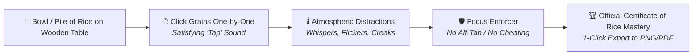

# Game Design Document: "Count the Rice" (Focus, Obsession & The Viral Certificate)

* **Official GitHub Repository**: [`Justin-stack101/GameDev_Concept1_CountTheRice_Game`](https://github.com/Justin-stack101/GameDev_Concept1_CountTheRice_Game)
* **Engine**: Unity (2D / 3D Core with URP)
* **Scripting**: C# .NET
* **Target Platforms**: Windows Standalone (`.exe`) & WebGL (Playable in Browser / Itch.io)
* **Estimated Timeline**: 2 to 3 Weeks (30–45 mins/day)

---

## 1. Overview & Concept



* **Genre**: Point-and-Click Micro-Horror / Focus & Endurance Simulation.
* **Premise**: You sit at a dimly lit wooden table with a single bowl/pile of rice. You must click and count every single grain of rice under eerie, escalating ambient distractions (whispers, flickering candles, shadows passing by).
* **The Hook**: Stressful, satisfying, funny, and deeply rewarding. Finishing the count unlocks an official personalized certificate ready to share on LinkedIn, Twitter/X, and Discord.

---

## 2. Core Gameplay Mechanics

### 2.1 Click-to-Count Interaction
* **Mouse Hover**: Highlights the hovered rice grain with a subtle outline or glow.
* **Left-Click**:
  * Triggers a crisp, satisfying *tap/click* sound effect.
  * Rice grain vanishes (or animates into a "counted" side pile).
  * Real-time HUD increments: `Grains Counted: [ X ] / [ Total ]`.
* **Difficulty Game Modes**:
  * **Quick Test**: 100 Grains (~2 to 3 minutes)
  * **Standard Trial**: 250 Grains (~5 to 8 minutes)
  * **Iron Patience Mode**: 500 Grains (~12 to 15 minutes)

### 2.2 Atmospheric Milestones (Psychological Tension)
* **25% Counted**: Table candle flickers slightly; distant faint breathing audio plays.
* **50% Counted**: Wooden floorboard creaks behind the player's chair; clock ticks louder.
* **75% Counted**: A shadow passes across the peripheral edge of the room; whispering wind.
* **100% Counted**: Golden warm light illuminates the table, triumphant chime plays, and the victory screen opens.

### 2.3 Universal "Anti-Alt-Tab" Focus Enforcer
* **Rule**: If the player attempts to Alt-Tab, minimize the window, or click on a second monitor to watch videos while counting:
  * A loud buzzer/glitch static sound triggers.
  * Message appears: *"FOCUS LOST. True patience requires your undivided attention."*
  * The rice bowl is knocked over $\rightarrow$ count resets to 0!

---

## 3. The Grand Reward: "Official Certificate of Rice Mastery"

Upon reaching 100% count, the game displays a high-resolution, personalized certificate:

```text
========================================================================
                      HONORARY CERTIFICATE
                               of
                   IRON PATIENCE & RICE MASTERY
------------------------------------------------------------------------
This certifies that:
                        [ PLAYER NAME ]

has demonstrated extraordinary mental focus, unwavering determination,
and supreme discipline by successfully counting all [ 500 ] grains of rice
without looking away or succumbing to distraction.

Date: [ REAL-TIME DATE ]          Total Elapsed Time: [ MM:SS ]
Official Seal: [ CERTIFIED ]      Accuracy: 100.0%
========================================================================
```

* **1-Click Export**: Player enters their name and clicks **"Download / Share Certificate"** $\rightarrow$ saves directly to their desktop as a `.png` or `.pdf` file.

---

## 4. Technical Architecture (C# Scripts)

```text
Assets/_CountTheRice/
├── Scripts/
│   ├── RiceGrain.cs            // Raycast click detection, destruction, audio trigger
│   ├── RiceGameManager.cs      // Tracks total count, game modes, and win condition
│   ├── FocusEnforcer.cs        // Alt-Tab / OnApplicationFocus window loss penalty
│   ├── AtmosphereDirector.cs   // Triggers candle flickers & spooky audio at milestones
│   └── CertificateExporter.cs  // Captures UI Canvas into high-res PNG image
├── Audio/
│   ├── SFX_RiceClick.wav
│   ├── SFX_Creak.wav
│   ├── SFX_Whisper.wav
│   └── SFX_VictoryChime.wav
├── Sprites/
│   ├── Rice_Grain.png
│   ├── Wooden_Table.png
│   └── Certificate_Template.png
└── Scenes/
    ├── MainMenu.unity
    └── Gameplay_Table.unity
```

### Core C# Code Blueprints:

#### 1. `RiceGrain.cs`
```csharp
using UnityEngine;

public class RiceGrain : MonoBehaviour
{
    private void OnMouseDown()
    {
        // Add to count
        RiceGameManager.Instance.AddCount(1);
        
        // Play click audio
        AudioManager.Instance.PlayRiceClick();
        
        // Remove grain
        Destroy(gameObject);
    }
}
```

#### 2. `FocusEnforcer.cs`
```csharp
using UnityEngine;
using UnityEngine.SceneManagement;

public class FocusEnforcer : MonoBehaviour
{
    void OnApplicationFocus(bool hasFocus)
    {
        if (!hasFocus)
        {
            TriggerFocusPenalty();
        }
    }

    void TriggerFocusPenalty()
    {
        Debug.Log("Player Alt-Tabbed! Focus lost.");
        SceneManager.LoadScene(SceneManager.GetActiveScene().buildIndex);
    }
}
```

#### 3. `CertificateExporter.cs`
```csharp
using System.IO;
using UnityEngine;

public class CertificateExporter : MonoBehaviour
{
    public RectTransform certificatePanel;

    public void SaveCertificateAsPNG(string playerName)
    {
        string filename = "Rice_Certificate_" + playerName + "_" + System.DateTime.Now.ToString("yyyyMMdd_HHmmss") + ".png";
        string path = Path.Combine(System.Environment.GetFolderPath(System.Environment.SpecialFolder.Desktop), filename);

        ScreenCapture.CaptureScreenshot(path);
        Debug.Log("Certificate exported successfully to: " + path);
    }
}
```

---

## 5. 3-Week Phased Implementation Roadmap

* **Week 1: Core Mechanics & Scene Setup**
  * Create Unity 2D project linked to GitHub repository.
  * Setup wooden table scene and spawn 100/250 rice grains.
  * Connect `RiceGrain.cs` click detection, audio feedback, and real-time HUD counter.
* **Week 2: Focus Enforcer & Atmosphere Director**
  * Integrate `FocusEnforcer.cs` for instant Alt-Tab reset.
  * Add candle flicker animation and sound triggers at 25%, 50%, and 75% milestones.
* **Week 3: Certificate UI & Build Export**
  * Design certificate template with player name input field.
  * Connect `CertificateExporter.cs` to save PNG to Desktop.
  * Build and export Windows standalone `.exe` & WebGL build!
