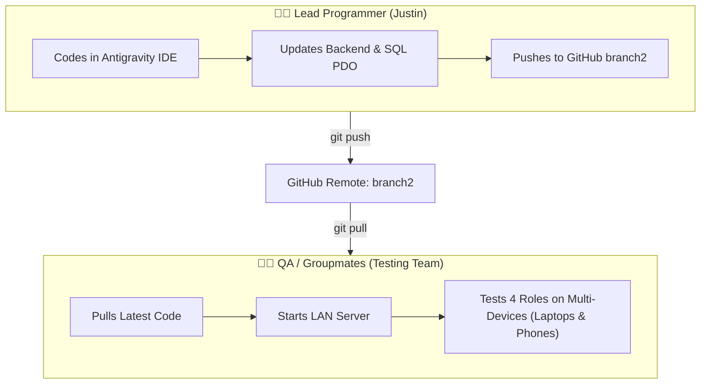
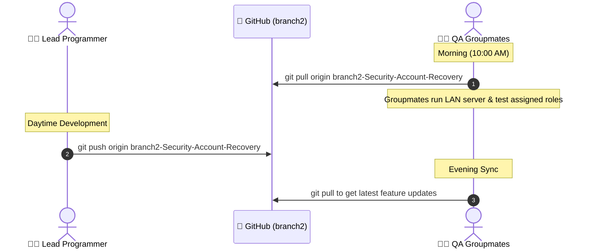
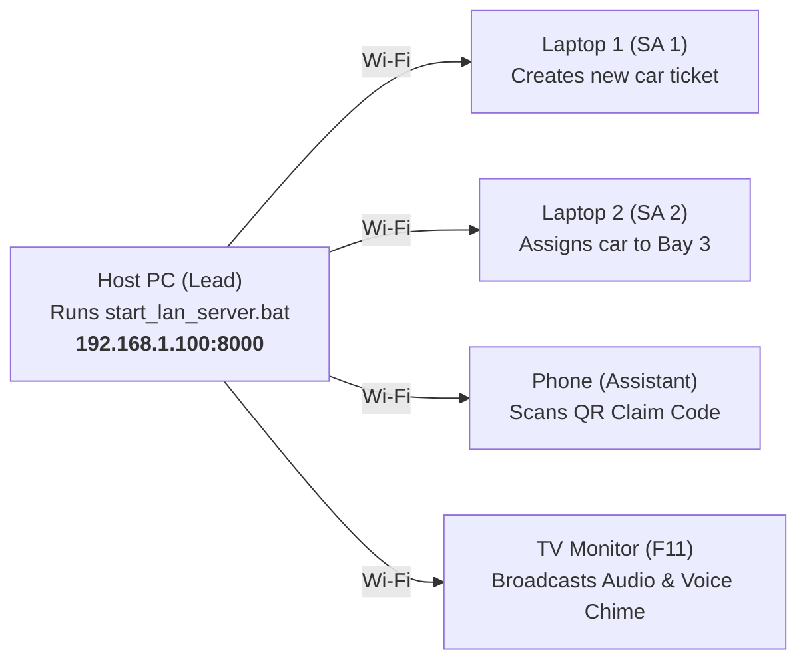

# 🤝 HonTech Team Collaboration Guide
## Master Multi-Role Workflow, Git Synchronization & LAN Testing Playbook
**Repository**: `Hontech_Main_Active_Development_PHP_SQL`  
**Active Branch**: `branch2-Security-Account-Recovery`  
**Audience**: Lead Programmer (Justin), QA Testers, Capstone Groupmates  

---

## 📌 1. Team Roles & Responsibilities



| Team Member | Primary Responsibility | Daily Tools |
| :--- | :--- | :--- |
| **Lead Developer (Justin)** | Systems architecture, PHP API routing (`router.php`), SQL PDO queries, frontend UI logic, and Git releases. | Antigravity IDE, XAMPP, MySQL |
| **QA / Groupmate 1** | **Service Advisor 1 Testing**: Customer intake, backjob lookups, and PDF Claim Stub printing. | Google Chrome, Laptop |
| **QA / Groupmate 2** | **Service Advisor 2 Testing**: Concurrent intake creation and Bay Allocation updates. | Google Chrome, Laptop |
| **QA / Groupmate 3** | **Assistant / Reception Testing**: Online booking triage and claim queue verification. | Mobile Phone / Tablet |
| **QA / Groupmate 4** | **TV Monitor / Lounge Display**: Live TV slides, weather widget, and automated voice announcement testing. | External Screen / TV (F11 Fullscreen) |

---

## 🛠️ 2. One-Time Setup for Groupmates

Every groupmate needs only **2 free tools** installed on their computer:

1. **Git for Windows**: Download from [git-scm.com/downloads](https://git-scm.com/downloads) (Click Next $\to$ Next $\to$ Finish).
2. **XAMPP (PHP 8.2 + MySQL)**: Download from [apachefriends.org](https://www.apachefriends.org).

### Quick Clone Command:
Open **Command Prompt** or **PowerShell** and run:
```bash
# 1. Navigate to XAMPP htdocs directory
cd C:\xampp\htdocs

# 2. Clone the official active development branch
git clone -b branch2-Security-Account-Recovery https://github.com/Justin-stack101/Hontech_Main_Active_Development_PHP_SQL.git
```

---

## 🚀 3. The Daily 3-Step Synchronization Loop



### 👨‍💻 For the Lead Programmer (Using Antigravity IDE):
When you finish a feature or bug fix and want to publish it to your team:
```bash
git add .
git commit -m "feat: completed service advisor bay allocation and claim stub printing"
git push origin branch2-Security-Account-Recovery
```

### 👩‍💻 For QA / Groupmates (Testing on Their Laptops):
1. **Pull the latest code**:
   ```bash
   git pull origin branch2-Security-Account-Recovery
   ```
2. **Launch the LAN Server**:
   Double-click [`start_lan_server.bat`](file:///c:/xampp/htdocs/CapstoneOfficial2_Development_Part-2-Hontech_Main_Active_Development_Branch2-Security-Account-Recovery/CapstoneOfficial2_Development_Part-2-Hontech_Main_Active_Development/start_lan_server.bat).
3. **Open Google Chrome**:
   Navigate to `http://localhost:8000`.

---

## 🔑 4. Standard Test Accounts & Credentials

Use these verified accounts to test role-specific UI and permissions:

| Role | Username / Email | Password | Allowed System Permissions |
| :--- | :--- | :--- | :--- |
| 👑 **Shop Owner** | `owner@hontech.com` | `owner123` | Full system access, revenue analytics, staff accounts, database seed resets. |
| 🛡️ **Admin** | `admin.marikina@hontech.com` | `admin123` | Workshop supervisor, bay lockouts, SLA delay logs, ticket overrides. |
| 📋 **Service Advisor 1** | `sa.marikina1@hontech.com` | `sa123` | Front-desk intake, customer directory, backjob flagging, Claim Stub PDF printing. |
| 📋 **Service Advisor 2** | `sa.marikina2@hontech.com` | `sa123` | Secondary front-desk intake, bay status transfers (`Pending` $\to$ `Monitoring`). |
| 🎫 **Assistant** | `assistant.marikina@hontech.com` | `assistant123` | Reception gate check-in, online booking triaging, TV monitor operation. |

---

## 🧪 5. Multi-Device Wi-Fi Testing Procedure

To test live multi-device synchronization during team review sessions:



1. **Host Starts Server**: Lead developer launches `start_lan_server.bat` (Displays local IP e.g. `192.168.1.100`).
2. **Team Connects over Same Wi-Fi**:
   - Laptop 1 opens `http://192.168.1.100:8000` $\to$ Logs in as **Service Advisor 1**.
   - Laptop 2 opens `http://192.168.1.100:8000` $\to$ Logs in as **Service Advisor 2**.
   - Phone opens `http://192.168.1.100:8000` $\to$ Logs in as **Assistant**.
   - TV Monitor opens `http://192.168.1.100:8000` in **F11 Fullscreen** TV mode.
3. **Run Live Smoke Test**: SAs create new tickets and assign bays $\to$ verify that the TV monitor updates in real-time and speaks the customer's name!

---

## 🛡️ 6. Emergency 1-Line Git Reset

> [!WARNING]
> If a groupmate accidentally modified local files and `git pull` gives an error or conflict, run this command in terminal to instantly clean and match the master branch:

```bash
git reset --hard origin/branch2-Security-Account-Recovery
git pull origin branch2-Security-Account-Recovery
```

---

*Maintained by the HonTech Development Team | Capstone 2026*
